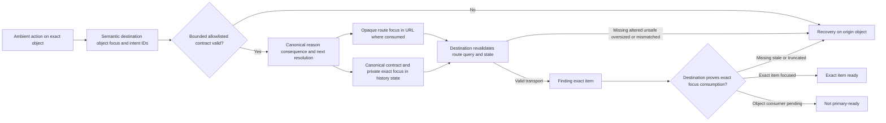
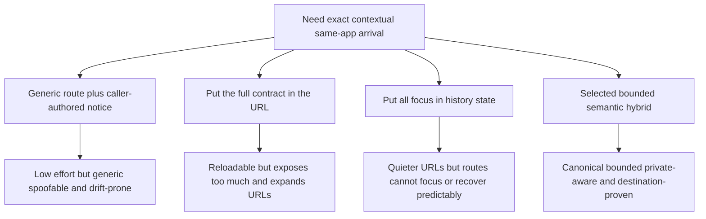

# Ambient Workspace Exact-Arrival Architecture Decision

Last updated: 2026-09-10 12:09:03 CDT

Status: Accepted for source implementation only; default off
Date: August 11, 2026
Decision owners: QuotePilot maintainers

The related implementation is part of the default-off `v0.8.0` source
candidate. This ADR does not establish publication, deployment, hosted
behavior, production readiness, human acceptance, or any new data or mutation
authority; each requires its own evidence.

## Context

Ambient Intelligence actions are supposed to resolve a specific need in the
context where it arose. A primary action that merely opens Workflow, Messages,
Schedule, or Reporting recreates the dead-click problem even when navigation
technically succeeds: the user still has to locate the relevant object and
reconstruct why they arrived.

The handoff must preserve four human-facing facts—object, reason, consequence,
and next resolution—without allowing callers to place arbitrary prose,
customer details, message content, credentials, or other sensitive material in
a URL or browser history state. It must also distinguish transport validation
from destination proof. A valid route and well-formed handoff do not prove that
the destination found and focused the requested item.

The existing workspace routes and role/data authorities remain canonical. This
decision governs same-application presentation context only. It does not grant
read access, bypass role gates, mutate records, mark a message read, resolve a
workflow item, or establish any provider, customer, commercial, staffing,
payment, booking, delivery, or operational evidence.

## Decision

Default-off Ambient primary arrivals will use a bounded semantic same-app
contract. The origin supplies only an allowlisted destination, object type and
opaque identifier, focus identifiers, and semantic intent identifier. A pure
contract boundary derives canonical allowlisted reason, consequence, and next-
resolution text; callers cannot author or override that text.

The URL carries only the opaque focus that the destination route already
consumes, when such a route contract exists. Browser history state carries the
canonical arrival contract and any exact focus that should remain private to
the same-app transition. In particular, an exact message identifier remains in
bounded history state while the URL identifies only its quote-scoped thread.
History state is a transport convenience, not secure storage: customer names,
message or proposal content, contact details, tokens, secrets, and free prose
are prohibited from both transports.

On arrival, the contract is rebuilt from its semantic identifiers and checked
against its route, query, exact keys, bounds, canonical text, and allowed
object/intent/focus relationships. Successful parsing establishes only a
pending arrival. The destination consumer must then explicitly prove that it
loaded and focused the exact object or item named by the contract before the
notice may say the requested item is **ready**. Missing, stale, mismatched, unsafe, oversized, or
truncated evidence produces contextual recovery. No nearby, first, newest, or
otherwise convenient item may be substituted.

Workflow, Approval, and Messages have supported exact-focus consumers.
Schedule now supports only exact accepted/booked event focus and an exact
current conflict focus; Reporting supports only exact opportunity summary,
bounded pipeline summary, and Ambient interaction-health targets. Other object
types remain state-only pending consumers and must report
`primaryActionReady: false`. In particular, Schedule cannot treat its legacy
`booking.staffLead` field as authoritative operational staffing evidence.

### Decision details

| Item | Content |
|---|---|
| **Decision** | Use `workspace-arrival-contract-v1`: a bounded semantic hybrid of route-consumed opaque URL focus and canonical same-app history state, followed by explicit destination focus proof. |
| **Why now** | Ambient actions now cross workspace surfaces; without one fail-closed contract, each callback can silently regress to generic routing, caller-authored context, or false arrival acknowledgement. |
| **Why this** | It preserves spatially useful canonical routes, keeps privacy-bounded exact message focus out of the URL, prevents text drift, and reserves “ready” for evidence from the destination that actually located the requested item. |
| **Known unknowns** | Browser history-state survival differs across reload, restoration, and embedding contexts; additional Schedule/Reporting object vocabularies remain undesigned; destination collections may need targeted reads to distinguish a missing item from an item omitted by a bounded result. |
| **Kill criteria** | Disable Ambient primary arrivals and replace this transport before rollout if any path leaks prohibited content, accepts altered canonical state, substitutes a different item, says an item is “ready” without matching destination proof, or marks a pending consumer primary-ready. |

## Contract and flow

The architectural contract has three separate proofs:

1. **Construction proof:** semantic IDs form one allowlisted destination,
   object, intent, and focus combination within identifier, query, and state
   bounds.
2. **Transport proof:** the active workspace route, parsed query, and canonical
   history state agree exactly. This proof may acknowledge **Finding**, never
   **ready**.
3. **Consumption proof:** the destination's current evidence contains and
   focuses the exact requested object or item. Only this proof may resolve the
   notice to **ready**.

Recovery keeps the original work intact and carries an exact reason,
consequence, and safe next resolution. It must not navigate to a generic route
or reinterpret the request as a less-specific action.

## Rationale and options considered

### Option 1: Generic destination route plus caller-authored notice

- **Pros:** smallest implementation and no new transport model.
- **Cons:** does not focus the relevant item, permits arbitrary or stale prose,
  makes “arrival” indistinguishable from ordinary navigation, and violates the
  no-generic-destination interaction law.

### Option 2: Encode the complete arrival contract in the URL

- **Pros:** naturally survives reload and can be inspected or shared.
- **Cons:** makes reason/consequence text and exact message focus visible to
  browser history, logs, copied links, and referrers; creates long fragile URLs;
  and still cannot prove that the destination consumed the focus.

### Option 3: Carry all route and focus context in browser history state

- **Pros:** keeps URLs compact and avoids exposing exact message focus in the
  query string.
- **Cons:** makes canonical routes unable to focus supported objects on their
  own, weakens refresh and restoration behavior, and can diverge from the
  destination's parsed route state.

### Option 4: Bounded semantic hybrid with destination proof (selected)

- **Pros:** retains canonical route focus where supported, keeps privacy-
  bounded exact focus in same-app state, regenerates all explanatory text from
  allowlisted semantics, fails closed on tampering or truncation, and separates
  transport success from actual item consumption.
- **Cons:** requires coordinated origin, route, parser, destination-consumer,
  and notice behavior; browser restoration may legitimately recover rather
  than resume; every new destination needs an explicit semantic vocabulary and
  focus-consumption proof before it can become primary-ready.

## Consequences

### Positive consequences

- A primary handoff arrives with the relevant object, reason, consequence, and
  next resolution without turning a generic workspace page into a false
  outcome.
- Canonical text cannot drift across calling surfaces or be replaced by
  untrusted caller prose.
- Exact message focus remains out of shareable URLs while the quote-scoped
  thread retains canonical route focus.
- A well-formed route cannot create a false “ready” acknowledgement; only the
  destination's matching focus evidence can do so.
- Failed or incomplete handoffs leave the originating work intact and provide
  truthful recovery without substitution.

### Negative consequences

- Browser reload or session restoration can lose same-app state; the truthful
  result is recovery, not an inferred arrival.
- Destination surfaces must own exact focus lookup and resolution reporting,
  which adds a contract to each eligible surface.
- Strict bounds and exact-key checks intentionally reject some otherwise
  parseable inputs.
- Unsupported Schedule and Reporting object types cannot be promoted as
  Ambient primary destinations until their exact consumers are designed,
  implemented, and proven.

### Neutral consequences

- Canonical workspace URLs and legacy non-Ambient navigation remain available.
- Role gates, tenant isolation, data-fetch authority, and all mutation paths
  remain unchanged and are evaluated by the destination as before.
- The contract records presentation intent and context only; it is not an
  audit receipt or persisted business evidence.

## Architecture impact

- **Ambient action origins:** emit stable semantic IDs and opaque record IDs;
  they no longer construct display prose or generic destination state.
- **Arrival contract boundary:** owns destination/object/intent allowlists,
  canonical explanatory text, identifier and serialized-size bounds, route
  construction, immutable handoff values, and fail-closed recovery.
- **Workspace routing:** continues to own canonical route parsing. Workflow and
  Messages carry only route-consumed opaque query focus; exact message identity
  remains in same-app state.
- **Browser navigation state:** carries one exact canonical contract. It is
  never treated as authentication, authorization, durable storage, or a source
  of customer/business truth.
- **Destination consumers:** validate current destination evidence, focus the
  exact item, and report pending, resolved, or recovery. A bounded collection
  cannot claim absence when truncation prevents that conclusion.
- **Arrival notice:** renders **Finding** after transport proof, **ready** only
  after exact consumption proof, and contextual recovery otherwise.
- **Schedule and Reporting:** use state-only context. Exact supported event,
  conflict, opportunity-report, pipeline, and interaction-health consumers may
  become ready only after focus proof; every other object remains pending.
- **Dependencies and authority:** no external dependency, network protocol,
  Firestore collection, callable, provider, public API, or new data authority
  is introduced by this decision.

## Principled implementation guidance

- Prefer semantic identifiers over caller-authored prose; derive human text
  from a single versioned allowlist.
- Keep URLs minimal and route-meaningful. Treat every URL value as shareable
  and observable, even when it is an opaque identifier.
- Treat history state as bounded same-app transport, never as a secret store or
  trust boundary.
- Rebuild and compare the canonical contract at the destination; do not trust
  serialized text merely because it came from browser navigation state.
- Preserve exactness across object type, object ID, route, focus, and intent.
  Never replace a missing item with a neighboring or default item.
- Separate `pending` transport acknowledgement from `resolved` destination
  evidence. Rendering the destination surface alone is not consumption proof.
- Fail closed on missing, stale, mismatched, truncated, oversized, unsafe, or
  altered context and leave the originating work recoverable.
- Keep unsupported consumers explicitly pending and non-primary-ready.
- Keep Ambient presentation independently default-off; compatibility routing
  must remain available without weakening the exact-arrival contract.

## Known unknowns and reversal signals

- History-state retention must be observed across supported browsers, back and
  forward navigation, reload, PWA restoration, and accessibility tooling. Loss
  is acceptable only when recovery is immediate and truthful.
- Additional Schedule and Reporting object types need separately reviewed exact
  vocabularies, route/focus consumption, missing-item behavior, and browser
  evidence before they may become primary-ready.
- Large or paginated Workflow and Messages datasets may require an exact
  targeted lookup so a consumer can distinguish `missing` from `not present in
  this bounded page` without inventing evidence.
- If production-like browser proof shows that exact focus cannot be carried
  without sensitive URL disclosure, false resolution, or unreliable recovery,
  disable the affected Ambient destination and supersede this transport rather
  than relaxing the contract.

## Related information

- [Ambient Intelligence work plan](AMBIENT_INTELLIGENCE_WORK_PLAN.md)
- [QuotePilot design system](DESIGN_SYSTEM.md)
- [Customer-centered workspace plan](CUSTOMER_CENTERED_WORKSPACE_PLAN.md)
- [Event Workspace ADR](EVENT_WORKSPACE_ADR.md)
- [`workspaceArrivalContract.js`](../src/lib/workspaceArrivalContract.js)
- [`workspaceRoutes.js`](../src/lib/workspaceRoutes.js)
- [`WorkspaceSurfaceBoundary.jsx`](../src/components/WorkspaceSurfaceBoundary.jsx)
