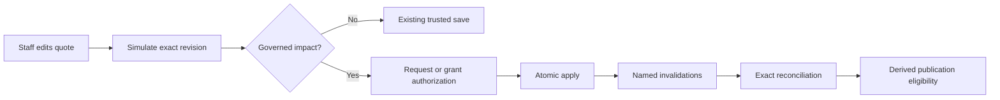

# Commercial Change Authority Architecture Decision

Status: Accepted for source implementation; runtime enforcement remains gated
Date: August 9, 2026
Decision owners: QuotePilot maintainers

## Context

QuotePilot already owns authoritative pricing, immutable quote versions,
proposal acceptance, payment evidence, booking, production planning, and a
versioned Commercial Dependency Graph. A consequential quote edit can therefore
make downstream artifacts or decisions wrong even when the proposed quote
itself is valid. The system needs a trusted answer to four separate questions:

1. What would change?
2. Who may authorize that exact change?
3. Which named dependencies become unresolved when it is applied?
4. What exact evidence is required to reconcile each invalidation?

The browser cannot own revision, actor, time, pricing, fingerprint, or receipt
truth. Existing proposal, acceptance, provider, payment, booking, and artifact
records must remain immutable and independently authoritative.

## Decision

Adopt a server-authoritative, receipt-driven commercial-change protocol:

Simulation is read-only and binds the canonical active revision, proposed-form
digest, current catalog authority, deterministic graph result, actor, and
server time. Sales staff may request authorization; tenant administrators may
authorize. Apply consumes the exact still-current authorization and atomically
writes the canonical quote/version changes plus immutable apply and invalidation
evidence. Reconciliation resolves only named invalidations through an allowed
evidence type and immutable receipt. The resulting `safeToPublish` value is a
derived eligibility signal only; it performs no publication.

The existing trusted quote-edit transaction remains the only write path.
Enforcement is dormant unless both `COMMERCIAL_CHANGE_AUTHORITY_ENABLED=true`
and the trusted tenant setting `commercialChangeAuthorityEnabled=true` are
present. Browser principals cannot promote either gate.

### Decision details

| Item | Content |
|---|---|
| Decision | Use versioned private receipts and exact-revision transactions for simulate, authorize, apply, invalidate, and reconcile. |
| Why now | Trusted BEO receipts and the dependency graph make retained freshness possible; ordinary save semantics alone can no longer represent downstream validity. |
| Why this | It preserves one pricing/write authority, gives implemented operations exact recovery patterns, and leaves acceptance/payment/provider truth untouched. Governed apply still needs its dedicated outcome-read contract. |
| Known unknowns | The first graph covers only declared v1 dependencies; additional artifacts need new versioned adapters and evidence contracts. |
| Kill criteria | Revert enforcement to dormant if an authorized apply can partially write, cross tenant scope, overwrite terminal evidence, or resolve an invalidation without exact trusted evidence. |

## Rationale and options considered

1. **Continue ordinary edit and save**
   - Pros: no new authority records or operator steps.
   - Cons: silently leaves downstream artifacts ambiguous and cannot support
     durable audit, freshness, or safe reconciliation.
2. **Let the browser calculate impact and mark dependencies current**
   - Pros: responsive and operationally simple.
   - Cons: lets untrusted form state claim pricing, revision, actor, time, and
     artifact evidence; cannot provide atomicity.
3. **Server-authoritative receipt protocol (selected)**
   - Pros: exact scope, deterministic replay, atomic invalidation, explicit
     role authority, and a safe basis for operation-specific recovery after
     ambiguous network outcomes.
   - Cons: more records, explicit operator steps, bounded-read/index concerns,
     and coordinated Functions/rules/frontend rollout.

## Consequences

### Positive

- A quote change can be inspected before mutation and cannot reuse a stale
  simulation or authorization after revision/catalog drift.
- Apply and invalidation are one transaction; no dependent record is silently
  regenerated, published, delivered, accepted, booked, charged, or completed.
- Exact request identities support idempotent replay. Simulation,
  authorization, BEO generation, dependency reconciliation, policy changes,
  and governed quote apply now expose operation-specific recovery. Apply-
  outcome reconciliation either validates the deterministic apply receipt and
  immutable target revision or atomically records a not-committed fence that a
  late apply transaction must observe.
- Private authority records remain callable-owned; staff receive bounded,
  human-readable projections.

### Negative

- Governed edits require additional staff review and may remain blocked until
  dependencies are reconciled.
- Each new artifact needs a server-owned generation/freshness adapter before it
  can support a strong reconciliation result.
- Runtime promotion requires a coordinated Functions, Firestore rules, index,
  frontend, and hosted-acceptance release.
- Apply-outcome reconciliation is a trusted mutation rather than a passive
  browser read because proving absence safely requires fencing the exact request
  against late commit. A transport failure of reconciliation itself retains the
  same request identity and remains uncertain until its deterministic receipt
  is replayed.

### Neutral

- Proposal acceptance, booking, payment, quote delivery, and the token portal
  keep their existing authorities and state machines.
- Prior quote versions, BEO receipts, and invalidation receipts are immutable;
  reconciliation creates new evidence rather than rewriting history.

## Architecture impact

- `functions/commercialChangeAuthority.js` owns receipt contracts, validation,
  deterministic replay, reconciliation rules, and publication eligibility.
- `functions/index.js` owns same-tenant staff/admin authorization, canonical
  reads, trusted pricing integration, Firestore transactions, and redacted DTOs.
- `functions/kitchenBeoAuthority.js` is the first artifact-specific trusted
  generation and freshness adapter.
- `functions/decisionDebt.js` derives a bounded deterministic priority from
  unresolved persisted dependencies; it does not create or resolve them.
- `src/lib/commercialChangeAuthorityClient.js` owns exact client request
  identities and unresolved-attempt continuity without browser storage of quote
  contents.
- Quote edit, quote record, Workflow, and Decision Debt panels expose the safe
  operational surface defined in
  `docs/COMMERCIAL_CHANGE_AUTHORITY_UI_SPEC.md`.
- Firestore rules deny browser reads/writes to simulations, approvals,
  authorizations, apply receipts, dependency state, invalidations,
  reconciliation receipts, BEO artifacts/receipts, and Decision Debt policies.

## Implementation guidance

- Keep graph traversal and canonical serialization pure and versioned; do not
  place pricing or mutable external evidence in the graph core.
- Reload canonical tenant data at every trusted boundary and fail on quote,
  catalog, policy, receipt, or scope drift.
- Use exact opaque request identities. An ambiguous result retains the same
  identity; a definitive rejection must be explicitly reset before a changed
  request begins. For governed quote apply, reconcile that exact identity; a
  not-committed outcome fences it permanently before a fresh simulation begins.
- Permit reconciliation only for the named open invalidations and allowed
  evidence class for their node kind. A note alone is never artifact freshness.
- Treat `safeToPublish` as eligibility text, never as an action or evidence that
  a proposal, portal, BEO, payment request, or message was published.
- Keep the global and tenant enforcement gates independently default-off until
  deployment and hosted staff acceptance are separately authorized.

## Related information

- `docs/COMMERCIAL_DEPENDENCY_GRAPH_ADR.md`
- `docs/COMMERCIAL_CHANGE_AUTHORITY_UI_SPEC.md`
- `docs/COMMERCIAL_CHANGE_AUTHORITY_DESIGN.md`
- `docs/COMMERCIAL_CHANGE_AUTHORITY_WORK_PLAN.md`
- `docs/CUSTOMER_CENTERED_WORKSPACE_PLAN.md`
- `docs/BEO_SLICE_PLAN.md`
