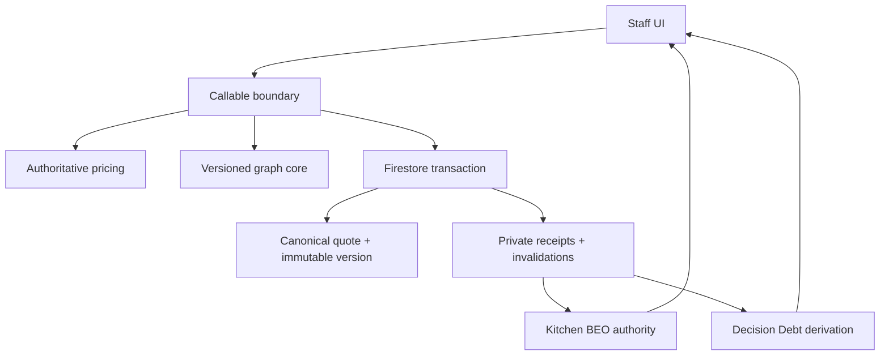

# Commercial Change Authority Design Document

Status: As-built source design; runtime enforcement remains gated
Date: August 9, 2026

## Overview

Commercial Change Authority extends the pure dependency graph into a trusted,
role-gated lifecycle for exact-revision simulation, authorization, atomic apply,
named invalidation, artifact generation/freshness, reconciliation, publication
eligibility, and Decision Debt. It reuses the trusted quote edit and pricing
paths and adds no second calculator, customer portal, or automatic publisher.

Referenced UI Spec: `docs/COMMERCIAL_CHANGE_AUTHORITY_UI_SPEC.md`

## Design summary

```yaml
design_type: extension
risk_level: high
complexity_level: high
complexity_rationale: Exact-revision authority coordinates pricing, quote/version writes, private receipts, artifact bytes, role checks, idempotency, and seven-state recovery across multiple asynchronous boundaries.
main_constraints:
  - Browser input is intent only; canonical revision, pricing, actor, time, graph, fingerprint, and receipts are server-owned.
  - Apply and named invalidations must be atomic.
  - Existing acceptance, booking, payment, provider, portal, and historical artifact evidence remains immutable.
biggest_risks:
  - Partial writes or stale authorization could produce false downstream authority.
  - A broad reconciliation could mark unrelated or stale artifacts current.
unknowns:
  - Additional artifact adapters beyond Kitchen BEO require separate versioned contracts.
  - Hosted workload and index behavior are not yet qualified.
```

## Background and context

### Prerequisite ADRs

- `docs/COMMERCIAL_DEPENDENCY_GRAPH_ADR.md`: pure, versioned graph topology and
  canonical serialization.
- `docs/COMMERCIAL_CHANGE_AUTHORITY_ADR.md`: private receipt protocol,
  role/transaction boundary, and independently gated enforcement.

### Agreement checklist

#### Scope

- [x] Server-authoritative simulation and role-gated authorization.
- [x] Atomic trusted quote/version apply plus immutable invalidations.
- [x] Bounded dependency-state read and exact reconciliation.
- [x] Trusted Kitchen BEO generation, immutable receipt/download, and freshness.
- [x] Server-derived Decision Debt and admin-only versioned policy.

#### Non-scope

- [x] No automatic publish, regeneration, proposal delivery, acceptance,
  booking, payment, or provider mutation.
- [x] No customer-facing graph, invalidation, actor, receipt, or Decision Debt.
- [x] No production gate promotion, migration/backfill, or deployment.

#### Constraints and standards

- [x] Parallel operation: yes; authority is dormant until global and tenant
  gates are both promoted.
- [x] Backward compatibility: required; the existing trusted edit path remains
  available while dormant and for a server-confirmed no-impact change.
- [x] Performance: bounded to 64 named invalidations/reconciliations per apply
  and bounded Decision Debt reads.
- [x] `docs/DOC_SYSTEM.md` and the capability-surfacing contract are explicit
  repository standards.
- [x] Existing request/receipt reconciliation patterns in quote delivery,
  payment, and booking are reused as an implicit convention.

### Quality-assurance mechanisms

| Mechanism | Enforces | Location | Scope |
|---|---|---|---|
| Capability-surfacing gate | No user-relevant backend orphan and exact UI states | `scripts/check-capability-surfacing.mjs` | Functions/client/UI/docs |
| Firestore rules suite | Private authority records are browser-inaccessible | `src/rules/__tests__/firestore.rules.test.js` | New collections and tenant settings |
| Focused server/client/component tests | Receipt integrity, role/scope, state, idempotency, recovery | `src/lib/__tests__/commercialChange*`, `kitchenBeo*`, `decisionDebt*`; component tests | Source slice |
| Environment/build/diff checks | Explicit gates, compile/bundle integrity, clean patch | package scripts | Repository-wide |

## Problem and requirements

The old edit flow could show advisory blast radius but could not safely apply a
governed change, retain invalidations, prove BEO freshness, or rank unresolved
decisions. Correctness requires all downstream authority to originate from the
same canonical revision and trusted transaction.

### Functional requirements

- CCA-FR-01: Same-tenant staff can simulate an exact current quote revision
  using server-authoritative pricing and graph evaluation.
- CCA-FR-02: Sales can request and admin can grant authorization for the exact
  unexpired simulation; drift invalidates reuse.
- CCA-FR-03: Apply writes the canonical quote, immutable version, apply receipt,
  dependency state, and named invalidations atomically.
- CCA-FR-04: Staff can read bounded dependency state and reconcile only exact
  named open invalidations with valid node-kind evidence.
- CCA-FR-05: Staff can generate a Kitchen BEO only from reloaded canonical data,
  receive immutable server bytes/receipt, and later download that exact receipt.
- CCA-FR-06: Freshness is one of `CURRENT`, `STALE`, `REVIEW`, `NOT_GENERATED`,
  or `UNKNOWN`, never inferred from browser state.
- CCA-FR-07: Decision Debt derives only from persisted unresolved dependencies,
  exact tenant calendar/policy, bounded exposure, and versioned formula.

### Non-functional requirements

- Reliability: every mutation is idempotent by exact request identity. Governed
  quote apply reconciliation validates a committed receipt plus immutable
  target revision, or atomically records a not-committed fence that prevents a
  late transaction from changing the result after the operator recovers.
- Security: all authority records/bytes are callable-only and tenant-bound.
- Maintainability: every schema/formula/graph/receipt is versioned and validated.
- Privacy: no quote/customer contents are added to URLs or browser storage.

## Acceptance criteria (EARS)

- [ ] **When** a current quote edit is simulated, the system shall return exact
  before/proposed facts, trusted pricing deltas, graph impact, receipt identity,
  expiry, and enforcement state without mutating the quote.
- [ ] **If** revision, catalog, proposal digest, policy, tenant, or authorization
  evidence drifts, **then** authorization/apply shall fail without partial write.
- [ ] **When** a governed apply succeeds, the system shall atomically record the
  new quote/version and all named invalidations with an immutable apply receipt.
- [ ] **While** an invalidation remains open, publication eligibility shall be
  blocked and the UI shall not claim the dependent artifact current.
- [ ] **When** a Kitchen BEO generation succeeds, the system shall retain exact
  PDF bytes and server receipt, expose current freshness only on exact matching
  canonical input, and support exact prior-receipt download.
- [ ] **When** Decision Debt is shown, each item shall expose the deterministic
  factors, bounds, source revision, score, and non-predictive boundary.

## Existing codebase analysis

### Implementation path mapping

| Type | Path | Responsibility |
|---|---|---|
| Existing/extended | `functions/index.js` | Staff/admin gates, pricing integration, canonical transactions, callable DTOs |
| New | `functions/commercialChangeAuthority.js` | Versioned simulation/authorization/apply/invalidation/reconciliation receipts |
| New | `functions/commercialChangeImpactEvaluator.js` | Deterministic before/proposed impact projection |
| Existing/extended | `functions/commercialDependencyGraphCore.cjs` | Shared pure graph/canonical core |
| New | `functions/kitchenBeoAuthority.js`, `functions/kitchenBeoPdf.js` | Server generation, receipt, bytes, freshness, exact download |
| New | `functions/decisionDebt.js` | Deterministic policy and bounded scoring |
| New | `src/lib/commercialChangeAuthorityClient.js`, `kitchenBeoClient.js`, `decisionDebtClient.js` | Safe request DTOs and in-memory exact-attempt continuity |
| Extended/new | `src/App.jsx`, relevant panels and `QuoteHistoryModal`/`SalesWorkflowModal` | Discoverable staff surfaces |
| Extended | `firestore.rules` | Deny direct browser authority and tenant-gate promotion |

### Code inspection evidence

| File/function | Relevance |
|---|---|
| `functions/index.js#updateQuoteDraft` | Existing trusted edit/version transaction extended for governed apply |
| `functions/index.js#simulateCommercialQuoteChange` | Exact pricing/revision simulation |
| `functions/index.js#reconcileCommercialDependencyState` | Named invalidation transaction |
| `functions/index.js#generateKitchenBeo` | Canonical double-read generation and receipt persistence |
| `functions/index.js#downloadKitchenBeoReceipt` | Exact prior receipt artifact download |
| `functions/index.js#getDecisionDebtSnapshot` | Bounded same-tenant derived read |

### Fact disposition

| Fact | Disposition | Evidence |
|---|---|---|
| Existing trusted pricing remains sole calculator | Preserve | `functions/pricingEngine.js`, `calculateQuotePricingAuthoritative` |
| Existing trusted edit owns canonical quote/version/customer/portal projection | Extend | `functions/index.js#updateQuoteDraft` |
| Browser-only BEO fingerprint is not retained authority | Transform | `functions/kitchenBeoAuthority.js`, generation receipts |
| Customer portal should expose invalidations/Decision Debt | Out of scope | Firestore rules and UI surface map |

## Design

### Change impact map

```yaml
Change Target: Commercial quote edit and downstream dependency authority
Direct Impact:
  - Functions callables and trusted quote edit transaction
  - Private commercial-change, dependency, BEO, and Decision Debt records
  - Quote edit, quote record, Workflow, and policy UI
Indirect Impact:
  - Additional bounded Firestore reads and immutable evidence volume
  - Coordinated Functions/rules/frontend release requirement
No Ripple Effect:
  - Public token portal and customer decision authority
  - Stripe/provider payment truth
  - Existing immutable acceptance, booking, and prior quote/artifact evidence
```

### Interface change matrix

| Existing | New | Conversion | Compatibility |
|---|---|---|---|
| Advisory Change Impact preview | Receipt-bound simulation and authorization | Yes | Preview DTO retained inside trusted simulation projection |
| `updateQuoteDraft` ordinary save | Optional exact commercial-change envelope | Yes | Dormant/no-impact path preserves existing trusted save |
| Browser Kitchen sheet download | Trusted status/generate/prior-receipt download | Yes | Existing presentation remains staff-only; server owns new evidence |
| Workflow attention | Decision Debt bounded projection | No | Additive panel and exact quote navigation |

### Architecture and data flow



Required order is canonical read -> validation/pricing -> deterministic plan ->
transactional drift recheck -> write/receipt -> redacted projection. External
publication/provider calls are absent.

### Integration points

| Integration | Old | New/switch | Verification |
|---|---|---|---|
| Quote edit | Trusted save | Exact authority envelope only when enforced/required | Transaction and App integration tests |
| Catalog authority | Pricing fingerprint | Bound into simulation/authorization/apply | Drift tests |
| BEO | Browser payload/PDF | Server payload/PDF/receipt plus exact prior download | Server parity/PDF/client/component tests |
| Workflow | Existing Attention | Add bounded Decision Debt projection | UI and derivation tests |
| Tenant settings | No change-authority gate | Server-owned tenant gate plus env gate | Rules/env tests |

### Data representation decision

| Criterion | Assessment | Reason |
|---|---|---|
| Semantic fit | No | Quote documents cannot safely carry append-only operation history/bytes. |
| Responsibility fit | No | Receipts/invalidation state are authority records, not editable quote fields. |
| Lifecycle fit | No | They are immutable or reconcile independently after quote save. |
| Boundary cost | Medium | Callable projection is required but keeps secrets/bytes private. |

Decision: new private, versioned receipt/state collections keyed by stable
opaque scope, with only bounded callable projections exposed.

### Data contracts

```yaml
Contract: Commercial change simulation
Input: organizationId, quoteId, expectedActiveVersionId, sanitized proposed form, requestId
Server guarantees: canonical pricing/revision/catalog/graph/actor/time binding; no mutation
Error: typed same-tenant, drift, validation, pricing, or resource-bound failure

Contract: Authorized apply through updateQuoteDraft
Input: existing trusted edit input plus exact simulation/authorization/apply identity
Server guarantees: all-or-nothing quote, immutable version, apply receipt, dependency state, invalidations
Invariant: no prior version, acceptance, provider, payment, booking, or artifact evidence is rewritten

Contract: Dependency reconciliation
Input: organizationId, quoteId, applyReceiptId, requestId, <=64 exact invalidation ids, resolution evidence/note
Server guarantees: only named open invalidations with allowed evidence are resolved; immutable receipt returned

Contract: Kitchen BEO generation and download
Input: opaque quote/request or quote/receipt scope only
Server guarantees: canonical payload/fingerprint/actor/time/PDF receipt; strict base64 and exact stored byte length/SHA validation on generation replay/final response/status/download; exact prior receipt bytes on download
Invariant: browser digest, revision, actor, time, payload, and bytes are ignored as authority

Contract: Decision Debt snapshot
Input: organizationId, optional quoteId, bounded limit
Server guarantees: server_derived, predictive=false, versioned policy/formula/graph and explicit bounds
```

### Field propagation map

| Field | Producer | Serialized boundary | Consumer rule |
|---|---|---|---|
| requestId | client helper | callable string | strict operation-specific pattern; retained only for exact uncertain attempt |
| active revision/catalog digest | server canonical reads | private receipt | must match at authorize/apply; no client override |
| invalidation ids | apply transaction | private docs and callable DTO | sorted, capped, exact quote/apply scope |
| BEO receiptId | server generation | callable DTO/download request | exact same-tenant immutable receipt only |
| dependency fingerprint | server BEO adapter | private receipt/status DTO | named schema/graph versions must be supported |
| Decision Debt policyVersion | server policy | snapshot and mutation precondition | optimistic exact-version check |

### State model

```yaml
Simulation/authorization/apply mutation: ready -> submitting -> uncertain|receipt|error
Implemented uncertain recovery: uncertain -> reconciliation -> receipt|uncertain|error
Governed apply recovery: uncertain -> reconciliation -> committed receipt|fenced recovery|uncertain|definitive error
Definitive recovery: error -> recovery -> ready
Dependency read: loading -> empty|success|partial|error; retained failure -> stale
BEO freshness: CURRENT|STALE|REVIEW|NOT_GENERATED|UNKNOWN; CURRENT follows the exact current-receipt pointer and validates retained bytes before derivation
Publication eligibility: READY|BLOCKED|UNKNOWN
```

### UI action to API mapping

| UI action | Callable | Response | Error handling |
|---|---|---|---|
| Simulate | `simulateCommercialQuoteChange` | simulation receipt/projection | retry exact request or resimulate after drift |
| Request/refresh authorization | `requestCommercialQuoteChangeAuthorization`, `getCommercialQuoteChangeAuthorizationState` | approval projection | no apply until exact authorized state |
| Admin authorize | `authorizeCommercialQuoteChange` | authorization receipt | stale/expired evidence requires new simulation |
| Apply | `updateQuoteDraft`, `reconcileCommercialQuoteChangeApplyOutcome` | quote/version/apply/invalidation receipt or immutable not-committed fence | never repeat the quote edit after ambiguity; reconcile the retained exact request, then open the committed revision or begin a fresh simulation only after a fenced not-committed receipt |
| Read/reconcile dependencies | `getCommercialDependencyState`, `reconcileCommercialDependencyState` | bounded state/receipt | exact retained request |
| BEO status/generate/download | `getKitchenBeoArtifactStatus`, `generateKitchenBeo`, `downloadKitchenBeoReceipt` | status or immutable PDF artifact | strict retained-byte integrity failure fails closed; browser download failure alone does not invalidate a receipt |
| Decision Debt read/configure | `getDecisionDebtSnapshot`, `configureDecisionDebtPolicy` | bounded snapshot/policy receipt | same request/version recovery |

## Implementation and migration

Selected approach: hybrid. Establish pure/versioned authority primitives first,
then vertical UI-bound slices for Change Authority, BEO, dependency state, and
Decision Debt. Existing quotes need no backfill; absent evidence produces
`NOT_GENERATED`/empty/unknown rather than manufactured history. Enforcement stays
dormant until separately promoted.

Required order:

1. Versioned graph and receipt validators.
2. Server callables/private rules and atomic apply.
3. Artifact-specific generation/freshness/download authority.
4. Dependency reconciliation and Decision Debt derivation/policy.
5. Exact ambiguous apply-outcome reconciliation and late-commit fencing before
   either enforcement gate may be enabled.
5. Client exact-attempt continuity and polished staff surfaces.
6. Capability/docs/full local/emulator qualification.
7. Separately authorized deployment, hosted acceptance, and gate promotion.

## Security considerations

- Firebase Auth plus same-tenant staff is required for reads/mutations; only
  tenant admin may authorize or configure policy.
- Request envelopes accept only opaque scope and intent; server reads all
  authority facts and limits collections/receipt sizes.
- Firestore rules deny all browser access to private authority collections and
  deny browser promotion of the tenant gate.
- Logs include bounded opaque org/quote/actor/error context only; never form
  contents, customer PII, receipt bodies, PDF bytes, portal/payment/provider data.

## Test boundaries and verification

External providers are not involved. Pure authority helpers are unit-tested;
Firestore/Admin behavior is covered through source-integration and emulator/
rules tests; callable clients mock the Functions transport; component tests own
all canonical UI states. Mocks cannot prove deployment, IAM, production data,
hosted browser behavior, or human acceptance.

Correctness means exact same-tenant revision/catalog evidence is preserved from
simulation through atomic apply and only qualifying trusted evidence resolves a
named invalidation. Verify through focused unit/component tests, Firestore rules
and emulator transaction cases, authoritative-pricing coverage, full unit/build,
capability-surfacing, docs governance, secrets, and diff checks.

Early verification point: an exact simulation -> authorization -> apply test
must produce one immutable version/apply receipt and the expected named open
invalidations, while forced drift/transaction failure produces no writes.

Output comparison: the BEO server adapter must remain byte/data-equivalent to
the declared browser BEO input adapter for identical canonical quote/operational
inputs; compare normalized payload, fingerprint inputs/digest, provenance fields,
and PDF receipt metadata. New server actor/time/receipt fields have no legacy
equivalent and are compared only to their trusted contract.

## Risks and mitigation

| Risk | Impact | Probability | Mitigation |
|---|---|---|---|
| Partial apply | High | Low | One Firestore transaction and forced-failure tests |
| Stale authorization reuse | High | Medium | Bind revision, catalog, proposed digest, policy, expiry; recheck transactionally |
| False freshness | High | Medium | Server-only fingerprint and strict five-state classifier |
| Over-broad reconciliation | High | Medium | Exact named ids, node-kind resolution allowlist, 64-item cap, immutable receipt |
| Decision Debt interpreted as prediction/revenue | Medium | Medium | `predictive=false`, factor/source UI, explicit operational-money boundary |
| Hosted load/index gap | Medium | Medium | Keep gate off; qualify emulator then hosted candidate before promotion |

## Future extensibility

Additional artifacts (contract, staffing, rentals, food/production plans,
payment scopes, portal projection) require their own versioned input adapter,
trusted generation/currentness evidence, reconciliation allowlist, UI contract,
and tests. Automatic publication remains a separate program.

## References

- `docs/COMMERCIAL_CHANGE_AUTHORITY_ADR.md`
- `docs/COMMERCIAL_CHANGE_AUTHORITY_UI_SPEC.md`
- `docs/COMMERCIAL_DEPENDENCY_GRAPH_ADR.md`
- `docs/BEO_SLICE_PLAN.md`
- `docs/CUSTOMER_CENTERED_WORKSPACE_PLAN.md`

## Update history

| Date | Version | Change |
|---|---|---|
| August 9, 2026 | 1.0 | As-built source design |
