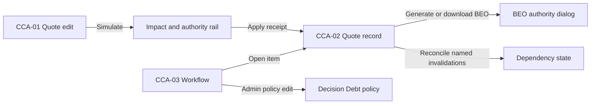

# Commercial Change Authority UI Specification

Status: Accepted implementation contract for CWF-15B-a and CWF-15C source work
Date: August 9, 2026
Owners: QuotePilot maintainers

Target requirements: `docs/CUSTOMER_CENTERED_WORKSPACE_PLAN.md` CWF-15
Architecture: `docs/COMMERCIAL_CHANGE_AUTHORITY_ADR.md`
Prototype: none; production React components are the implementation under test

## Purpose

This specification binds Commercial Dependency Graph authority to the existing
staff quote record and quote editor. It does not create a second dashboard or a
second pricing engine. It defines what staff must see before QuotePilot may call
an artifact current, authorize a consequential quote edit, invalidate a
dependent decision, reconcile it, or publish a replacement artifact.

The source implementation remains behind the commercial-dependency authority
feature gate until its hosted acceptance gate is recorded. Provider actions,
production backfills, deployment, and gate promotion are separate decisions.

## Surface map

| Staff surface | Capability | Primary action |
|---|---|---|
| Quote record | Kitchen BEO authority and freshness | Generate, download exact receipt, reconcile stale artifact |
| Quote editor | Change Impact authorization | Simulate, review consequences, authorize/request authorization, apply |
| Workflow Attention | Unresolved dependency decisions, Decision Debt, and its admin policy | Open the exact quote and affected decision; admins configure bounded lock windows and reviewed weights beside the derived snapshot |

Customer portal and proposal presentation do not expose internal graph,
invalidation, Decision Debt, actor, or generation-receipt records.

Decision Debt policy stays beside its derived Workflow snapshot so the meaning,
current bounds, and effect of each setting are discoverable at the point of
use. Tenant administrators alone can mutate the versioned policy; sales and
other authorized staff have read-only priority and factor visibility.

## Screen list and transitions

| Screen | Route/surface | Entry condition | Exit/transition |
|---|---|---|---|
| CCA-01 Quote edit | `/app/quotes/:quoteId/edit` | Same-tenant staff opens a trusted editable quote | Simulation stays in edit; a completed apply returns the new exact version/receipt state |
| CCA-02 Quote record | `/app/quotes/:quoteId` | Same-tenant staff opens the authoritative record | Open Kitchen BEO authority or dependency reconciliation without invoking the token portal |
| CCA-03 Workflow | `/app/workflow` | Same-tenant staff opens Workflow/Attention | Open the exact quote for a Decision Debt item; admin may edit the policy in place |



## Component decomposition

```text
Quote editor
  +-- CommercialChangeImpactPanel
      +-- CommercialChangeAuthorityControls

Quote record
  +-- CommercialDependencyStatePanel
  +-- KitchenBeoArtifactPanel

Workflow
  +-- DecisionDebtPanel
      +-- PolicyMutation
```

### Component: CommercialChangeImpactPanel

| State | Default/success | Loading | Empty | Error | Partial/stale |
|---|---|---|---|---|---|
| Display | Exact fact, money, dependency, simulation, approval, authorization, and apply evidence | Retain any prior completed simulation and mark it stale while the exact new request runs | State explicitly that no governed impact exists; normal trusted save remains available | Safe message and explicit retry/recovery; no save assumed | Label the bounded or changed-source evidence and disable authorization/apply |

| AC | EARS condition | User action | System response | Recovery |
|---|---|---|---|---|
| CCA-AC-01 | When staff changes governed quote inputs | Select Change Impact | Simulate against the exact current revision and server pricing | Retry the same simulation or return to edit |
| CCA-AC-02 | While governed impact exists | Request or grant authorization | Bind the exact simulation; admin authority remains distinct from sales request | Refresh exact authorization state |
| CCA-AC-03 | When an exact authorization is current | Apply authorized change | Record quote/version/apply/invalidation evidence atomically | A transport-ambiguous result remains unresolved; never repeat blindly. A dedicated exact apply-outcome read/reconcile contract is required before either enforcement gate is enabled. |

### Component: CommercialDependencyStatePanel

| State | Default/success | Loading | Empty | Error | Partial/stale |
|---|---|---|---|---|---|
| Display | Current apply scope, unresolved/resolved nodes, eligibility, and immutable receipt | Exact quote scope plus loading status | `NOT_GENERATED`/no dependency receipt, without implying current | `UNKNOWN`, safe error, retry | Retain prior data as stale and revoke reconciliation eligibility |

| AC | EARS condition | User action | System response | Recovery |
|---|---|---|---|---|
| CCA-AC-04 | When named invalidations are open | Select exact nodes and resolution | Validate node/evidence class and require a staff note where applicable | Retain the same request identity after uncertainty |
| CCA-AC-05 | When reconciliation succeeds | Review receipt | Show only the named resolved invalidations and recomputed eligibility | Refresh dependency state |

### Component: KitchenBeoArtifactPanel

| State | Default/success | Loading | Empty | Error | Partial/stale |
|---|---|---|---|---|---|
| Display | `CURRENT`, `STALE`, `REVIEW`, receipt metadata, and exact download actions as evidence permits | Read trusted artifact status | `NOT_GENERATED` with Generate action | `UNKNOWN` or definitive mutation failure, with safe retry/reset | Prior trusted status remains visibly stale; no currentness claim |

| AC | EARS condition | User action | System response | Recovery |
|---|---|---|---|---|
| CCA-AC-06 | When no current trusted BEO exists | Generate Kitchen BEO | Server reloads canonical data, generates bytes, writes the immutable receipt/artifact, and validates strict base64 plus retained length/SHA before replay or final response | Reconcile exact generation identity after uncertainty; corrupt retained bytes fail closed |
| CCA-AC-07 | When a receipt exists | Download current or prior receipt bytes | Download the server-retained PDF for that exact immutable receipt after retained-byte integrity validation | A browser download error does not invalidate the receipt |
| CCA-AC-08 | When a fresh BEO covers named artifact invalidations | Complete generation | Resolve only qualifying Kitchen BEO invalidations in the same trusted flow | Refresh dependency state |

### Component: DecisionDebtPanel

| State | Default/success | Loading | Empty | Error | Partial/stale |
|---|---|---|---|---|---|
| Display | Bounded deterministic items, formula factors, policy, and source | Load tenant snapshot | State that no qualifying unresolved decision is present | Safe unavailable state and retry | Show bounds/truncation or retain prior data as stale |

| AC | EARS condition | User action | System response | Recovery |
|---|---|---|---|---|
| CCA-AC-09 | When persisted unresolved dependencies qualify | Review Decision Debt | Explain dependency, proximity, exposure, reversibility, score, and next quote action | Retry the bounded read |
| CCA-AC-10 | When a tenant admin changes policy | Save versioned lock-window policy | Record exact policy receipt without resolving any dependency | Reconcile same request or reset a definitive rejection |

## Existing component and token map

| UI element | Decision | Existing source | Notes |
|---|---|---|---|
| Status semantics | Reuse | `StatusChip`, `statusSemantics` | Text always accompanies color |
| Quote edit surface | Extend | `CommercialChangeImpactPanel` in `App.jsx` | No second editor or calculator |
| Quote record | Extend | `QuoteHistoryModal`/routed Quotes workspace | Staff-only; never calls portal loader |
| Workflow | Extend | `SalesWorkflowView` | Decision Debt and admin policy stay discoverable with Attention |
| Layout/status styles | Reuse | `src/styles.css` neutral staff-shell tokens | Proposal/customer branding remains isolated |

Responsive behavior: cards collapse to one column below the existing mobile
breakpoint; long IDs/digests wrap; action groups wrap without horizontal page
overflow. Existing neutral-shell spacing, typography, status families, focus
rings, and reduced-motion media queries are authoritative; this feature adds no
independent visual theme.

## Evidence vocabulary

| Label | Required evidence | Forbidden implication |
|---|---|---|
| `CURRENT` | The current-artifact pointer resolves to the exact immutable successful receipt, retained bytes pass strict base64 and exact length/SHA validation, a fresh server fingerprint matches, and no named invalidation remains unresolved | Operational completion, publication, customer view, or provider delivery |
| `STALE` | A valid prior receipt exists but its declared-input fingerprint/revision differs, or an authorized invalidation remains unresolved | Artifact deletion or automatic regeneration |
| `REVIEW` | Source/graph/schema evidence is valid enough to identify the artifact but a governed dependent decision is unresolved | Unsafe, failed, or automatically rejected |
| `NOT_GENERATED` | No successful trusted receipt exists for this artifact and quote | Generation failure |
| `UNKNOWN` | The bounded authority read failed or required evidence is incomplete/unsupported | Currentness or staleness |

Simulation-only `REVIEW` and `STALE` remain advisory until an authorized apply
transaction creates an immutable invalidation receipt. A matching digest alone
never establishes publication or completion.

## Kitchen BEO state and display matrix

| State | Display | Available controls | Recovery |
|---|---|---|---|
| Loading | Skeleton plus canonical quote/revision scope | None | Wait or leave quote record |
| Not generated | `NOT_GENERATED`; no receipt claimed | Generate Kitchen BEO | Retry after a definitive error |
| Ready/current | `CURRENT`; receipt ID, source revision, actor, server time, graph/schema, fingerprint | Download exact receipt bytes; generate a new reviewed receipt | Refresh authority |
| Stale | `STALE`; exact mismatch/invalidation reasons and affected nodes | Reconcile by generating a new receipt; prior receipt remains downloadable | Retry/reconcile with the same request identity |
| Review | `REVIEW`; unresolved decision names and source | Open each decision; generation cannot silently resolve it | Complete an authorized decision, then refresh |
| Submitting | Exact request identity and non-final status | No second request | Wait for receipt |
| Uncertain | No success/failure claim; exact request retained in memory | Reconcile unchanged request | Reload status, then retry same identity |
| Reconciliation | Prior request/receipt identity visible | No duplicate generation | Wait for exact receipt or definitive rejection |
| Receipt | Immutable receipt metadata and exact download | Download; refresh freshness | Start a new generation only as a new request |
| Error | Definitive safe message; no receipt invented | Retry or return to quote | Correct configuration/source and retry |

The server reloads canonical quote data and owns payload, fingerprint, actor,
time, bytes, and receipt identity. Browser-supplied versions, digests, actors,
timestamps, payloads, and bytes are never trusted.

## Change Impact authorization matrix

| Phase | Staff display | Mutation authority |
|---|---|---|
| Edit | Unsaved fields and current canonical revision | None |
| Simulating | Prior completed simulation may remain visibly retained and stale | None |
| Simulation ready | Exact before/proposed facts, authoritative total/deposit deltas, affected nodes, protected-evidence boundary, simulation ID | None |
| No declared impact | Explicit empty result | Normal save is allowed only if the server independently confirms no governed impact |
| Authorization required | Actor role, base revision, expiry, affected artifacts/decisions, `Safe to apply` result | Admin may explicitly authorize; sales may request scoped approval |
| Authorization pending | Request ID, requester, time, exact simulation scope | No apply |
| Authorized | Authorizer, server time, exact simulation/base/catalog scope | One apply attempt may consume the authorization |
| Applying | Operation ID and atomicity notice | No second apply |
| Uncertain | No save assumed; same operation retained | Reconcile exact operation |
| Receipt | New immutable quote version plus invalidation receipt and reopened decisions | None beyond explicit next actions |
| Stale authorization | Drift reason: quote revision, catalog authority, proposed digest, approval, or policy | Re-simulate; never patch the old authorization |
| Definitive error | Safe message with no partial-success claim | Correct issue and begin a new simulation |

Simulation never mutates accepted versions, contracts, portal decisions,
provider/payment evidence, prior artifacts, or checklist history. Apply must
atomically write the canonical quote, immutable quote version, customer/portal
projection updates already owned by the trusted edit transaction, consumed
authorization, invalidation receipt, and server-owned dependency decision
states. Any failed precondition leaves all of them unchanged.

## Reconciliation and publication

Invalidation does not regenerate or republish anything. Each affected artifact
or decision receives an explicit unresolved state. Reconciliation names the
invalidation IDs it intends to resolve and creates a new immutable receipt.
Only a fresh server fingerprint match may resolve those named invalidations.
Old receipts and generated bytes remain immutable.

Publication is a distinct future action. CWF-15C may report `safeToPublish`
only as a deterministic result of zero unresolved governed dependencies; it
does not publish a proposal, BEO, payment request, portal revision, or provider
message.

## Decision Debt display contract

Decision Debt appears in Workflow Attention and the exact quote record only
after server-owned unresolved dependency state exists. Every row shows:

- the unresolved decision and affected downstream count;
- tenant-local event date and days to its configured lock;
- dependency weight, commercial-exposure bucket, and reversibility factor;
- the versioned deterministic formula and bounded 0-100 score;
- the exact next safe action and source/truncation state.

It is not predictive AI, revenue, likelihood, customer intent, or accounting
exposure. Missing timezone, policy, authoritative cents, or dependency evidence
produces `UNKNOWN`/blocked evidence rather than a guessed score.

## Accessibility and responsive requirements

- Every state is expressed in text in addition to color.
- Status changes use restrained `role=status`; uncertainty and errors use
  `role=alert` without stealing focus.
- After an action receipt, focus returns to the receipt heading or exact
  invalidated decision row.
- Keyboard order follows simulation, authorization, receipt, then dependent
  actions. Disabled actions explain the missing authority in `title` and nearby
  text.
- IDs, fingerprints, and long dependency names wrap without horizontal page
  overflow at mobile widths.
- Reduced-motion preferences apply to loading and receipt transitions.

## Acceptance traceability

| Requirement | Screens/components | Required evidence |
|---|---|---|
| CCA-AC-01 through CCA-AC-03 | CCA-01 / `CommercialChangeImpactPanel` | Simulation and authority component/client/server tests plus transaction/emulator coverage |
| CCA-AC-04 through CCA-AC-05 | CCA-02 / `CommercialDependencyStatePanel` | Exact read/mutation state markers and reconciliation tests |
| CCA-AC-06 through CCA-AC-08 | CCA-02 / `KitchenBeoArtifactPanel` | Generation, receipt-download, freshness, invalidation, PDF, and UI tests |
| CCA-AC-09 through CCA-AC-10 | CCA-03 / `DecisionDebtPanel` | Derivation, policy mutation, bounds, and state tests |

Each user-relevant contract must also be registered under CWF-14 with its exact
Functions exports, frontend entry points, focused tests, Feature Matrix row, and
User Manual section. Read surfaces cover loading, empty, success, stale,
partial, error, and recovery. Implemented operation-specific mutations cover
ready, submitting, uncertain, reconciliation, receipt, error, and recovery;
governed apply uncertainty remains unresolved until its dedicated exact outcome
read/reconcile contract is added. Browser and emulator evidence do
not satisfy deployment, hosted staff acceptance, production-data migration, or
feature-gate promotion.

## Open items

- Add the dedicated exact governed-apply outcome read/reconcile contract and
  bind its uncertain, reconciliation, receipt, definitive-error, and recovery
  states here before either enforcement gate is enabled.
- Deployment, gate promotion, hosted operator acceptance, and customer/
  production data remain separate release work.

## Update history

| Date | Version | Change |
|---|---|---|
| August 9, 2026 | 1.1 | Recorded exact governed-apply outcome reconciliation as an open pre-activation UI contract |
| August 9, 2026 | 1.0 | Accepted source contract for impact, generation, freshness, reconciliation, and Decision Debt |
