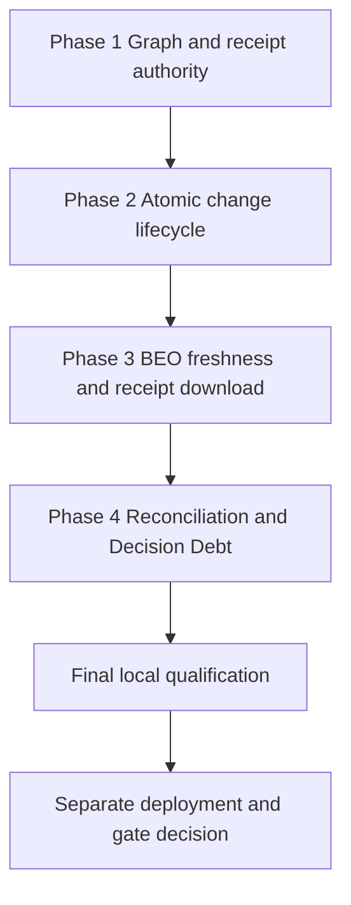

# Work Plan: Commercial Change Authority

Created: August 9, 2026
Type: feature
Review scope: current `feature/customer-centered-workspace` source diff against `origin/main`; no deployment or gate promotion
Estimated impact: multi-surface Functions, client, rules, UI, tests, and docs

## Related documents

- `docs/COMMERCIAL_CHANGE_AUTHORITY_ADR.md`
- `docs/COMMERCIAL_CHANGE_AUTHORITY_UI_SPEC.md`
- `docs/COMMERCIAL_CHANGE_AUTHORITY_DESIGN.md`
- `docs/COMMERCIAL_DEPENDENCY_GRAPH_ADR.md`
- `docs/CUSTOMER_CENTERED_WORKSPACE_PLAN.md`

## Objective

Turn commercial edits into an exact simulate -> authorize -> atomic invalidate
-> reconcile protocol, then expose trusted Kitchen BEO freshness/receipts and
deterministic Decision Debt without creating a second pricing, portal,
publication, or provider authority.

## Verification strategy

- Correctness: exact same-tenant revision/catalog/proposal/policy evidence must
  survive simulation through all-or-nothing apply, and only qualifying trusted
  evidence may resolve named invalidations.
- Method: focused unit/client/component tests, rules and Functions emulator
  transactions, authoritative-pricing lane, full unit/build/browser/governance/
  secret/diff checks.
- Timing: focused tests per slice; full repository qualification after docs and
  capability contracts converge; hosted qualification only after separate
  deployment authorization.
- Early target: a forced-drift and forced-transaction-failure test around one
  exact simulation/authorization/apply sequence.
- Success: the valid case writes one new version/apply receipt plus exact named
  invalidations; invalid cases write nothing.
- Failure response: leave both gates dormant, correct the authority/transaction
  design, and rerun the same exact evidence case.

## Quality-assurance mechanisms

| Mechanism | Enforces | Config/source | Covered work |
|---|---|---|---|
| Capability surfacing | Exact backend/UI/manual/matrix ownership and UI states | `scripts/check-capability-surfacing.mjs` | All new authority exports |
| Rules lane | Browser denial and same-tenant authority | `firestore.rules`, rules tests | Private records and tenant gate |
| Authoritative-pricing lane | No second/stale calculator | pricing tests/emulator | Simulation and apply |
| Unit/component/browser/build | Contracts, recovery, rendering, integration | package scripts | Full slice |
| Docs/secrets/diff | Canonical sync and safe repository state | package scripts | Release candidate |

## Design-to-plan traceability

| Design item | Category | Covered by | Status |
|---|---|---|---|
| Versioned graph/receipt validators | prerequisite | Phase 1 | covered |
| Exact simulation and role authorization | impl target | Phase 2 | covered |
| Atomic quote/version/apply/invalidation transaction | contract change | Phase 2 | covered |
| Server BEO receipt/freshness/PDF/prior download | impl target | Phase 3 | covered |
| Exact dependency reconciliation | impl target | Phase 4 | covered |
| Bounded Decision Debt and admin policy | impl target | Phase 4 | covered |
| Complete source/local verification | verification | Final QA | covered |
| Exact ambiguous apply-outcome read/reconciliation | reliability correction | Next source task | open |
| Hosted promotion and acceptance | prerequisite | Release gate | intentionally separate |

## Reference contract values

| Contract | Required observable value | Covered by |
|---|---|---|
| BEO freshness order | `CURRENT`, `STALE`, `REVIEW`, `NOT_GENERATED`, `UNKNOWN` remain distinct | Phase 3 |
| Read states | loading, empty, success, stale, partial, error, recovery | Phases 2-4 |
| Mutation states | ready, submitting, uncertain, reconciliation, receipt, error, recovery; governed apply uncertainty remains unresolved pending its exact outcome read | Phases 2-4 plus open next task |
| Publication lifecycle negative | `safeToPublish` never invokes publication | Phases 2/4 |
| Decision Debt formula boundary | deterministic priority, `predictive=false`, not accounting revenue | Phase 4 |

## UI component-to-task mapping

| UI component | States | Task |
|---|---|---|
| `CommercialChangeImpactPanel` | read plus authority mutation states | Phase 2 |
| `CommercialDependencyStatePanel` | bounded read and exact reconciliation | Phase 4 |
| `KitchenBeoArtifactPanel` | five freshness and seven mutation states | Phase 3 |
| `DecisionDebtPanel` | bounded read, admin policy mutation, read-only staff | Phase 4 |

## ADR bindings

| ADR decision | Axis | Binding | Task |
|---|---|---|---|
| Pure graph remains non-authoritative for pricing/mutation | dependency direction | Graph supplies topology/canonicalization only | Phase 1 |
| Receipt-driven exact-revision protocol | data flow | simulate -> authorize -> atomic apply -> reconcile | Phase 2/4 |
| Separate server artifact authority | persistence | browser fingerprint cannot become receipt truth | Phase 3 |
| Independently dormant enforcement | configuration | global and tenant gates required | Phase 2/QA |

## Connection map

| Boundary | Left owner | Right owner | Serialized format/parse | Expected signal | Task |
|---|---|---|---|---|---|
| Browser -> callable | client helpers | Functions exports | strict opaque IDs/request DTO; reject extra authority | Validated receipt projection | Phases 2-4 |
| Callable -> Firestore | Functions transaction | private collections | versioned canonical receipt docs | Atomic write/idempotent replay | Phases 2-4 |
| BEO receipt -> browser download | `downloadKitchenBeoReceipt` | `KitchenBeoArtifactPanel` | base64 PDF, MIME, filename, exact receipt id | Exact prior immutable bytes download | Phase 3 |
| Env -> Functions | materializer | runtime | literal boolean | default dormant/enforced only with tenant gate | QA |

## Failure-mode checklist

| Category | Applies | Coverage |
|---|---|---|
| same-value | yes | no-impact simulation and idempotent replay |
| no-op | yes | no governed impact uses ordinary trusted save |
| empty input | yes | strict request/quote/form validation |
| invalid option | yes | role/resolution/schema/version allowlists |
| missing config | yes | catalog/policy/gate/BEO evidence fail closed |
| unavailable boundary | yes | callable/read errors and exact retry |
| shared-state dependency | yes | revision/catalog transaction recheck |
| rollback-only visibility | yes | prior receipts immutable; recovery creates new evidence |
| missing-sort-key ordering | yes | deterministic sort and bounded node/receipt reads |

## Implementation phases

### Phase 1: Graph and receipt authority

- [x] Keep the v1 graph/canonical core versioned, deterministic, and pure.
- [x] Add receipt schemas, integrity validation, caps, exact request identities,
  and replay collision checks.
- [x] Add focused cycle/version/canonical/parity/receipt tests.

### Phase 2: Exact commercial-change lifecycle

- [x] Add simulation, sales request/admin authorization, exact state read, and
  governed apply integration with authoritative pricing.
- [x] Make quote/version/apply/dependency invalidation writes atomic.
- [x] Add default-off global plus server-owned tenant enforcement gates.
- [x] Expose complete read/mutation UI states in the quote editor.

### Phase 3: Trusted Kitchen BEO

- [x] Reload canonical quote inputs and generate server-owned payload,
  fingerprint, PDF bytes, actor/time, artifact, and immutable receipt.
- [x] Validate strict base64 plus exact stored byte length/SHA-256 on generation
  replay and final response; make `CURRENT` follow the exact immutable receipt
  pointer and revalidate its retained bytes.
- [x] Classify five-state freshness and resolve only qualifying BEO
  invalidations on fresh generation.
- [x] Support exact current and prior immutable receipt download without
  relying on browser regeneration.
- [x] Expose status, generation, uncertainty/reconciliation, receipt, download,
  and recovery UI.

### Phase 4: Dependency reconciliation and Decision Debt

- [x] Add bounded dependency-state read and exact named reconciliation.
- [x] Add deterministic bounded Decision Debt from persisted unresolved state.
- [x] Add admin-only versioned lock policy beside Workflow snapshot; non-admin
  staff remain read-only.
- [x] Add safe quote navigation, source/bounds/factor text, and complete states.

### Final phase: Quality assurance

- [x] Add a same-tenant exact apply-outcome reconciliation contract bound to the
  original request, simulation, authorization, quote, revision, and apply
  receipt. It proves a commit from the deterministic receipt plus immutable
  target version, or writes a transaction fence that proves not committed and
  prevents that exact timed-out request from committing later.

- [ ] Re-run all focused tests after final source convergence.
- [ ] Pass `npm run check:env`, full unit, Firestore/emulator and authoritative-
  pricing lanes, `npm run build`, bundle, Playwright, capability surfacing,
  docs governance, secrets, and `git diff --check`.
- [ ] Complete requirement-by-requirement audit against ADR/design/UI spec.
- [ ] Record final local evidence in `PROJECT_STATUS.md` without calling it
  hosted/provider/production/human acceptance.

### Separate release gate (not authorized by this plan)

- [ ] Commit/review/push/merge the exact source candidate.
- [ ] Deploy coordinated frontend, Functions, rules/indexes under the official
  release process.
- [ ] Qualify hosted signed-in staff behavior and production-safe data/indexes.
- [ ] Explicitly promote global and tenant gates only after acceptance.

## Completion criteria

Source implementation is complete only when all feature phases and final local
QA pass. Production delivery additionally requires the separate release-gate
items; source/local success cannot satisfy them.

## Progress

- Source phases: implemented in the working-tree candidate.
- Final local qualification: pending final convergence; no final test count is
  recorded in this plan.
- Deployment/provider/production data/gate promotion/human acceptance: not
  performed or authorized.
