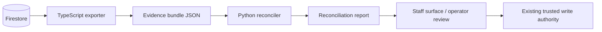

# Architecture Decision: Python as a Read-Only Reconciliation Tier

Last updated: 2026-09-10 15:09:08 CDT

Status: Accepted and implemented as a read-only reconciliation tier. It has no
credential, network, mutation, pricing, approval, or customer-facing authority.
Date: August 21, 2026
Decision owner: QuotePilot owner

## Context

QuotePilot enforces a great deal of commercial correctness at write time.
`functions/paymentLedger.js` refuses a payment whose amount is not the
authoritative quote amount, refuses a second active operation for a payment
kind, and refuses a settled payment without provider evidence.
`functions/pricingEngine.js` refuses to price against an unconfirmed catalog.
`functions/proposalAcceptance.js` freezes an exact `totalsMinor` snapshot at
signature. Those are strong guarantees, and they are all guarantees about a
single write.

The commercial failures an operator actually loses money to are not single-write
failures. They live in the space *between* records that were each individually
valid when written:

- a payment that matched the quote, against a payout that arrived short;
- an accepted promise that never reached the operational plan;
- a margin figure that silently omits a revenue category;
- a customer email that changed the guest count after acceptance;
- labor that overran a cost basis nobody has revisited since the quote.

Nothing in the system currently reads the whole chain at once and asks whether
it agrees with itself. The operator does that reconciliation by hand, in their
head, across a payment processor, a spreadsheet, and their memory of a phone
call.

This work is a poor fit for the existing tiers. It is not a write path, so it
does not belong in a Firebase Function. It is not a presentation concern, so it
does not belong in `src/`. It is batch, numeric, rule-dense, and needs to be
readable by whoever has to defend a number to an accountant.

## Decision

Introduce **Python as a read-only reconciliation tier**, and make the
**Commercial Truth Loop** its first and only capability.

The tier consumes an exported evidence bundle and emits findings. It has no
write path, no network access, no credentials, and no authority. Every
commercial fact in QuotePilot continues to be created and changed only by the
existing TypeScript/JavaScript services.

The arrow from the report back into the product goes through a human and then
through an existing write path. There is no arrow from Python to Firestore, and
adding one is out of scope for this decision.

## Binding decisions

1. **No write path, ever.** The reconciler reads a bundle and writes a report.
   It never holds a Firebase credential, never opens a socket, and never
   mutates a commercial record. Giving Python a write path requires a new ADR,
   not a follow-up commit.
2. **Findings are observations, not authority.** Every finding carries
   `authority: "observation_only"`. A finding is never a reprice, an approval,
   a charge, an acceptance, or a customer-facing statement.
3. **Observation never becomes policy.** The reconciler may report that a payout
   difference matches a *declared* processor fee schedule. It may not infer a
   rate from history and then treat that rate as authorized. Where a rule needs
   a threshold or a rate, that value is declared evidence supplied by the
   operator, carried as `EvidenceStatus.DECLARED`, and named in the finding.
4. **Absent evidence is never a pass.** A rule that cannot reach a verdict
   returns `unverifiable`, which keeps the record outside `fullyReconciled` and
   names the exact evidence node that would close it. A reconciliation rate that
   counted missing data as clean would be worse than no rate at all.
5. **Standard library only.** The package declares no runtime dependencies and
   no test dependencies. The CI gate is `python3 -m unittest`, so it needs no
   install step, no network, no lockfile, and no dependency review. Adding a
   third-party runtime dependency requires an entry in
   `docs/TECH_EXCEPTIONS.md`.
6. **Deterministic by construction.** Money is integer cents; floats are
   rejected at the loader rather than rounded. The evaluation instant is an
   input, not a clock read. Two runs over the same bundle produce byte-identical
   output, which is what makes a finding defensible weeks later.
7. **One typed artifact.** Every result conforms to
   `truthloop-reconciliation-v1`. Narrative prose is a bounded field inside that
   contract, never the protocol.
8. **Evidence is named in the existing vocabulary.** Findings cite the
   `fact.*` / `output.*` / `artifact.*` node ids already defined in
   `functions/commercialDependencyGraphCore.cjs` rather than inventing private
   labels, so a finding traces back to a node the rest of the system knows.
9. **No new CI status context.** The gate runs inside the existing `lane:core`
   job. Protected `main` keeps exactly the same eight named `CI Quality`
   contexts, so this change cannot silently alter branch protection.
10. **The exporter is TypeScript's job.** Producing the evidence bundle is a
    separate, separately reviewed capability that keeps tenant isolation and
    role checks in the tier that already owns them. It lives in `evidence/`
    rather than `functions/` because it owns no callable export; promoting it
    into `functions/` is a later step for whenever a callable does.
11. **Availability is never collapsed.** Evidence the exporter cannot supply is
    classified — `missing`, `not_applicable`, `not_yet_available`,
    `blocked_by_integration`, `contradictory`, `schema_drift` — because those
    are different operator instructions. Only `available` and `not_applicable`
    let a rule reach a verdict.
12. **Unknown schemas are refused, not read.** A source declaring a schema
    version the exporter was not written against is exported as `schema_drift`.
    Reading an unknown shape optimistically is how a reconciler starts
    reporting confident numbers about fields that no longer mean what it
    thinks.

## Options considered

| Option | Benefit | Risk | Decision |
|---|---|---|---|
| Reconcile inside existing Functions | No new language or tier | Mixes batch analysis into request-scoped write authority; every rule becomes a deploy risk against live payment paths | Rejected |
| Reconcile in the browser from client reads | Fast to demo | Cannot see payout evidence, cannot be trusted as a record, and multiplies tenant-read surface | Rejected |
| Python service with Firestore write access | Could self-heal discrepancies | Creates a second authority over commercial truth that is easier to get wrong than the one that exists | Rejected |
| Python read-only reconciliation tier | Batch/numeric work in a tier suited to it, with no new authority | A second language to maintain, and an exporter that must be built before it is useful end to end | **Selected** |
| Do nothing | No new surface | The operator remains the integration layer, and revenue leakage stays invisible | Rejected |

## Consequences

### Positive

- The chain from customer request to realized contribution is checked as a
  whole, by something other than an operator's memory.
- Discrepancies come with an explanation and a named evidence source, so
  "explain this payment" stops being an investigation.
- The reconciliation rate is honest, because unverifiable records are counted
  as unreconciled.
- Historical runs are reproducible, which is what later predictive work needs
  as a foundation.
- The tier can be deleted without touching a single commercial write path.

### Negative

- QuotePilot now has two languages, two test runners, and two sets of
  contributor instructions.
- The loop produces no operator value until the TypeScript exporter exists;
  until then its evidence comes from fixtures and tests.
- Findings can be wrong in a new way: a rule may be right about the evidence and
  wrong about the business, and an operator may over-trust a confident
  narrative.
- Rules encode business judgement (what counts as an overrun, which categories
  belong in margin) that will need revisiting per organization.

## Kill criteria

Remove or disable the tier if any of these are observed:

- a finding is presented to a customer, or is used as a repricing authority;
- the package acquires a write path, a credential, or network access;
- a rule or producer back-solves a rate or threshold from history and then
  applies it as policy;
- the payout producer emits settlement evidence before the Connect program
  authorizes it, or any producer fabricates evidence to make a record
  reconcile;
- an availability state is collapsed into null, or a blocking state is treated
  as resolving;
- `unverifiable` is folded into `explained` to improve the reconciliation rate;
- the reconciler and the TypeScript authorities disagree about a number and the
  reconciler is treated as correct.

## What this decision does not claim

Passing the Python gate is local test evidence. It is not an exporter, not a
staff surface, not hosted verification, not provider evidence, not a production
deployment, and not human acceptance. No commercial record is reconciled in
production until the exporter ships and an operator reviews the output.

## Related

- Rule catalog and evidence contract: `docs/COMMERCIAL_TRUTH_LOOP_DESIGN.md`
- Bounded-authority precedent: `docs/STEWARD_ADR.md`
- Evidence node vocabulary: `docs/COMMERCIAL_DEPENDENCY_GRAPH_ADR.md`
- Payment rails and provider evidence: `docs/STRIPE_CONNECT_PROGRAM.md`
