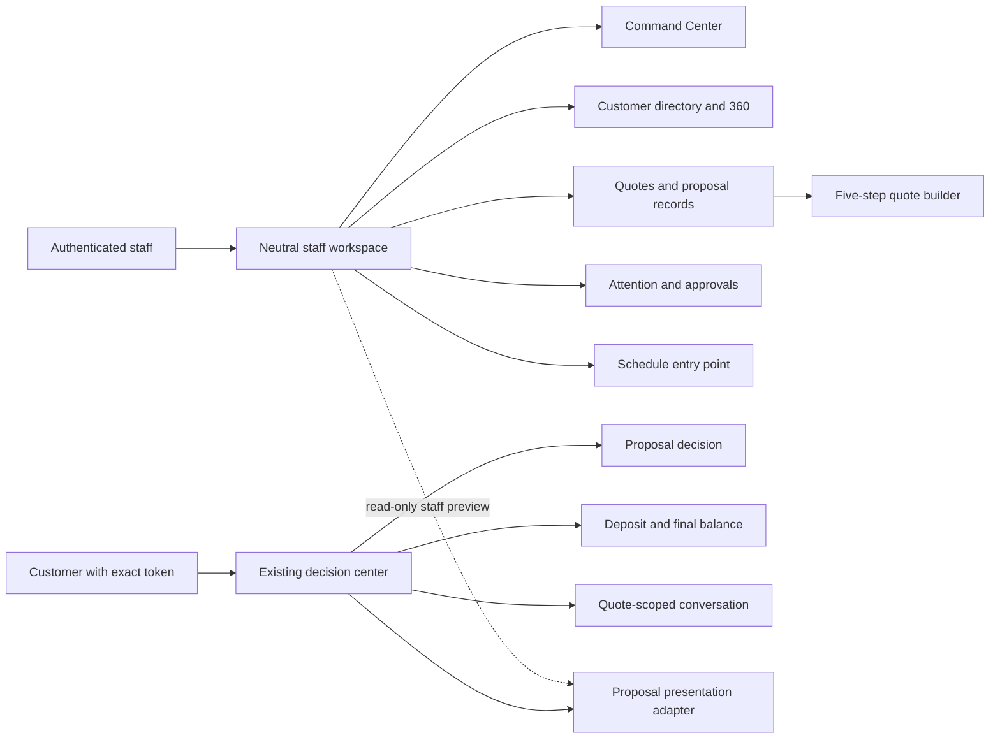
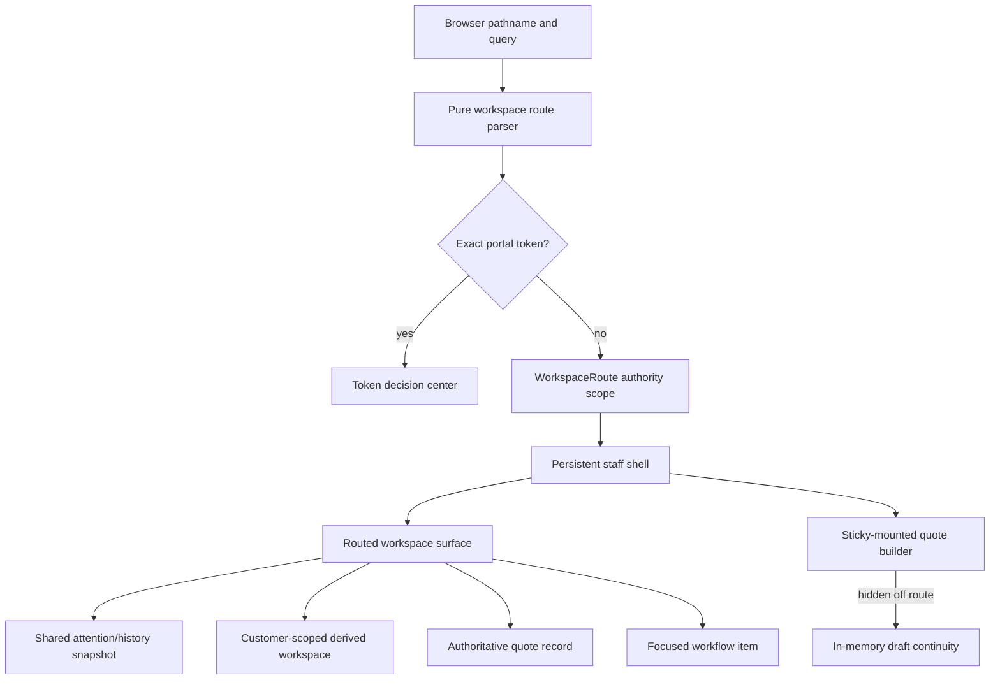
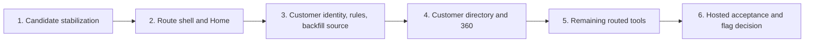

# Customer-Centered Workspace Plan

Status: accepted product and architecture direction. Current qualification and
release evidence lives in `PROJECT_STATUS.md`; remaining rollout work lives in
`DEV_TASKS.md`. This document defines contracts, sequence, and the scope boundary
of named source tranches. A tranche described here as present or source-complete
identifies the accepted implementation boundary only; it is not mutable test,
deployment, provider, production-data, flag-promotion, or human-acceptance
evidence.

Last updated: August 9, 2026

## Product direction

QuotePilot is evolving from a five-step quote wizard surrounded by modal tools
into a customer-centered quote-to-booking workspace. The quote builder remains
the trusted place to create and revise commercial scope, but it becomes one
focused capability within a staff operating system organized around customers,
quotes, attention, events, and money.

The existing token-based customer decision center remains the sole
customer-facing experience in this program. It already owns proposal scope,
pricing, acceptance, requested changes, typed-signature evidence, deposit and
final-balance states, and quote-scoped conversation. This pivot extends that
decision center through better internal context; it does not replace it with a
generic account portal.

## Outcomes

The first release must let an authenticated staff member:

1. Land in a Commercial Command Center at `/app`.
2. Move among Home, Customers, Quotes, Workflow, and Schedule through persistent
   neutral staff navigation.
3. Find a customer by stable, same-tenant identity and open a Customer 360.
4. Follow the customer's active quotes, proposal versions, events, payment
   states, conversations, and next safe staff action without weakening the
   authority of the underlying quote records.
5. Enter, leave, and resume the quote builder without losing an in-memory draft
   during ordinary navigation or browser Back/Forward.

Success is a source behavior only until the required local checks pass. It is
not production-ready until an exact revision also passes hosted deep-link,
signed-in staff, portal-isolation, and human acceptance gates.

## Scope boundary

The following are not part of this release:

- persistent authenticated customer accounts;
- Stripe Connect or tenant merchant onboarding;
- customer-wide mutable conversation threads;
- first-class structured change-request records;
- a persisted customer `commercialSummary` cache;
- production customer-ID backfill, merge, deployment, or feature-flag removal.

## Route contract

| Route | Surface | Program tranche |
|---|---|---|
| `/app` | Commercial Command Center | First release |
| `/app/customers` | Paginated customer directory | First release |
| `/app/customers/:customerId` | Internal Customer 360 | First release |
| `/app/quotes` | Quotes workspace | First release |
| `/app/quotes/new` | Existing five-step builder | First release |
| `/app/quotes/:quoteId` | Focused quote/proposal record | First release |
| `/app/quotes/:quoteId/edit` | Existing trusted edit flow | First release |
| `/app/workflow` | Attention, follow-ups, and approvals | First release |
| `/app/schedule` | Scheduling workspace | Operational extraction |
| `/app/reporting` | Reporting workspace | Operational extraction |
| `/app/catalog` | Catalog administration | Administrative extraction |
| `/app/imports` | Import Studio | Administrative extraction |
| `/app/integrations` | Integration operations | Administrative extraction |
| `/app/diagnostics` | Diagnostics | Administrative extraction |

Route invariants:

- `?portal=<token>` takes precedence on every pathname. Canonical portal links
  remain `/app?portal=...`.
- `/app/home` replaces to `/app` rather than creating another history entry.
- An unknown `/app/*` path renders an authenticated 404 inside the staff shell.
- Customer and quote identifiers are opaque URL-encoded IDs. Customer names,
  email addresses, quote contents, and draft contents never enter URLs, History
  state, persisted search state, or route/draft-continuity storage. The existing
  explicitly browser-local fallback may retain its local quote records; routed
  draft continuity remains in memory and introduces no additional persistence.
- Route changes use the browser History API. No routing dependency is added.
- The existing workspace authority boundary remains mounted across path
  changes. A UID, role, tenant, organization, platform-authority, or host change
  must still remount the scoped workspace.

## Workspace architecture

The route layer consists of a pure route table/parser, path builders, a browser
location hook, and a navigation context backed by `pushState`, `replaceState`,
and `popstate`. Route parsing and path construction are unit-testable without a
browser.

The quote builder stays mounted and is visually hidden when another staff route
is active. Ordinary navigation and Back/Forward therefore preserve its current
in-memory draft. `/app/quotes/new` resumes that draft. The explicit **New Quote**
action retains the existing discard confirmation and resets only after the
operator confirms. A dirty draft installs a `beforeunload` warning; it is never
serialized into a URL or storage.

Route state is the navigation authority in the flagged shell. Quote History,
Sales Workflow, Schedule, Reporting, Catalog, Imports, Integrations, and
Diagnostics expose reusable embedded view bodies while retaining their existing
dialog wrappers for contextual or flag-off/legacy callers. Embedded views use
region semantics and route activation focus; dialog focus trapping, Escape,
scroll lock, and trigger restoration apply only to the modal presentation. A
separate boolean does not compete with the active route.

## Command Center contract

The Command Center reuses the existing workflow-attention and quote-history
contracts. It introduces no new read contracts or data sources. It may change
how those existing reads are coordinated, bounded, cached, and presented.

The Home surface must:

- start in a real loading state rather than briefly showing an empty result;
- ignore stale request generations after tenant, auth, or route changes;
- share one attention/history snapshot with the header badge;
- pass quote ID, attention type, and request ID when opening Workflow so the
  exact row can be focused;
- keep quote lifecycle, proposal acceptance, booking, deposit, final balance,
  and operational readiness semantically distinct even when they share a
  visual status family;
- let a customer name open Customer 360 when `customerId` is present, while
  quote and payment actions open the authoritative quote record.

Lazy-load failures must remain recoverable without destroying the staff shell or
an in-memory quote draft.

## Stable customer identity

`organizations/{organizationId}/customers/{customerId}` is the same-tenant
customer identity. New quote-projected customers receive a generated opaque ID;
new canonical quotes and every immutable quote version store the server-owned
`customerId`. A private
`organizations/{organizationId}/customerEmailClaims/{normalizedEmailHash}`
record serializes normalized-email ownership for trusted quote and import
transactions. Browsers cannot read or write that claim collection. Neither the
customer ID nor its email claim is exposed through the public portal projection.

### Trusted write behavior

| Operation | Required identity behavior |
|---|---|
| Create | Resolve a same-tenant email claim/customer or create a generated opaque customer plus its claim inside the trusted quote transaction, then write the ID to the quote and first version atomically. |
| Duplicate | Resolve or create the duplicate's same-tenant customer and email claim inside the trusted transaction; do not inherit an unrelated identity accidentally. |
| Edit | Retain the quote's existing `customerId`; update that customer projection and its trusted email claim when contact details change. |
| Edit collision | Reject a normalized email claimed by or recorded on a different customer in the organization; never silently reassign the quote. |
| Legacy quote | Leave unbound until the guarded backfill can prove a unique same-tenant match. |

Customer records add server-owned normalized search fields suitable for a
bounded, paginated staff directory. The source page contract caps returned rows
at 100 and reads one sentinel; Firestore rules require same-tenant staff and an
explicit query limit no greater than 101. Exact field names and query/index
details belong to the backend contract in
`docs/CUSTOMER_WORKSPACE_BACKEND_HANDOFF.md`.

### Legacy backfill

The backfill is dry-run first and reports, without writing:

- uniquely matched normalized-email bindings;
- duplicate customer matches;
- missing or invalid identities;
- already-bound records and conflicting bindings.

Apply mode is limited to an explicit emulator target in this program. Any
production apply requires a separate authorization, exact project and tenant
scope, a reviewed dry-run artifact, an explicit confirmation token, and its own
release record. A backfill must not invent customer identity, payment evidence,
delivery evidence, or historical portal acceptance. The current customer-ID
backfill also does not create or repair private email claims; legacy
identity/claim normalization remains a separately reviewed data operation.

## Internal Customer 360

Customer 360 is staff-only and derives its commercial summary from bounded
customer-scoped quote reads. V1 deliberately does not persist a
`commercialSummary` cache: payment webhooks, booking changes, expiry, deletion,
and workflow mutations occur outside quote create/edit and would make a
write-time cache drift.

The staff DTO/read helper returns:

- customer identity and safe contact projection;
- up to 25 current quote summaries and up to the 10 most-recent immutable
  proposal versions for each displayed quote, with explicit truncation metadata;
- accepted or booked events plus Schedule and BEO entry points;
- current attention and the next safe staff action;
- deposit and final-balance states, never presented as accounting revenue;
- server-owned quote-scoped conversation count/latest-actor summaries when
  available, entry points, and recent activity.

The detail surface has Overview, Quotes & Proposals, Events, Money, and
Conversations sections. Conversation records remain bound to their quote.
Customer 360 aggregates links and bounded summaries; it does not copy message
bodies or merge histories into a customer-wide thread. A legacy quote without a
server-owned conversation summary reports that limitation and links staff to the
authoritative quote conversation.

A staff proposal preview uses a read-only presentation adapter over canonical
staff data. It must never invoke the public portal loader, consume a portal
token, or establish customer `viewed` evidence.

## Authority model

| Principal | Canonical quote | Customer record | Portal projection | Customer conversation |
|---|---|---|---|---|
| Unauthenticated without token | Denied | Denied | Denied | Denied |
| Exact valid portal token | Denied | Denied | Exact customer-safe projection only | Exact quote/current issuance through trusted callable |
| Authenticated but unassigned | Denied | Denied | No added grant | Denied |
| Same-tenant staff | Role-gated read/write through existing trusted paths | Role-gated read | Staff tooling only | Quote-scoped trusted callable |
| Cross-tenant principal | Denied | Denied | Denied | Denied |

Canonical organization quote documents become staff-readable only. The legacy
verified-email customer read grant is retired. Browser self-creation of a
`customer` role document is removed; server bootstrap remains authoritative.
Exact-token portal reads, expiry/rotation, proposal acceptance, signed payment
truth, and quote conversation behavior are preserved.

## Visual and branding boundary

The persistent staff shell uses neutral product chrome. Tenant identity remains
visible as contextual data, but marketing, token portal, customer proposal, and
proposal-export branding remain outside that skin. Neutral CSS selectors must
target explicit staff-shell classes rather than generic descendants that could
recolor a proposal preview rendered inside staff tools.

Navigation must remain usable at desktop and mobile widths, by keyboard and
screen reader, with visible focus, safe overflow, sufficient contrast, and
focus restoration across routed/modal transitions.

## Delivery slices

1. **Candidate stabilization:** retain Command Center,
   status semantics, and neutral staff chrome; fix loading, stale generations,
   snapshot sharing, focused navigation, CSS scope, and documentation accuracy.
2. **Route shell and Home:** introduce the native route
   layer, make `/app` the flagged staff landing, preserve portal precedence and
   builder drafts, and add direct-route/404 behavior.
3. **Customer identity and authority:** store stable
   `customerId` atomically, serialize normalized-email ownership in a private
   server-only claim, add rules-bounded directory reads, provide dry-run/emulator
   backfill source, retire legacy email authority, and expand rules coverage.
4. **Customer directory and 360:** provide staff
   directory/detail surfaces, bounded derived commercial/version/conversation
   summaries, exact quote/workflow actions, read-only proposal presentation,
   and quote-scoped conversation entry points.
5. **Remaining routed tools:** expose Schedule, Reporting,
   Catalog, Imports, Integrations, and Diagnostics as embedded lazy routes while
   retaining guarded contextual/legacy modal wrappers.
6. **Hosted acceptance:** enable the temporary shell/default-landing build flag
   only for the reviewed target; verify deep links, signed-in staff behavior,
   portal precedence, and branding isolation before considering flag removal.

## Second-evaluation enhancement track

The source/local screenshot evaluation originally found four visible gaps that
should not be mistaken for hosted or human acceptance: the desktop header could
wrap under real command density, embedded routes inherited modal-derived
**Close** language, several operational values retained raw enum/date formatting,
and data freshness and evidence provenance were too quiet. Current source has
locally addressed header containment, route-appropriate return language,
primary-route heading focus, first-release staff formatting, and a Home-scoped
read-context rail; hosted keyboard, long-data overflow, contrast, branding, and
human acceptance remain open. The original ten-item design track addresses those
findings; three
revenue-and-retention extensions, one ongoing productization gate, and one
high-priority platform primitive deepen the same customer-centered model
without reopening the customer/account or commercial-authority boundary.

### Pre-host release-candidate work

- **CWF-01 — Responsive command shell and route-language/human-format
  refinement.** Preserve the locally contained desktop action row, usable
  primary navigation hierarchy, route-appropriate embedded return language, and
  unchanged **Close** wording for true modal wrappers. Finish humanizing raw
  statuses, identifiers, dates, money, and empty values without changing their
  canonical values, then verify desktop/mobile keyboard order, focus, overflow,
  contrast, and no customer/proposal-brand leakage on the hosted candidate.
- **CWF-03 — Trust, freshness, and evidence rail.** Add a compact, consistent
  staff-only rail that names tenant scope, source/read contract, last successful
  refresh, loading/stale/error/truncation state, and whether a displayed fact is
  canonical evidence or derived presentation. Its first slice is surface-scoped
  and read-only over canonical staff records and server-owned receipts; it must
  remain constrained by the signed-in role's existing read contracts and
  never call the public portal loader or establish customer `viewed` evidence.
  It must not imply provider acceptance, payment, booking, delivery, or customer
  activity from freshness alone, and it introduces no write authority. A global
  cross-surface evidence ledger is a separate program.

### Platform primitive — highest-priority new program

- The accepted `docs/COMMERCIAL_DEPENDENCY_GRAPH_ADR.md` governs the pure CWF-15A
  foundation: registry ownership/evolution, canonical serialization/hashing,
  browser/server parity, traversal, cycle rejection, and proof boundaries. The
  graph may consume server-authoritative pricing outputs but never calculates
  prices, persists evidence, or mutates a record.
- `docs/COMMERCIAL_CHANGE_AUTHORITY_ADR.md`, its UI specification, design, and
  work plan now govern the separately implemented source/local authority:
  exact-revision simulation, authorization, atomic apply/invalidation, trusted
  Kitchen BEO receipts/freshness/download, dependency reconciliation, and
  Decision Debt. Source presence does not promote its default-off enforcement
  gates or prove deployment/hosted acceptance.
- **CWF-15 — Commercial Dependency Graph, change blast radius, artifact
  freshness, and decision debt (high).** Introduce a versioned, deterministic
  dependency registry for authoritative commercial facts and the outputs they
  govern. Initial source nodes include guest count, event date/time, venue,
  accepted revision, menu, add-ons, rentals, staffing, and dietary constraints;
  dependent nodes include authoritative totals, deposit/final-balance scope,
  contracts, BEOs, staffing/food/rental plans, production plans, and the
  customer decision-center projection. The registry and evaluator are a
  platform contract, not a dashboard, AI model, or second pricing engine.

  A trusted quote change must be able to produce a read-only simulation of the
  exact before/after facts, deterministically traverse affected dependencies,
  show financial and operational deltas, identify invalidated checks/artifacts,
  and answer whether publication is safe. The mutation sequence is explicit:
  simulate consequences, authorize the named revision change, atomically record
  dependency invalidations and audit evidence, reconcile required outputs, then
  intentionally publish. Simulation never mutates an accepted immutable
  revision, contract, payment/provider evidence, portal decision, or generated
  artifact, and stale dependents never silently regenerate or republish.

  CWF-15A retains a schema-versioned Kitchen BEO dependency fingerprint over
  only declared normalized inputs. The original browser download remains
  provenance only. The current source separately adds trusted server BEO
  generation: canonical reread/recheck, bounded PDF bytes, immutable receipt,
  actor/server time, exact current and prior-receipt download, and
  `CURRENT`/`STALE`/`REVIEW`/`NOT_GENERATED`/`UNKNOWN` classification. Currentness
  follows the current-artifact pointer to the exact immutable receipt, validates
  its retained bytes with strict base64 plus exact stored length/SHA-256, and
  requires no qualifying open invalidation; a
  hash alone still proves only declared-input equivalence, not publication,
  delivery, customer acceptance, booking, payment, or completion.

  Decision Debt is a deterministic Attention ranking derived from unresolved
  dependency nodes, tenant-local event proximity, bounded commercial exposure,
  dependency weight, and reversibility. Tenant-configurable lock windows for
  guests, menu, rentals, staffing, and BEO finalization require validated,
  versioned organization settings and explicit defaults. The score explains
  its factors and affected decisions; it is neither predictive AI nor proof
  that a customer, provider, or staff member took an action. Current source
  derives it only from persisted unresolved dependency state and exposes the
  deterministic factors/bounds in Workflow. Tenant admins edit the versioned
  lock policy beside that snapshot; non-admin staff remain read-only.

  Delivery remains intentionally sliced. **CWF-15A is source-complete** with the pure
  versioned registry/evaluator, browser/Node parity fixtures, and a visible BEO
  dependency fingerprint plus exact source and proof-boundary metadata. It does
  not itself change quote-write behavior or claim retained freshness.

  **CWF-15B-a — generation authority is present in source.** The server reloads
  canonical same-tenant data, binds artifact/quote/revision/schema/fingerprint/
  actor/time/byte evidence, stores immutable receipt/PDF bytes, and supports
  exact current or prior receipt download. Replays and final responses validate
  strict base64 and exact stored byte length/SHA-256 before returning retained
  evidence. Browser-supplied digest, source
  revision, actor, time, payload, or bytes never become receipt truth.

  **CWF-15B-b — Change Impact simulation is present in source.** It uses the
  existing trusted pricing boundary, exact saved/proposed snapshots, catalog
  fencing, deterministic graph effects, and immutable simulation evidence. A
  simulation remains read-only and cannot itself save or invalidate anything.

  **CWF-15C source authority is present but dormant by default.** Sales may
  request and tenant admins may grant exact authorization; the trusted edit
  transaction atomically writes quote/version/apply/invalidation evidence;
  staff may reconcile only named open dependencies; BEO generation may resolve
  only qualifying BEO invalidations; and Workflow exposes Decision Debt. The
  derived `safeToPublish` result remains eligibility only—no automatic publish
  action exists. A dedicated exact read/reconcile contract for a transport-
  ambiguous governed apply outcome remains open and is required before either
  gate may be enabled. `COMMERCIAL_CHANGE_AUTHORITY_ENABLED` and the trusted tenant
  gate must both remain off until separately authorized hosted acceptance.

### First follow-on

- **CWF-02 — Universal commercial search and command palette.** Provide one
  keyboard-accessible entry point whose first slice federates bounded,
  same-tenant Customer and Quote directory reads. Broader proposal/event search
  requires a dedicated bounded backend read model with tenant-bound cursors,
  caps, opaque IDs, and visible truncation. Search text and customer content
  remain transient in memory—never URLs or browser storage—and search must never
  expose portal tokens, `customerEmailClaims`, message bodies, private payment
  records, raw analytics, or admin-only data. Commands navigate or enter an
  existing guarded action; they do not bypass role, confirmation, approval, or
  provider-evidence checks.
- **CWF-04 — Customer relationship briefing header.** Give Customer 360 a
  concise briefing for identity, next event, active commercial records, current
  attention, latest bounded activity, freshness, and next safe staff action.
  Every value remains derived from the customer-scoped DTO; the header is not a
  persisted rollup, generic customer account, or mutable customer profile hub.
  Mutable notes, tags, ownership, health scores, or cached customer summaries
  require a separate CRM/customer-record authority program.
- **CWF-05 — Evidence-safe customer timeline.** Present quote versions,
  provider acceptance, provider-reported delivery or bounce, recipient view,
  customer portal decisions, booking, payment, and quote-scoped conversation
  milestones in one bounded chronological view with source and truncation labels.
  Keep those delivery milestones distinct. Do not merge message bodies, infer
  missing milestones, manufacture historical evidence, or convert a browser
  return into payment truth.
- **CWF-06 — Proposal readiness and version-change intelligence.** Explain
  readiness blockers and compare authoritative immutable versions using
  human-readable scope, pricing, schedule, and terms changes. Intelligence is
  advisory, deterministic, and read-only: historical versions are never
  recalculated or mutated in the browser, server-authoritative pricing remains
  the calculation boundary, staff must intentionally save/send a new revision,
  and customer input never supplies price or total authority. AI scoring or
  persisted recommendations require a separate privacy/model-governance track.
- **CWF-07 — Workflow ownership, due/SLA cues, and completion receipts.** Add
  derived aging and due/overdue cues first, plus a bounded receipt for an
  internally completed attention item. Persisted owners, assignees, SLA clocks,
  escalation, and handoffs require server-side assignment validation and a safe
  staff-directory contract; sales roles must not enumerate `userRoles`.
  Provider notifications remain a separate delivery program. A receipt proves
  only the named trusted workflow action; it does not prove customer contact,
  provider delivery, quote revision, acceptance, payment, booking, or resolution
  of a later request.

### Later follow-on

- **CWF-08 — Event run-of-show schedule.** Extend Schedule with a bounded
  generated read-only event-day sequence derived from canonical event, booking,
  staffing, production-checklist, and BEO references. Collaborative tasks,
  dependencies, rosters, resources, vendors, and portal-visible timing require
  a separate versioned and audited event-operations model. Run-of-show
  completion remains an operational planning fact—not inventory availability,
  staff attendance, customer acceptance, payment, or booking evidence.
- **CWF-09 — Proof-safe commercial intelligence studio.** Provide drillable
  pipeline, conversion, cycle-time, customer/event cohort, quote-change, and
  verified payment-state analysis with visible scope, freshness, denominator,
  and truncation. Accepted/booked quote value and verified money received remain
  separate; neither is labeled accounting revenue, and no dashboard metric may
  become commercial write authority. UI refinement may reuse only explicitly
  bounded current metrics; establishing those bounds is a prerequisite where a
  read remains unbounded. Substantive expansion must use tenant-bounded server
  aggregates rather than unbounded browser history. Accounting, reconciliation,
  tax, refunds, and disputes remain separate decision tracks.
- **CWF-10 — Reduced-motion-aware signature interaction and recovery polish.**
  Refine the existing exact-token decision center's typed-signature review,
  consent, loading, stale-revision, retry, success, and focus-return states with
  reduced-motion behavior. This evolves the existing decision center rather
  than creating a generic portal or persistent account; the trusted callable
  remains acceptance authority, and customer input cannot mutate proposal scope,
  prices, totals, payment truth, or booking state. Recovery must reuse existing
  idempotency/reconciliation behavior and must never auto-retry a non-idempotent
  provider operation.

### Revenue, retention, and productization extensions

- **CWF-11 — Rebooking radar and post-event closeout (medium).** One week after
  a booked event, create a bounded staff closeout sequence for internal review,
  a tenant-branded thank-you/review opportunity, and unresolved operational
  follow-up. Add anniversary attention such as a same-week-last-year repeat-event
  cue. The first source tranche now exposes those bounded cues in Customer 360
  and lets staff create one deterministic rebook draft only when the booked
  source, acceptance receipt, stable customer, and retained accepted immutable
  version still match. It overlays current customer contact, uses the current
  catalog with server-authoritative repricing, and records source provenance.
  Delivery remains blocked until staff saves a new current-or-future event date
  later than the source event; creating the draft starts no customer message,
  decision, booking, or payment. The next source tranche now atomically creates
  one deterministic private closeout record during an eligible governed booking,
  bound to the stable customer, exact accepted immutable version, and verified
  private acceptance snapshot. Legacy sources remain bookable with a visible
  source-review block instead of manufactured authority. The record becomes due
  seven tenant-calendar days after the event, records a safe configuration block
  when the tenant time zone is missing, projects bounded state to Customer 360
  and Workflow, uses a separate exact configuration-refresh receipt, and uses
  idempotent callable-owned receipts for four explicit
  internal review/reopen actions. Those receipts prove internal review only.
  The source/local Revenue Autopilot tranche now provides one separately gated
  post-event review-request occurrence from an exact completed closeout,
  accepted revision, stable customer, strict template, public HTTPS review URL,
  consent/subscription, quiet hours, provider readiness, idempotency, bounded
  retry, unsubscribe, and suppression controls. Reopening or invalidating the
  closeout self-stops the occurrence; portal expiry alone does not erase valid
  completed-closeout authority. Runtime and outbound sends still default off,
  so this is not provider, delivery, review-posted, lead, booking, payment,
  recovered-revenue, or production evidence.
- **CWF-12 — Revenue autopilot, email follow-ups, and payment dunning (medium).**
  Add scheduled tenant-branded email policies and Attention escalation on proven
  server/provider boundaries: quote reminders stop on exact portal view,
  acceptance, or decline; deposit reminders require acceptance and stop only on
  webhook-authoritative payment; final-balance reminders use tenant-local
  event-minus-14/7/3-day rules and stop on the matching settled rail; and a
  customer reply becomes unacknowledged only through the exact latest message
  and is resolved by an explicit trusted acknowledgement, never by inference
  from message order. The read-only Workflow preview remains as advisory
  explanation. A separate source/local operations tranche now adds versioned
  tenant policy/templates, customer consent/subscription, public unsubscribe,
  stable idempotent jobs, bounded quiet-hour retry/dispatch leases, exact
  provider-outcome reconciliation, unread-reply Attention, a 15-minute bounded
  scheduler, and signed Resend delivered/bounced/complained handling. Staff see
  bounded operations in Workflow and controls in Customer 360. Runtime and sends
  are independently default-off, the webhook uses `standardwebhooks@1.0.0` with
  only its Secret Manager webhook secret, and no provider/deployment/production/
  human evidence is inferred. Any recovered-value claim remains deferred and
  must keep booked value, verified money received, temporal association, and
  accounting revenue separate.
- **CWF-13 — Customer 360 activation and CRM-grade relationship intelligence
  (medium).** Make the internal customer workspace the default answer to "show
  me everything about this customer": bounded quotes and immutable proposals,
  events, verified payment states, quote-scoped conversation summaries, repeat
  patterns, and next safe actions. The first source tranche now derives a
  visible commercial-measures panel directly from the bounded Customer 360 DTO:
  quoted value, exact-state accepted and booked value, source-bounded deposit
  and final-balance amounts, and recorded repeat-event evidence. Payment values
  are promoted as provider-confirmed only for an exclusively Firebase-backed
  DTO with the matching paid state and a valid provider confirmation timestamp;
  browser-local, mixed, and unknown-source fields fail closed as unavailable.
  Every result exposes its denominator and missing trusted-evidence count.
  `Lifetime` is permitted only when the bounded customer quote read explicitly
  reports complete; otherwise the UI says `Displayed-record`. These are
  read-only operational measures, never accounting revenue, cash reconciliation,
  forecasts, or a persisted rollup. This extends the stable customer read model
  and Customer 360 contract rather than creating a second customer identity,
  persisted `commercialSummary`, generic external account, or customer-wide
  mutable conversation. Hosted activation and legacy normalization remain
  release gates, not facts inferred from source presence.
- **CWF-14 — No-orphan-capability productization gate (ongoing).** Treat an
  operator- or customer-relevant backend capability as incomplete until its
  intended audience has a discoverable, role/feature-safe entry point and a
  polished surface for loading, empty, success, stale, partial/truncated, error,
  retry/reconciliation, and receipt states as applicable. Require human-readable
  language, responsive containment, keyboard/focus and accessibility coverage,
  branded staff/customer isolation, user-manual guidance, and component/browser
  evidence. Trace each contract in the Feature Matrix from backend authority to
  frontend surface, tests, and docs. Pure security primitives, private claims,
  secrets, raw provider data, and internal ledgers remain hidden; expose only the
  safe operational outcome or attention state users actually need. Enforce this
  contract mechanically in `lane:core` through the versioned capability-
  surfacing manifest, exact backend export ownership, and real entry/test/doc
  locators. Bind every claimed UI state to an assertion-bearing, always-on
  component test through a canonical `data-capability-state` marker; list
  shared-helper affected exports explicitly, and do not allow callable exports
  to use a headless classification. Treat the gate as structural traceability,
  not an inferred semantic call graph or visual/hosted acceptance; prose review
  alone is insufficient.

Cross-track invariants remain absolute: no customer or quote content in URLs,
History state, persisted search state, or route/draft-continuity storage; the
supported explicitly browser-local fallback remains a separate local mode and
never establishes canonical or provider evidence. Do not create a generic
authenticated customer portal, make accounting-revenue claims, accept customer-
supplied pricing authority, weaken exact-token or tenant boundaries, or infer
hosted/provider/production/human evidence from source, tests, screenshots,
animation, or presentation copy.

## Verification and evidence gates

Required source/local evidence includes:

- unit coverage for route parsing/building, status semantics, Customer 360
  derivation, customer collision/backfill behavior, and stale snapshot guards;
- component/browser coverage for direct loads, Back/Forward, dirty-draft
  survival, explicit discard, exact Home focus, mobile navigation, lazy
  recovery, authenticated 404, and portal precedence;
- Firebase unit/emulator coverage for transaction atomicity, edit collision,
  cross-tenant denial, canonical-customer denial, portal-token continuity, and
  legacy backfill conflicts;
- visual/accessibility checks for staff chrome, proposal/portal isolation,
  keyboard flow, focus, overflow, and contrast;
- `npm run check:env`, focused and full unit suites, relevant Firestore/emulator
  lanes, authoritative-pricing coverage when quote writes change,
  `npm run build`, bundle guard, Playwright, documentation governance, secret
  scan, and `git diff --check`.
- a no-orphan-capability review mapping each new user-relevant backend contract
  to its audience, entry point, role/feature gate, complete UI state model,
  frontend tests, and operating documentation, with explicit justification for
  intentionally headless security/infrastructure primitives.

Evidence remains layered:

1. Source present.
2. Local unit/build/browser checks pass.
3. Emulator authority and migration checks pass.
4. Exact hosted candidate deep links and signed-in staff flow pass.
5. Provider evidence, if a provider behavior is in scope.
6. Production promotion.
7. Human acceptance.

No earlier layer implies a later one. Removing the temporary flag and promoting
production are separate, explicitly authorized release actions.

Current qualification evidence and its proof boundary are recorded only in
`PROJECT_STATUS.md`; this plan intentionally does not duplicate mutable counts
or release status.

## Deferred decision tracks

- **Structured change requests:** later callable-only program that must link a
  customer request to an authoritative resulting quote version without letting
  customer input mutate pricing.
- **Stripe Connect:** separate payments architecture decision covering account
  type, merchant-of-record responsibility, onboarding, webhooks, payouts,
  disputes, taxes, and isolation from the existing deposit/final-balance and
  buyer-onboarding rails.
- **Persistent customer accounts:** discovery only until membership, recovery,
  multi-organization access, migration, and coexistence with exact-token portal
  links are specified and approved.
