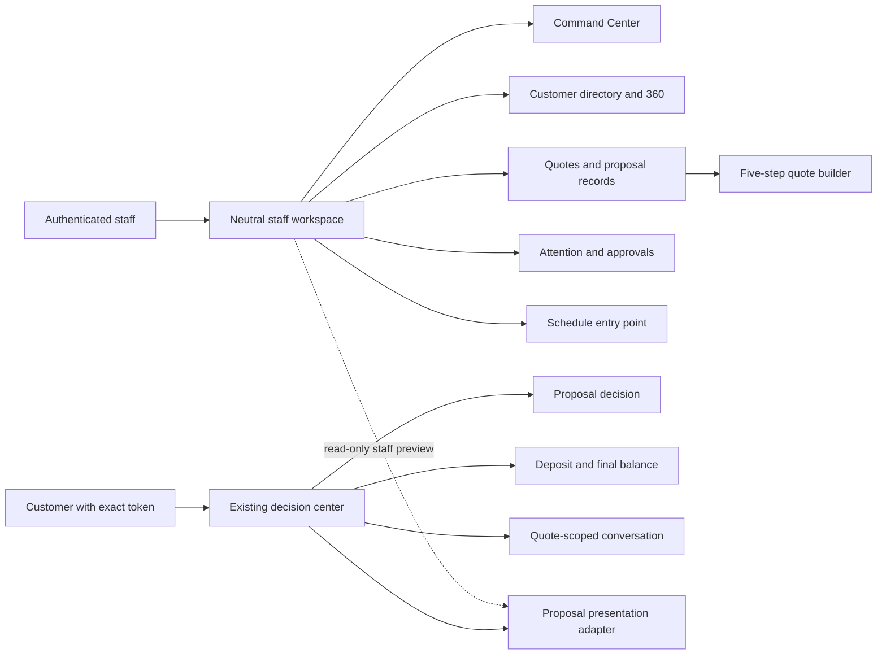
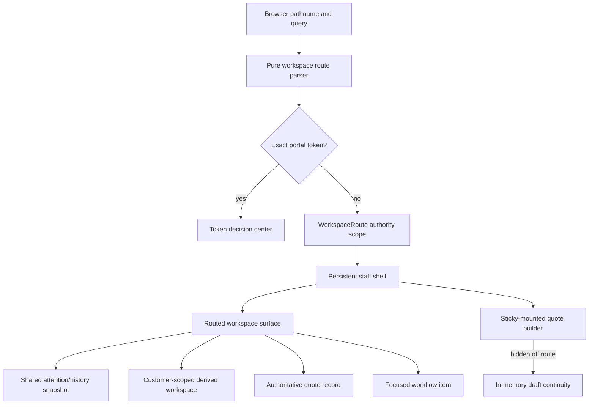
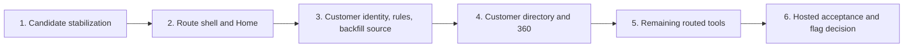

# Customer-Centered Workspace Plan

Status: accepted product and architecture direction. Source delivery is tracked
in `DEV_TASKS.md` and `docs/FEATURE_MATRIX.md`; this document is not evidence of
a merge, deployment, hosted route, provider result, or human acceptance.

Last updated: August 8, 2026

## Product direction

QuotePilot is evolving from a five-step quote wizard surrounded by modal tools
into a customer-centered quote-to-booking workspace. The quote builder remains
the trusted place to create and revise commercial scope, but it becomes one
focused capability within a staff operating system organized around customers,
quotes, attention, events, and money.

The existing token-based customer decision center remains the sole
customer-facing experience in this program. It already owns proposal scope,
pricing, acceptance, requested changes, typed-signature evidence, deposit and
final-balance states, and quote-scoped conversation. This pivot extends that
decision center through better internal context; it does not replace it with a
generic account portal.

## Outcomes

The first release must let an authenticated staff member:

1. Land in a Commercial Command Center at `/app`.
2. Move among Home, Customers, Quotes, Workflow, and Schedule through persistent
   neutral staff navigation.
3. Find a customer by stable, same-tenant identity and open a Customer 360.
4. Follow the customer's active quotes, proposal versions, events, payment
   states, conversations, and next safe staff action without weakening the
   authority of the underlying quote records.
5. Enter, leave, and resume the quote builder without losing an in-memory draft
   during ordinary navigation or browser Back/Forward.

Success is a source behavior only until the required local checks pass. It is
not production-ready until an exact revision also passes hosted deep-link,
signed-in staff, portal-isolation, and human acceptance gates.

## Scope boundary

The following are not part of this release:

- persistent authenticated customer accounts;
- Stripe Connect or tenant merchant onboarding;
- customer-wide mutable conversation threads;
- first-class structured change-request records;
- a persisted customer `commercialSummary` cache;
- production customer-ID backfill, merge, deployment, or feature-flag removal.

## Route contract

| Route | Surface | Delivery |
|---|---|---|
| `/app` | Commercial Command Center | First release; default staff landing |
| `/app/customers` | Paginated customer directory | First release |
| `/app/customers/:customerId` | Internal Customer 360 | First release |
| `/app/quotes` | Quotes workspace | First release |
| `/app/quotes/new` | Existing five-step builder | First release |
| `/app/quotes/:quoteId` | Focused quote/proposal record | First release |
| `/app/quotes/:quoteId/edit` | Existing trusted edit flow | First release |
| `/app/workflow` | Attention, follow-ups, and approvals | First release |
| `/app/schedule` | Scheduling workspace | Follow-on extraction |
| `/app/reporting` | Reporting workspace | Follow-on extraction |
| `/app/catalog` | Catalog administration | Follow-on extraction |
| `/app/imports` | Import Studio | Follow-on extraction |
| `/app/integrations` | Integration operations | Follow-on extraction |
| `/app/diagnostics` | Diagnostics | Follow-on extraction |

Route invariants:

- `?portal=<token>` takes precedence on every pathname. Canonical portal links
  remain `/app?portal=...`.
- `/app/home` replaces to `/app` rather than creating another history entry.
- An unknown `/app/*` path renders an authenticated 404 inside the staff shell.
- Customer and quote identifiers are opaque URL-encoded IDs. Customer names,
  email addresses, quote contents, and draft contents never enter URLs or
  browser storage.
- Route changes use the browser History API. No routing dependency is added.
- The existing workspace authority boundary remains mounted across path
  changes. A UID, role, tenant, organization, platform-authority, or host change
  must still remount the scoped workspace.

## Workspace architecture

The route layer consists of a pure route table/parser, path builders, a browser
location hook, and a navigation context backed by `pushState`, `replaceState`,
and `popstate`. Route parsing and path construction are unit-testable without a
browser.

The quote builder stays mounted and is visually hidden when another staff route
is active. Ordinary navigation and Back/Forward therefore preserve its current
in-memory draft. `/app/quotes/new` resumes that draft. The explicit **New Quote**
action retains the existing discard confirmation and resets only after the
operator confirms. A dirty draft installs a `beforeunload` warning; it is never
serialized into a URL or storage.

During the modal-to-route transition, route state is the navigation authority.
Reusable Quote History and Sales Workflow view bodies may remain inside their
existing dialog wrappers for legacy callers, but a separate boolean must not
compete with the active route.

## Command Center contract

The Command Center reuses the existing workflow-attention and quote-history
contracts. It introduces no new read contracts or data sources. It may change
how those existing reads are coordinated, bounded, cached, and presented.

The Home surface must:

- start in a real loading state rather than briefly showing an empty result;
- ignore stale request generations after tenant, auth, or route changes;
- share one attention/history snapshot with the header badge;
- pass quote ID, attention type, and request ID when opening Workflow so the
  exact row can be focused;
- keep quote lifecycle, proposal acceptance, booking, deposit, final balance,
  and operational readiness semantically distinct even when they share a
  visual status family;
- let a customer name open Customer 360 when `customerId` is present, while
  quote and payment actions open the authoritative quote record.

Lazy-load failures must remain recoverable without destroying the staff shell or
an in-memory quote draft.

## Stable customer identity

`organizations/{organizationId}/customers/{customerId}` is the same-tenant
customer identity. New canonical quotes and every immutable quote version store
the server-owned `customerId`. The public portal projection does not expose the
field unless a later reviewed contract requires it.

### Trusted write behavior

| Operation | Required identity behavior |
|---|---|
| Create | Resolve or create the same-tenant customer inside the trusted quote transaction, then write its ID to the quote and first version atomically. |
| Duplicate | Resolve or create the duplicate's same-tenant customer inside the trusted transaction; do not inherit an unrelated identity accidentally. |
| Edit | Retain the quote's existing `customerId`; update that customer projection when contact details change. |
| Edit collision | Reject a normalized email that already belongs to a different customer in the organization; never silently reassign the quote. |
| Legacy quote | Leave unbound until the guarded backfill can prove a unique same-tenant match. |

Customer records add server-owned normalized search fields suitable for a
bounded, paginated staff directory. Exact field names and query/index details
belong to the backend contract in
`docs/CUSTOMER_WORKSPACE_BACKEND_HANDOFF.md`.

### Legacy backfill

The backfill is dry-run first and reports, without writing:

- uniquely matched normalized-email bindings;
- duplicate customer matches;
- missing or invalid identities;
- already-bound records and conflicting bindings.

Apply mode is limited to an explicit emulator target in this program. Any
production apply requires a separate authorization, exact project and tenant
scope, a reviewed dry-run artifact, an explicit confirmation token, and its own
release record. A backfill must not invent customer identity, payment evidence,
delivery evidence, or historical portal acceptance.

## Internal Customer 360

Customer 360 is staff-only and derives its commercial summary from bounded
customer-scoped quote reads. V1 deliberately does not persist a
`commercialSummary` cache: payment webhooks, booking changes, expiry, deletion,
and workflow mutations occur outside quote create/edit and would make a
write-time cache drift.

The staff DTO/read helper returns:

- customer identity and safe contact projection;
- active quotes and relevant proposal versions;
- accepted or booked events plus Schedule and BEO entry points;
- current attention and the next safe staff action;
- deposit and final-balance states, never presented as accounting revenue;
- quote-scoped conversation summaries, entry points, and recent activity.

The detail surface has Overview, Quotes & Proposals, Events, Money, and
Conversations sections. Conversation records remain bound to their quote.
Customer 360 aggregates links and summaries; it does not merge histories into
a customer-wide thread.

A staff proposal preview uses a read-only presentation adapter over canonical
staff data. It must never invoke the public portal loader, consume a portal
token, or establish customer `viewed` evidence.

## Authority model

| Principal | Canonical quote | Customer record | Portal projection | Customer conversation |
|---|---|---|---|---|
| Unauthenticated without token | Denied | Denied | Denied | Denied |
| Exact valid portal token | Denied | Denied | Exact customer-safe projection only | Exact quote/current issuance through trusted callable |
| Authenticated but unassigned | Denied | Denied | No added grant | Denied |
| Same-tenant staff | Role-gated read/write through existing trusted paths | Role-gated read | Staff tooling only | Quote-scoped trusted callable |
| Cross-tenant principal | Denied | Denied | Denied | Denied |

Canonical organization quote documents become staff-readable only. The legacy
verified-email customer read grant is retired. Browser self-creation of a
`customer` role document is removed; server bootstrap remains authoritative.
Exact-token portal reads, expiry/rotation, proposal acceptance, signed payment
truth, and quote conversation behavior are preserved.

## Visual and branding boundary

The persistent staff shell uses neutral product chrome. Tenant identity remains
visible as contextual data, but marketing, token portal, customer proposal, and
proposal-export branding remain outside that skin. Neutral CSS selectors must
target explicit staff-shell classes rather than generic descendants that could
recolor a proposal preview rendered inside staff tools.

Navigation must remain usable at desktop and mobile widths, by keyboard and
screen reader, with visible focus, safe overflow, sufficient contrast, and
focus restoration across routed/modal transitions.

## Delivery slices

1. **Candidate stabilization:** retain Command Center, status semantics, and
   neutral staff chrome; fix loading, stale generations, snapshot sharing,
   focused navigation, CSS scope, and documentation accuracy.
2. **Route shell and Home:** introduce the native route layer, make `/app` the
   flagged staff landing, preserve portal precedence and builder drafts, and add
   direct-route/404 behavior.
3. **Customer identity and authority:** store stable `customerId` atomically,
   add bounded directory reads, provide dry-run/emulator backfill source, retire
   legacy email authority, and expand rules coverage.
4. **Customer directory and 360:** ship staff directory/detail surfaces,
   derived commercial summaries, exact quote/workflow actions, read-only
   proposal presentation, and quote-scoped conversation entry points.
5. **Remaining routed tools:** extract Schedule, Reporting, Catalog, Imports,
   Integrations, and Diagnostics in reviewable follow-on slices.
6. **Hosted acceptance:** enable the temporary shell/default-landing build flag
   only for the reviewed target; verify deep links, signed-in staff behavior,
   portal precedence, and branding isolation before considering flag removal.

## Verification and evidence gates

Required source/local evidence includes:

- unit coverage for route parsing/building, status semantics, Customer 360
  derivation, customer collision/backfill behavior, and stale snapshot guards;
- component/browser coverage for direct loads, Back/Forward, dirty-draft
  survival, explicit discard, exact Home focus, mobile navigation, lazy
  recovery, authenticated 404, and portal precedence;
- Firebase unit/emulator coverage for transaction atomicity, edit collision,
  cross-tenant denial, canonical-customer denial, portal-token continuity, and
  legacy backfill conflicts;
- visual/accessibility checks for staff chrome, proposal/portal isolation,
  keyboard flow, focus, overflow, and contrast;
- `npm run check:env`, focused and full unit suites, relevant Firestore/emulator
  lanes, authoritative-pricing coverage when quote writes change,
  `npm run build`, bundle guard, Playwright, documentation governance, secret
  scan, and `git diff --check`.

Evidence remains layered:

1. Source present.
2. Local unit/build/browser checks pass.
3. Emulator authority and migration checks pass.
4. Exact hosted candidate deep links and signed-in staff flow pass.
5. Provider evidence, if a provider behavior is in scope.
6. Production promotion.
7. Human acceptance.

No earlier layer implies a later one. Removing the temporary flag and promoting
production are separate, explicitly authorized release actions.

## Deferred decision tracks

- **Structured change requests:** later callable-only program that must link a
  customer request to an authoritative resulting quote version without letting
  customer input mutate pricing.
- **Stripe Connect:** separate payments architecture decision covering account
  type, merchant-of-record responsibility, onboarding, webhooks, payouts,
  disputes, taxes, and isolation from the existing deposit/final-balance and
  buyer-onboarding rails.
- **Persistent customer accounts:** discovery only until membership, recovery,
  multi-organization access, migration, and coexistence with exact-token portal
  links are specified and approved.
