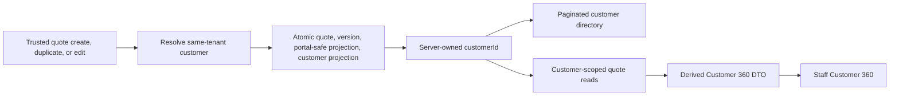

# Customer Workspace Backend Handoff

Status: approved contract for the customer-identity and Customer 360 source
slice. This handoff does not authorize a production backfill, deployment,
Stripe Connect work, or persistent customer accounts.

Last updated: August 8, 2026

North star: [Customer-Centered Workspace Plan](CUSTOMER_CENTERED_WORKSPACE_PLAN.md)

## Objective

Give authenticated same-tenant staff a stable customer identity and a bounded
Customer 360 read model while preserving canonical quote, portal, payment,
booking, and conversation authority.

The sequence is identity first, derived workspace second:



V1 must not persist a `commercialSummary` cache. Quote create/edit is not the
only mutation path for payments, bookings, expiry, deletion, workflow, or
conversation activity, so that cache would become a second, drifting source of
commercial truth.

## Existing seams to preserve

- Canonical quotes live under
  `organizations/{organizationId}/quotes/{quoteId}` with immutable versions
  beneath each quote.
- Trusted quote create, duplicate, and edit already run server-side and write
  the canonical quote, version, and public portal projection together.
- The organization customer projection is server-owned and already reuses
  normalized-email matches without erasing richer imported optional fields.
- Current source routes customer CSV create and rollback through admin-only
  callables so new imports receive stable IDs and server-owned `nameKey` and
  `emailKey` fields. Previously deployed imported-only records still require a
  reviewed normalization/migration before the directory flag is enabled for a
  tenant; source availability is not migration evidence.
- `customerPortalQuotes` is the customer-safe, exact-token projection. List
  reads stay denied. Customer decisions, delivery activation, expiry/rotation,
  payment truth, and quote-scoped conversation retain their existing
  boundaries.
- A staff proposal preview cannot use the public portal loader because only a
  real customer portal visit may establish `viewed` evidence.

Confirm the current implementation locations before editing. Expected seams
include `functions/quoteCreation.js`, trusted callable exports in
`functions/index.js`, `src/lib/quoteStore.js`, `firestore.rules`, and their
focused unit/emulator tests.

## Slice A: stable customer identity

### Persisted contract

Add server-owned `customerId` to:

- every newly created canonical quote;
- every newly created immutable quote version;
- a duplicated quote and its first duplicate version;
- a legacy quote only through the guarded backfill.

Do not add `customerId` to `customerPortalQuotes` or other public customer-safe
projections in this slice.

The customer record keeps its opaque document ID and gains server-owned search
fields. A compatible example is:

```text
organizations/{organizationId}/customers/{customerId}
  customerId
  organizationId
  name
  email
  phone
  company
  normalizedEmail
  normalizedName
  searchPrefixes[]
  lastQuoteId
  lastQuoteNumber
  lastEventName
  lastEventDate
  createdAtISO
  updatedAtISO
```

Exact field naming may follow existing normalization helpers, but the following
properties are required:

- values are normalized by trusted server code, never accepted as browser
  authority;
- search material contains no tenant-external lookup key;
- IDs are treated as opaque and URL-encoded by the frontend;
- blank quote fields do not erase richer imported customer data;
- a directory query is bounded and deterministic.

### Create and duplicate

Inside the existing trusted Firestore transaction:

1. Normalize the submitted contact identity.
2. Resolve a unique same-tenant customer or create one using the existing
   collision-safe identity rule.
3. Write that customer's opaque ID to the canonical quote and version.
4. Update the customer projection without replacing richer optional data with
   blanks.
5. Write the existing customer-safe portal projection without exposing the
   internal ID.

The quote/version/customer writes are one atomic operation. A retry must remain
idempotent and must not create a second identity for the same normalized email.

### Edit

For a quote that already has `customerId`:

1. Load that exact same-tenant customer in the trusted transaction.
2. Retain the existing `customerId` on the quote and new version.
3. If contact fields changed, update that customer projection.
4. Before accepting a changed normalized email, check whether another customer
   owns it in the organization.
5. Reject a collision with a stable conflict error. Never silently bind the
   quote to the other customer.

For a legacy unbound quote, the edit path may resolve a unique same-tenant
identity only if the implementation makes that compatibility behavior explicit
and covers duplicate/missing cases. It must never guess between conflicts.

### Acceptance criteria

- Create and duplicate atomically persist one same-tenant `customerId` on the
  canonical quote and version.
- Edit retains that identity across contact changes.
- An email collision with a different customer fails without partial writes.
- Cross-tenant IDs are rejected even if their contact fields match.
- The public portal projection remains customer-safe and omits `customerId`.
- Existing delivery, proposal-acceptance, pricing, payment, and booking tests do
  not change meaning.

## Slice B: bounded customer directory

Add a staff-only query helper that supports a deterministic page size and an
opaque cursor. The UI contract should accept a normalized search term and must
not download the full tenant customer collection for client-side filtering.

A compatible response shape is:

```text
{
  customers: [{
    customerId,
    name,
    email,
    phone,
    company,
    lastQuoteId,
    lastQuoteNumber,
    lastEventName,
    lastEventDate,
    updatedAtISO
  }],
  nextCursor
}
```

Requirements:

- same-tenant authenticated staff only;
- stable ordering and bounded `limit` with a server-enforced maximum;
- cursor validation that cannot escape the organization;
- no email address in route params;
- a clear empty state and recoverable error state;
- any required composite index lands with source and emulator coverage.

## Slice C: Customer 360 read model

Add a staff-only DTO/read helper that loads the exact customer and bounded quote
records scoped by `customerId`. Derive summaries in the reader from current
canonical data rather than persisting a rollup.

A compatible DTO is:

```text
{
  customer: { customerId, name, email, phone, company, updatedAtISO },
  quotes: [{
    quoteId, quoteNumber, status, eventName, eventDate,
    currentRevisionId, versions[], proposalState,
    bookingState, depositState, finalBalanceState,
    attention[], conversationSummary, recentActivity[]
  }],
  events: [],
  money: {
    deposit: { states and amounts from canonical provider truth },
    finalBalance: { states and amounts from canonical provider truth }
  },
  attention: [],
  nextSafeAction,
  recentActivity: [],
  pageInfo
}
```

DTO rules:

- Proposal accepted, booked, deposit paid, final balance paid, and operational
  readiness remain separate fields.
- Money totals are operational payment-state summaries, not accounting revenue.
- Conversation summaries remain per quote and link to the quote-scoped panel;
  message histories are not merged.
- BEO and Schedule entry points are references/actions, not new copies of event
  truth.
- Recent activity is bounded and derived from records the staff principal may
  already read.
- A next action is a presentation decision over existing safe actions; it does
  not create new write authority.

The staff proposal preview uses a read-only presentation adapter over canonical
quote/version data. It must not call the token portal loader, write portal
activity, rotate a token, or establish `viewed`.

### Acceptance criteria

- Same-tenant staff can load one customer's identity, quote/proposal history,
  events, payment states, attention, conversation links, and recent activity.
- Cross-tenant and unassigned principals cannot enumerate or load a customer.
- Pagination prevents an unbounded organization quote scan.
- A missing/deleted customer and a customer with no quotes have distinct,
  recoverable states.
- Previewing a proposal as staff leaves portal `viewed` evidence unchanged.

## Slice D: legacy backfill source

Provide a dry-run-first operator script. It requires an explicit project and
organization and reports deterministic JSON/text totals for:

- already bound and valid;
- unique normalized-email match and would bind;
- missing customer match;
- duplicate customer matches;
- existing conflicting `customerId`;
- invalid/missing quote email;
- quote versions that would receive the binding.

Dry run is the default and performs no writes. Apply mode in this program is
restricted to Firebase emulators and requires an exact printed confirmation
token. Tests must prove that partial quote/version binding is rolled back on an
error.

Production apply is outside scope. It needs separate authorization, a reviewed
dry-run artifact, exact project/organization targeting, a production-specific
confirmation contract, and a release/audit record. Neither dry run nor apply
may create delivery, viewed, acceptance, booking, or payment evidence.

## Slice E: legacy authority retirement

Update Firestore rules so canonical organization quote documents are
staff-readable only. Retire the legacy verified-email read branch for a
matching `customerEmailKey`.

Remove browser self-creation of `userRoles/{uid}` with role `customer`. Customer
membership/bootstrap remains server-authoritative. Do not replace that grant
with a generic signed-in customer read over canonical quotes.

Preserve:

- public exact-token gets of customer-safe `customerPortalQuotes`;
- denial of portal list queries;
- portal expiry, rotation, and current-issuance delivery requirements;
- server-authoritative acceptance and payment-webhook truth;
- quote-scoped conversation callables and their issuance checks.

Rules coverage must include unauthenticated users, exact valid/invalid portal
access, authenticated unassigned users, same-tenant staff by role, a legacy
`customer` role principal, and cross-tenant principals across canonical,
customer, and portal-safe records.

## Required verification

Run the repository's high-risk maintainer lane plus focused coverage for:

- quote create, duplicate, and edit transaction atomicity;
- immutable version propagation;
- edit collision and cross-tenant identity rejection;
- directory ordering, limit, search, and cursor behavior;
- Customer 360 derivation and bounded reads;
- rules allow/deny matrix and exact-token portal continuity;
- dry-run classification and emulator apply rollback;
- authoritative pricing because trusted quote writes change;
- staff preview not creating `viewed` evidence;
- environment, full unit, build, bundle, Playwright, docs governance, secrets,
  and diff checks required by the north-star plan.

Record source, local, emulator, hosted, provider, production, and human evidence
separately. A passing emulator backfill does not authorize a production apply.

## Deferred programs

### Structured change requests

The existing freeform `changes_requested` decision remains supported. A future
first-class request record must be callable-only, bind to the proposal revision
the customer saw, and link resolution to a separately saved authoritative quote
version. It must never accept prices or totals as customer authority. Specify
and approve this as its own program before implementation.

### Stripe Connect

Stripe Connect is a separate payments decision track, not a Customer 360
backend slice. It requires decisions for account type, merchant of record,
onboarding ownership, capabilities, webhook/event isolation, transfers, payouts,
refunds, disputes, tax/accounting obligations, and coexistence with both current
payment rails. No Connect collection, secret, callable, or UI is authorized by
this handoff.

### Persistent external customer accounts

Keep customer accounts in discovery until membership, recovery, verified-email
bootstrap, multi-organization access, authorization revocation, migration, and
coexistence with exact-token portal links are specified. The token decision
center remains the only customer-facing experience in current scope.
