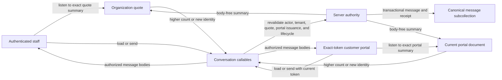
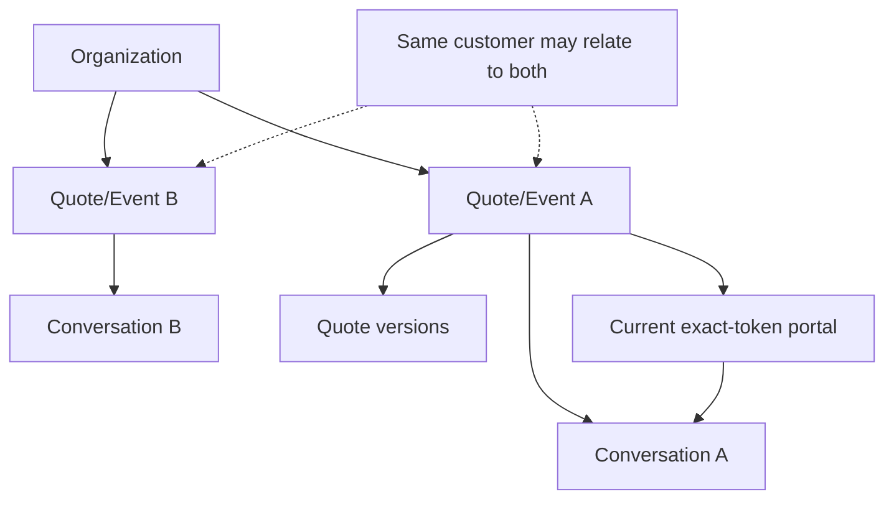

# Event Messaging Station Architecture

Last updated: 2026-09-10 15:09:08 CDT

Status: working-branch architecture and implementation boundary. This document
does not establish merge, deployment, hosted availability, production-data
operation, or human acceptance. Refer to [`PROJECT_STATUS.md`](../PROJECT_STATUS.md)
for canonical operational status and [`DEV_TASKS.md`](../DEV_TASKS.md) for the
canonical execution queue.

## Decision

QuotePilot conversations remain one canonical thread per quote/event. The
recommended near-real-time design uses small, body-free Cloud Firestore signals
to tell an authorized client that a conversation changed, followed by the
existing Firebase callable to revalidate access and return canonical message
bodies. Sends remain callable-owned and receipt-driven.

QuotePilot does not need a separate SSE, WebSocket, or application-managed
long-poll service for this workload. Firestore snapshot listeners already
provide a managed, reconnecting, low-latency notification channel. The message
callables preserve the repository's exact-token, tenant, lifecycle, retry, and
proof boundaries.



The signal is a notification that server state changed. It is not the message
body, a delivery receipt, a read receipt, or evidence that the other person is
online.

## Repository-grounded baseline

The repository already contains the durable conversation authority:

- [`functions/portalConversation.js`](../functions/portalConversation.js)
  validates request shape, message length, actor identity, total-message bounds,
  rolling rate limits, and portal activation.
- `getQuotePortalConversation` and `sendQuotePortalConversationMessage` in
  [`functions/index.js`](../functions/index.js) revalidate the quote, active
  organization, exact portal issuance, lifecycle, and staff tenant on every
  operation. The send transaction owns message IDs, actor fields, timestamps,
  idempotent request receipts, the canonical conversation state, and the
  quote-level summary.
- [`src/lib/portalConversationClient.js`](../src/lib/portalConversationClient.js)
  exposes the bounded load/send client and generates stable client request IDs
  for exact retry reconciliation.
- [`src/components/QuoteConversationPanel.jsx`](../src/components/QuoteConversationPanel.jsx)
  presents messages and preserves unresolved request identity and unchanged
  message text in bounded application memory. It does not put either value in
  browser storage.
- [`firestore.rules`](../firestore.rules) denies direct browser reads and writes
  to canonical message, request, rate-limit, and conversation-state records.
  Same-tenant staff can read their organization quote. An unauthenticated portal
  holder can `get` only the exact active `customerPortalQuotes/{portalKey}`
  document; portal collection listing remains denied.

Before this branch, conversation bodies loaded through the callable on panel
open or explicit refresh. A successful local send merged its returned canonical
receipt into the sender's panel, but another open browser did not automatically
reload the conversation.

## What this branch implements

This branch is intended to deliver the first event-segregated station and the
minimum safe near-real-time signal path:

1. A first-class staff route at `/app/messages`, with an optional opaque
   `quoteId` focus in the query string and a persistent **Messages** navigation
   entry.
2. A bounded staff inbox listener over up to 50 same-tenant quote documents,
   ordered by `conversationSummary.latestMessageAtISO`. Firestore returns the
   authorized quote documents; the client normalizes only event/thread fields
   and merges them with the already-bounded workspace quote snapshot. Both live
   state and seed rows are identity-bound to the current organization, so an
   organization change clears prior-tenant rows before the next listener effect.
3. Body-free message-summary normalization, search, **Needs reply**, **Active**,
   upcoming, past/read-only, date-not-set, and not-started groupings. A customer reply is
   described as `needsReply`; it is not called unread or seen evidence.
4. A central station that opens the existing authoritative
   `QuoteConversationPanel` for exactly one selected quote/event.
5. A server-owned `conversationSummary` projected in the same successful send
   transaction onto both:
   - `organizations/{organizationId}/quotes/{quoteId}`; and
   - the exact validated current `customerPortalQuotes/{portalKey}` document.
6. A metadata-only document listener for the selected conversation. Staff watch
   the exact organization quote; the customer watches only the exact portal
   document. A server-origin summary with a higher authoritative count or a
   distinct non-older latest-message identity triggers the existing
   authoritative conversation callable. Comparing count before identity keeps
   an intervening concurrent message from being hidden when the final summary
   points at the local sender's receipt. The conversation component remounts on
   the complete staff/portal access identity, clearing prior message bodies and
   drafts before a tenant, quote, authenticated principal, or portal-token change
   can render.
7. Explicit listener states: **Catching up**, **Live updates**, **May be stale**,
   and **Updates paused**. Cache snapshots and local pending-write snapshots are
   stale; listener errors with retained rows are partial and paused. Manual
   inbox reconnect, thread refresh, and the existing safe-send reconciliation
   remain available.
8. Fail-closed station eligibility matching the current provider-accepted,
   active, unexpired portal delivery. Historical threads with an invalid current
   portal can remain visible as unavailable, but they never start a callable load.
9. On mobile, route-backed thread selection supports browser Back/Forward. The
   station return action clears the quote focus, restores focus to the selected
   event row, and leaves refresh on the thread list. Inbox rows include quote
   number, event date/time, and venue so similar events remain distinguishable.

The projected summary contains only its schema version, message count, latest
message ID, latest message time, latest actor type, and server update time. It
must not contain message text, hashes, actor names, staff identity, role, email,
or the portal token.

All implementation claims above remain source-branch claims. Even after local
validation and Git publication, this
branch does not prove a hosted listener, a production Functions/rules release,
customer receipt, production use, or human acceptance.

## Event and quote segregation

The canonical conversation key is:

```text
organizationId + quoteId
```

The quote is QuotePilot's canonical event record, so the station must keep two
quotes separate even when they share the same customer, email address, venue,
date, or event name. Quote revisions remain inside the same quote thread.
Rotating a portal token invalidates the old bearer link but does not create a
second conversation or discard canonical history.

Grouping is presentation only. It must never change the underlying quote,
schedule, proposal, acceptance, payment, booking, production, or delivery
records. Conversation content is not an authority channel for those states.



Recommended station information architecture:

- Desktop: event-thread rail, selected conversation, compact event context.
- Mobile: thread list followed by a focused conversation view with a clear
  return action.
- Thread identity: event name, customer, event date/time, quote number, and
  lifecycle badge.
- Priority: customer-authored latest messages first, then latest activity.
- Search: event name, customer name, quote number, and event date. Search text
  stays in memory and is not reflected into a public URL.

## Live data flow and truth language

### Receive path

1. A selected client attaches one Firestore document listener.
2. The first server-origin snapshot establishes that the signal is current.
   A cache-only snapshot remains explicitly stale.
3. A higher authoritative message count, or a distinct non-older latest-message
   identity, schedules one callable reload. Duplicate metadata notifications do
   not reload. Count is compared first so a summary whose latest ID matches a
   just-returned local receipt still reconciles any intervening concurrent send.
4. The callable revalidates current authority, reads canonical messages, and
   performs its final portal-issuance check before returning bodies.
5. The client merges by message ID and keeps the selected quote/access identity
   as a generation boundary so a late response cannot populate another thread.
6. Listener failure changes the UI to **Updates paused**. It never silently
   claims the conversation is live; manual refresh remains available.

### Send path

1. The client starts or restores one exact `clientRequestId` with an unchanged
   body.
2. The callable validates access and commits the message, retry receipt,
   counters, attention outcome, quote summary, and exact portal summary in one
   transaction.
3. Only the returned callable receipt lets the sender say **Message recorded in
   this quote conversation**.
4. Firestore signals other open clients; those clients reload bodies through
   the callable.
5. A missing send receipt remains uncertain and must use the same request ID and
   unchanged body for reconciliation.

Use the following language consistently:

| UI state | What it proves | What it does not prove |
|---|---|---|
| Catching up | The listener is starting | Server-current data or another participant online |
| Live updates | A server-origin signal snapshot was observed | Guaranteed latency, message delivery, or message read |
| May be stale | The visible signal came from cache | Current server state |
| Updates paused | The listener is unavailable or failed | That the conversation itself is unavailable |
| Message recorded | The authoritative send callable returned the exact receipt | External delivery or recipient view |
| Needs reply | The latest canonical actor is the customer | That any specific staff member has or has not read it |

Do not use `delivered`, `read`, `seen`, `online`, or `typing` unless a separate
authoritative contract for that fact is implemented and verified. A Firestore
listener event is transport activity, not human activity.

## Cost and scaling

Firestore bills listener bootstrap results and documents added to, updated in,
or removed from the result set. It does not bill merely for keeping an idle
listener connection open. Reconnection can cause a fresh query charge: with
offline persistence, a disconnection longer than 30 minutes is billed like a
new query; without persistence, each disconnect/reconnect is billed that way.
Security Rules dependent-document reads can add billable reads.

The first-release bounds are therefore intentional:

- one inbox listener while the staff station is mounted;
- at most 50 live inbox quote documents;
- one exact selected-thread signal listener;
- no listener per inbox row;
- unsubscribe on thread, organization, portal, or surface change;
- random message IDs and small body-free summary updates; and
- cursors rather than offsets when pagination is added.

The current inbox listener reads complete quote documents because Firestore web
queries do not return field projections. This is within existing same-tenant
staff read authority and is reasonable for the first bounded slice, but it is
not the ideal large-tenant shape. If measured quote size, bootstrap latency, or
read cost becomes material, introduce a small server-owned
`conversationThreads/{quoteId}` projection and migrate the inbox listener only
after rules, backfill, capability-surfacing, and parity tests exist.

The current conversation callable can return up to the repository's 500-message
thread limit. The next scaling improvement should be cursor-based APIs:

- initial latest 50;
- messages after the newest `(createdAtMs, messageId)` cursor for live catch-up;
- older pages before the earliest cursor; and
- a bounded `hasMore` response.

That delta/pagination contract is future work, not part of this branch. Until it
exists, every signal-triggered reload may reread the bounded thread.

## Offline behavior

The current web initialization uses Firestore's default memory cache; it does
not enable persistent IndexedDB caching. Keep that default for the exact-token
customer portal because proposal and message context is sensitive and a
persistent web cache is not automatically cleared between sessions.

Required behavior when connectivity is unavailable:

- cached summary data is visibly **May be stale**;
- message bodies already held in component memory may remain visible;
- no new message is described as recorded without a callable receipt;
- an unresolved send retains its exact request identity and unchanged body only
  in bounded application memory; and
- reconnect/retry never silently creates a second send identity.

Persistent offline access for authenticated staff may be considered later only
as an explicit trusted-device choice with sign-out/cache-clear behavior and a
documented privacy review. It must not be enabled globally for customer portal
sessions.

## Security and privacy

Non-negotiable controls:

- Canonical message, request, rate-limit, and state subcollections remain
  direct-read and direct-write denied in Firestore rules.
- Message bodies continue to cross the browser boundary only through the
  callable's whitelisted response.
- Staff listeners remain same-tenant and role-authorized.
- A portal listener targets one exact document ID and remains valid only while
  the portal issuance, delivery activation, organization, expiry, and lifecycle
  rules remain valid. Portal collection listing stays denied.
- The server derives actor identity, timestamps, message IDs, and summaries.
  Clients cannot submit or overwrite those facts.
- Summary projections are body-free and bind to the exact quote and current
  portal issuance.
- Portal tokens and message bodies must not enter analytics, diagnostics, URLs
  other than the existing portal entry contract, logs, inbox projections, or
  browser persistence.
- App Check may reduce automated abuse, but it does not replace Firebase Auth,
  tenant rules, portal-token validation, rate limiting, or callable authority.
- Listener and callable emulator tests must cover cross-tenant denial, old-token
  denial after rotation, inactive/expired/deleted portal denial, cache/stale
  presentation, listener cleanup, and late-response scope isolation.

Firestore Security Rules are not filters. Every query must be provably safe for
its complete potential result set. Any future collection-level inbox or direct
message listener must carry explicit tenant/query constraints and rules tests.

## Presence and typing

Presence and typing indicators are deferred. Cloud Firestore does not natively
support disconnect-aware presence. Firebase's documented solution uses Realtime
Database connection state and `onDisconnect`, optionally mirrored to Firestore
with Cloud Functions.

If later user research proves that these indicators materially improve the
workflow, use Realtime Database only for ephemeral state:

```text
/conversationPresence/{organizationId}/{quoteId}/{sessionId}
/conversationTyping/{organizationId}/{quoteId}/{participantSessionId}
```

Each browser/tab needs a separate connection record, a server timestamp,
`onDisconnect().remove()` or offline transition, and a short heartbeat expiry.
The exact-token customer would also need a deliberately scoped, short-lived
session identity; the public portal token must not become a broad Realtime
Database credential. Presence must degrade to **Status unavailable**, never a
false offline assertion. Typing state must expire quickly and must never be
written to canonical history or interpreted as delivery/read evidence.

Do not add Realtime Database solely to make the interface feel more like a
consumer chat product. First validate the durable live-message station with
real staff and portal users.

## Why not custom SSE, WebSockets, or forced long-polling

| Option | Decision | Reason |
|---|---|---|
| Firestore snapshot signal + callable body | Selected | Reuses the current data, auth, retry, and lifecycle authority while adding managed low-latency notifications. |
| Direct browser listener on canonical messages | Rejected for this branch | It widens the established callable-only body boundary and does not naturally authorize the unauthenticated exact-token portal. |
| Server-Sent Events | Deferred/rejected | It is a valid one-way browser standard, but QuotePilot would need a new authenticated streaming service, replay cursor, fan-out, observability, and deployment surface for a capability Firestore already supplies. |
| Custom WebSocket service | Rejected | It adds reconnect, timeout, active-instance billing, multi-instance synchronization, and a second realtime data plane while Firestore remains the durable source. |
| Application polling loop | Rejected | It is slower, repeatedly rereads unchanged data, costs more at useful intervals, and creates extra visibility/background-tab logic. |
| Forced Firestore long-polling | Rejected by default | The web SDK already auto-detects when WebChannel long-polling is needed; forcing it may reduce performance. |

## Delivery phases

### Phase 1 — This branch

- Event-focused `/app/messages` station and navigation.
- Bounded same-tenant live inbox summary.
- Exact selected-thread summary listener.
- Body-free quote and current-portal summary projection.
- Callable-authoritative message reload and existing safe send/reconciliation.
- Honest live/cache/paused states and focused unit/rules/browser coverage.

Exit evidence is source diff plus local unit, Firestore rules/emulator, build,
capability-surface, and focused browser checks. It is not hosted or production
evidence.

### Phase 2 — Scale and operational hardening

- Cursor/delta conversation reads and older-history pagination.
- A dedicated small thread projection only if measured need justifies it.
- Per-staff explicit read position only if the product requires true unread
  counts; retain **Needs reply** as a separate operational fact.
- App Check monitored rollout and enforcement decision.
- Observability for listener errors, reload rate, callable latency, read volume,
  and stale-state duration without logging bodies or tokens.
- Hosted disposable-tenant staff/customer acceptance before any production
  promotion.

### Phase 3 — Optional interaction enhancements

- Realtime Database presence/typing only after scoped-identity design and user
  validation.
- Explicit message read receipts only with a separate authority and privacy
  contract.
- Attachments, reactions, external notifications, and cross-channel delivery
  only as separately designed capabilities.

None of Phase 2 or Phase 3 is implemented by this branch.

## Verification strategy

Correctness means all of the following are true:

1. Same-customer quotes remain separate event threads.
2. A new successful send changes the quote and exact current portal summary in
   the same transaction and never includes a message body in either summary.
3. Staff and portal listeners reload only for a higher-count or distinct
   non-older server-origin signal in their exact authorized scope.
4. Cache-only and listener-error states never present as live.
5. Duplicate listener events and the sender's local receipt do not duplicate a
   message.
6. Token rotation or tenant/access change stops the old scope from receiving
   bodies and synchronously removes prior-scope rows, message bodies, and drafts
   from the rendered surface.
7. Uncertain sends preserve the exact retry identity and never imply a record.
8. The inbox remains bounded, cleans up listeners, and contains no message body
   or portal token.

The local two-browser emulator proof now covers signed-in staff and the exact
active portal opening the same quote, each sending once, and the other panel
updating without manual refresh. Focused client tests cover duplicate/older
signal suppression, pending-write staleness, and the same-latest-ID/higher-count
concurrent-send race. An open-listener portal-rotation case remains a useful
follow-up. This local proof still does not establish hosted or production
behavior.

## Inspected integration points

| Area | Current integration point | Branch or future impact |
|---|---|---|
| Server authority | `functions/index.js`, `functions/portalConversation.js` | Branch adds current-portal summary projection; future adds cursor reads. |
| Client API | `src/lib/portalConversationClient.js` | Existing callable contract reused; future cursor parameters are additive. |
| Conversation UI | `src/components/QuoteConversationPanel.jsx` | Branch adds selected-document signal states and station presentation. |
| Staff inbox | Organization-scoped quote collection | Branch adds bounded summary listener and event grouping. |
| Routing | `src/lib/workspaceRoutes.js`, `src/App.jsx` | Branch adds `/app/messages` and opaque quote focus. |
| Portal | `customerPortalQuotes/{portalKey}` | Branch receives body-free summary and watches only the exact current document. |
| Rules | `firestore.rules` | Existing message-body denial and exact portal `get` boundary remain; tests must prove the listener shape. |
| Indexes | `firestore.indexes.json` | No new composite index is assumed; add one only if the final query requires it. |
| Canonical docs | Feature Matrix, User Manual, capability contracts, changelog/status | Required before the behavior can be considered complete under `docs/DOC_SYSTEM.md`. |

## Primary technical sources

- [Firebase: Get realtime updates with Cloud Firestore](https://firebase.google.com/docs/firestore/query-data/listen)
- [Firebase: Understand real-time queries at scale](https://firebase.google.com/docs/firestore/real-time_queries_at_scale)
- [Firebase: Understand Cloud Firestore billing](https://firebase.google.com/docs/firestore/pricing)
- [Firebase: Access data offline](https://firebase.google.com/docs/firestore/manage-data/enable-offline)
- [Firebase: Securely query data](https://firebase.google.com/docs/firestore/security/rules-query)
- [Firebase: Build presence in Cloud Firestore](https://firebase.google.com/docs/firestore/solutions/presence)
- [Firebase: Realtime Database offline and presence capabilities](https://firebase.google.com/docs/database/web/offline-capabilities)
- [Firebase JavaScript API: Firestore transport settings](https://firebase.google.com/docs/reference/js/firestore_.firestoresettings)
- [Firebase: App Check for web](https://firebase.google.com/docs/app-check/web/recaptcha-enterprise-provider)
- [WHATWG HTML: Server-sent events](https://html.spec.whatwg.org/dev/server-sent-events.html)
- [Google Cloud: Using WebSockets on Cloud Run](https://cloud.google.com/run/docs/triggering/websockets)
