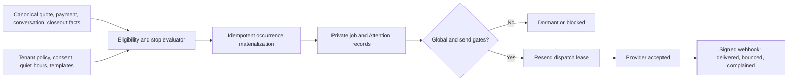

# Revenue Autopilot Authority Architecture Decision

Status: Accepted for source implementation; runtime and sends remain gated
Date: August 9, 2026
Decision owners: QuotePilot maintainers

## Context

QuotePilot already records quote delivery/view state, proposal acceptance,
verified payment-webhook state, tenant calendar context, quote conversations,
customer identity, and post-event closeout. Those facts can support useful
follow-up and dunning, but only when each reminder is tied to exact authority
and stops itself when the relevant outcome changes.

The system must not equate a scheduled job with a provider send, provider
acceptance with delivery, delivery with customer view, or temporal attribution
with recovered revenue. Customer email consent, subscription, suppression, and
unsubscribe must be server-owned. The existing token portal remains the
customer decision center; Revenue Autopilot is an SMS-free email and internal
Attention program, not a customer account.

## Decision

Adopt a deterministic, tenant-scoped scheduler and immutable occurrence/job
model, with independently gated materialization and sending:

V1 has five independently governed lanes:

- quote follow-up;
- deposit reminder;
- final-balance reminders fixed to event-minus-14/7/3 tenant calendar days;
- one post-event review request bound to the exact completed private closeout;
- unread customer reply escalation into internal Attention.

The first four are outbound email lanes. Unread reply is internal and does not
require provider delivery. Occurrence identity is stable across template
changes, dispatch has one bounded lease and provider idempotency identity, and
ambiguous outcomes require exact reconciliation. Provider webhook events are
signature-verified and indexed to a known accepted job before they may update
delivery state.

### Decision details

| Item | Content |
|---|---|
| Decision | Own policy, recipient controls, occurrences, jobs, Attention, dispatch receipts, unsubscribe, and provider evidence in trusted server records. |
| Why now | Existing authoritative quote/payment/conversation/closeout facts can support deterministic automation without predictive AI. |
| Why this | It provides stop-on-outcome behavior, tenant calendar safety, exact retries, and visible staff operations while preserving provider and commercial proof boundaries. |
| Known unknowns | Sender-domain acceptance, hosted scheduler behavior, provider webhook operation, and customer wording require separate provider/hosted/human evidence. |
| Kill criteria | Keep or return both runtime gates to false if any lane can send without exact tenant/customer consent, bypass quiet hours, duplicate an occurrence, or infer payment/delivery/revenue. |

## Rationale and options considered

1. **Manual reminders only**
   - Pros: no scheduler or provider automation risk.
   - Cons: no deterministic stop rules, recovery, queue evidence, or reliable
     post-event loop.
2. **Delegate all automation to a generic marketing platform**
   - Pros: mature campaign tooling.
   - Cons: duplicates commercial state, weakens exact quote/payment/closeout
     binding, and introduces a new customer-data authority.
3. **QuotePilot-owned deterministic scheduler with Resend boundary (selected)**
   - Pros: exact tenant/quote/customer scope, existing evidence reuse, bounded
     retries, provider-state separation, and a discoverable staff surface.
   - Cons: scheduler/webhook operations, secret rotation, provider acceptance,
     monitoring, and coordinated release become explicit responsibilities.

## Consequences

### Positive

- Reminder jobs self-stop on exact current view/decision/payment/closeout
  evidence rather than relying on a marketing-list snapshot.
- Customer consent and subscription records are separate from tenant policy and
  runtime/provider gates.
- Public unsubscribe is token-bound, idempotent, and stores only a server-owned
  hash; it does not expose a customer account or portal token.
- Staff can inspect bounded policy, jobs, provider outcomes, Attention, and
  mutation receipts without reading provider/customer secrets.

### Negative

- Production operation requires a scheduler, verified sender, signed webhook,
  three independently bound managed secrets, provider monitoring, and explicit incident/rollback
  procedures.
- Configured tenant policy is insufficient to send: multiple independent gates
  can intentionally leave the system dormant.
- Email-only V1 does not satisfy SMS use cases.

### Neutral

- The token portal, proposal decisions, payment webhooks, booking, closeout,
  and quote conversation remain independent authorities.
- Attribution windows report temporal association and exact money/booking facts
  separately; the system does not claim accounting or recovered revenue.

## Architecture impact

- `functions/revenueAutopilot.js` owns tenant-calendar occurrences, safety/stop
  evaluation, bounded materialization, dispatch state, provider outcome state,
  Attention, and attribution boundaries.
- `functions/revenueAutopilotAuthority.js` owns tenant policy, compiled
  templates, recipient controls, unsubscribe tokens, closeout binding, and
  redacted projections.
- `functions/revenueAutopilotTemplates.js` owns strict placeholder compilation;
  job content is frozen when materialized.
- `functions/index.js` owns callable role/scope checks, private Firestore
  persistence, the 15-minute UTC scheduler, Resend dispatch, exact outcome
  reconciliation, and the signed Resend webhook.
- `standardwebhooks@1.0.0` is the pinned webhook-signature verifier. The webhook
  verifies the raw payload directly with `RESEND_WEBHOOK_SECRET`; it does not
  construct a Resend API client and does not receive `RESEND_API_KEY`.
- `src/components/RevenueAutopilotOperations.jsx` is the staff operations
  surface in Workflow; Customer 360 owns staff-visible customer controls; the
  public `?unsubscribe=<opaque-token>` route owns customer unsubscribe.
- Firestore rules deny every browser principal direct access to policy,
  templates, recipient controls, jobs, Attention, receipts, provider events,
  provider-message index, tenant registry, and scheduler cursor.

## Secret and release-gate ownership

- `REVENUE_AUTOPILOT_ENABLED` controls runtime materialization/operation and
  defaults to `false`.
- `REVENUE_AUTOPILOT_SENDS_ENABLED` separately permits outbound dispatch,
  defaults to `false`, and may not be true unless runtime is enabled and
  `NOTIFICATIONS_EMAIL_PROVIDER=resend`.
- `REVENUE_AUTOPILOT_TOKEN_SECRET` belongs only in Firebase Secret Manager and
  signs customer unsubscribe links.
- `RESEND_WEBHOOK_SECRET` belongs only in Firebase Secret Manager and verifies
  the raw signed Resend webhook through `standardwebhooks@1.0.0`. It is
  distinct from `RESEND_API_KEY`, and the webhook receives no API key.
- `RESEND_API_KEY` belongs only in Firebase Secret Manager and is bound only to
  dispatch/reconciliation functions that need it.

No source presence, policy record, local test, or deployment may promote these
gates by implication.

## Implementation guidance

- Materialize stable occurrences from canonical server reads only. Never accept
  browser actor, time, portal, payment, provider, message, or closeout evidence.
- Freeze template content and provider request scope in the private job before
  dispatch; use one bounded lease and idempotency identity.
- Stop or block jobs when scope expires or authority changes. The post-event
  lane may outlive portal expiry, but only while its exact accepted revision and
  private completed closeout remain valid; reopening the closeout self-stops it.
- Keep provider accepted, delivered, bounced, and complained as distinct states.
- Make every customer control and unsubscribe mutation idempotent and
  receipt-safe; ambiguous outcomes reconcile the same request identity.
- Never put email addresses, message bodies, portal/payment links, provider
  identifiers, raw unsubscribe tokens/hashes, or secrets in staff projections,
  logs, URLs other than the opaque unsubscribe token, or release evidence.

## Related information

- `docs/REVENUE_AUTOPILOT_UI_SPEC.md`
- `docs/REVENUE_AUTOPILOT_DESIGN.md`
- `docs/REVENUE_AUTOPILOT_WORK_PLAN.md`
- `docs/CUSTOMER_CENTERED_WORKSPACE_PLAN.md`
- `docs/CUSTOMER_WORKSPACE_BACKEND_HANDOFF.md`
- `docs/LAUNCH_RUNBOOK.md`
