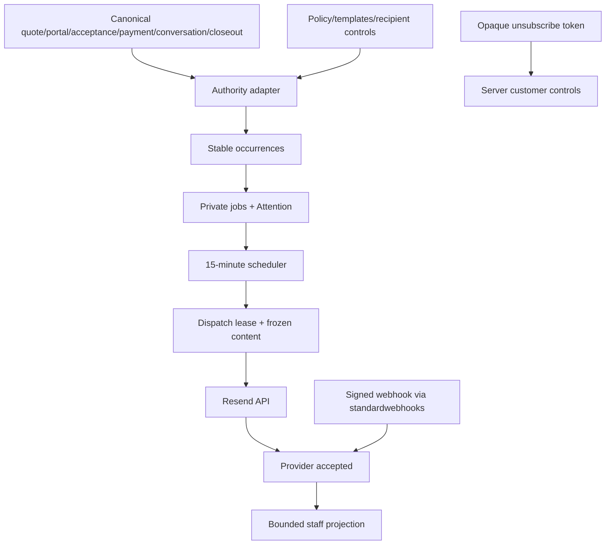

# Revenue Autopilot Design Document

Status: As-built source design; runtime and sends remain gated
Date: August 9, 2026

## Overview

Revenue Autopilot is a deterministic email-reminder and internal Attention
system over QuotePilot's canonical quote, portal, acceptance, payment,
conversation, customer-control, and post-event closeout evidence. V1 supports
four outbound email lanes and one internal unread-reply lane while preserving
separate policy, runtime, provider, consent, stop, dispatch, delivery, customer,
payment, and attribution authorities.

Referenced UI Spec: `docs/REVENUE_AUTOPILOT_UI_SPEC.md`

## Design summary

```yaml
design_type: new_feature
risk_level: high
complexity_level: high
complexity_rationale: Five lanes coordinate tenant calendar arithmetic, private policy and recipient authority, idempotent occurrence/job records, bounded dispatch leases, an external provider, signed webhooks, public unsubscribe, and exact recovery.
main_constraints:
  - Runtime and outbound sends are separately default-off.
  - Browser/provider inputs never establish quote, decision, payment, closeout, actor, or time authority.
  - Provider acceptance, delivery, bounce, complaint, portal view, payment, and attribution remain distinct.
biggest_risks:
  - Duplicate or wrongly scoped email dispatch.
  - Missing stop/consent/quiet-hour evidence causing an unsafe send.
unknowns:
  - Hosted scheduler, DNS/sender, webhook, and customer-copy acceptance are not yet qualified.
  - Production monitoring and incident thresholds require operator acceptance.
```

## Background and context

### Prerequisite ADR

- `docs/REVENUE_AUTOPILOT_ADR.md`: internal deterministic scheduler, private
  authority records, Resend boundary, signed unsubscribe, and gate ownership.

### External resources

| Resource | Identifier | Scope |
|---|---|---|
| Firebase Pub/Sub scheduler | `runRevenueAutopilotSchedule`, every 15 minutes UTC | Pages enabled tenant registry, materializes/stops bounded jobs, dispatches eligible work |
| Resend send API | provider `resend` | Outbound email only after all gates and a bounded dispatch lease |
| Standard Webhooks | `standardwebhooks@1.0.0` | Raw-body Resend signature verification with only `RESEND_WEBHOOK_SECRET`; no API key |
| Firebase Secret Manager | `RESEND_API_KEY`, `RESEND_WEBHOOK_SECRET`, `REVENUE_AUTOPILOT_TOKEN_SECRET` | Independently bound send, webhook-verify, and unsubscribe-signing secrets |

### Agreement checklist

#### Scope

- [x] Quote follow-up, deposit, final-balance, post-event review email lanes.
- [x] Exact unread-customer-reply Attention and staff acknowledgement.
- [x] Tenant policy/templates/quiet hours/time zone and customer consent/
  subscription controls.
- [x] Idempotent materialization, dispatch lease/retry/reconciliation, signed
  provider outcomes, public unsubscribe, and bounded staff operations.

#### Non-scope

- [x] No SMS, marketing campaign builder, customer account, merged conversation,
  accounting revenue, refund/dispute automation, or AI/predictive decision.
- [x] No production provider configuration, deployment, flag promotion,
  production data mutation, or human acceptance.

#### Constraints and standards

- [x] Parallel operation: source and tenant configuration may exist while both
  environment gates remain false.
- [x] Backward compatibility: legacy/missing policy and controls normalize to
  dormant/blocked, never implicit consent.
- [x] Performance: scheduler pages bounded tenants and jobs; staff read caps
  jobs at 100 and Attention at 50.
- [x] `docs/DOC_SYSTEM.md`, capability surfacing, strict secret ownership, and
  existing provider evidence language are explicit standards.

### Quality-assurance mechanisms

| Mechanism | Enforces | Location | Scope |
|---|---|---|---|
| Focused core/authority/template tests | Calendar, stops, policy, controls, materialization, leases, provider states, attribution | `src/lib/__tests__/revenueAutopilot*.test.js` | Server and client contracts |
| Component/integration tests | All read/mutation states, role-safe actions, Customer 360, unsubscribe | `src/components/__tests__/revenueAutopilot*.test.jsx` | User surfaces |
| Functions env materializer | Explicit independent boolean gates and secret rejection | `scripts/materialize-functions-env.mjs` | Release configuration |
| Firestore rules tests | Private policy/job/provider/control records | `src/rules/__tests__/firestore.rules.test.js` | Browser denial |
| Capability-surfacing gate | Backend-to-interface/manual/matrix traceability | `scripts/check-capability-surfacing.mjs` | Full feature slice |

## Problem and requirements

Operators need reminders and reply escalation that stop themselves from current
evidence and recover safely after provider uncertainty. A generic scheduled
email is insufficient because quote revision, portal view/decision, acceptance,
payment rail, closeout, consent, quiet hours, and customer subscription can each
independently block or stop an occurrence.

### Functional requirements

- RA-FR-01: Admin configures a versioned tenant policy with explicit enablement,
  IANA time zone, quiet hours, bounded attempts, lane policies, and strict
  compiled templates.
- RA-FR-02: Admin records customer-specific consent and subscription evidence;
  missing or contradictory controls fail closed.
- RA-FR-03: Stable occurrences are materialized from canonical evidence and do
  not duplicate when templates change or the scheduler retries.
- RA-FR-04: Quote follow-up stops on exact current portal view/accept/decline or
  terminal quote evidence; payment lanes use exact acceptance and verified
  payment authority.
- RA-FR-05: Post-event review request requires the exact accepted revision,
  stable customer, valid completed private closeout, lane template, and public
  HTTPS `reviewRequestUrl`; reopening/invalidating the closeout self-stops it.
- RA-FR-06: Dispatch respects global/runtime/send/provider/tenant/lane/customer/
  quiet-hour gates, leases one exact job, freezes content, and bounds retry.
- RA-FR-07: Resend webhook verifies the raw payload and updates only the known
  exact accepted job for delivered/bounced/complained evidence.
- RA-FR-08: Customer can idempotently unsubscribe through an opaque signed token;
  no customer identity or token hash appears in public/staff projections.
- RA-FR-09: Exact unread latest customer message creates one internal Attention
  item and an exact staff acknowledgement resolves only that message.

### Non-functional requirements

- Reliability: all control/materialization/reconciliation/unsubscribe mutations
  are exact-request idempotent; jobs have bounded leases/retry counts.
- Security: private Firestore records, provider indexes, secrets, and frozen
  message content are Admin SDK only.
- Calendar correctness: due dates use explicit tenant IANA calendar arithmetic,
  including DST and overnight quiet hours; never browser local time.
- Privacy: staff projections omit message bodies, emails, links, provider IDs,
  tokens/hashes, credentials, and private payment evidence.

## Acceptance criteria (EARS)

- [ ] **While** either global gate is false, the scheduler shall be dormant and
  shall create no provider send claim.
- [ ] **When** policy or recipient authority is absent/contradictory, the
  affected lane shall be blocked without creating an eligible outbound job.
- [ ] **When** the same occurrence is materialized again, the system shall reuse
  its stable identity and update/stop it without duplicating a send.
- [ ] **When** a job enters provider uncertainty, retry/reconciliation shall use
  the same job, attempt scope, and provider idempotency identity.
- [ ] **When** Resend reports an event, only a valid raw-body signature and known
  provider-message index may update the exact job; replay shall be idempotent.
- [ ] **When** a customer unsubscribes with a valid current token, the system
  shall record one receipt and stop email eligibility without exposing identity.
- [ ] **When** a completed closeout is reopened, its post-event occurrence shall
  stop and shall not rematerialize from stale completion evidence.

## Existing codebase analysis

### Implementation path mapping

| Type | Path | Responsibility |
|---|---|---|
| New | `functions/revenueAutopilot.js` | Calendar, occurrences, eligibility/stops, materialization, Attention, dispatch/provider/attribution state |
| New | `functions/revenueAutopilotAuthority.js` | Policy/templates/controls/token/closeout validation and safe projections |
| New | `functions/revenueAutopilotTemplates.js` | Strict template compiler/renderer |
| Extended | `functions/index.js` | Callables, private transactions, scheduler, Resend send/reconcile/webhook |
| New | `src/lib/revenueAutopilotClient.js` | DTO validation and exact pending-attempt continuity |
| New/extended | Revenue Autopilot components, `SalesWorkflowModal`, `CustomerWorkspaceView`, `main.jsx` | Staff/customer-visible surfaces and route precedence |
| Extended | `firestore.rules`, Functions package/env materializer | Private authority, pinned dependency, default-off gates |

### Code inspection evidence

| File/function | Relevance |
|---|---|
| `functions/index.js#getRevenueAutopilotOperations` | Bounded redacted staff projection |
| `functions/index.js#materializeRevenueAutopilotJobs` | Same-tenant manual exact-quote materialization |
| `functions/index.js#runRevenueAutopilotSchedule` | 15-minute bounded tenant/job scheduler |
| `functions/index.js#revenueAutopilotResendWebhook` | Raw-body `standardwebhooks` verification and exact provider-index transaction |
| `functions/revenueAutopilotAuthority.js#normalizeReviewRequestUrl` | Strict public HTTPS review destination |
| `src/main.jsx` | Portal-first then unsubscribe public-route precedence |

### Fact disposition

| Fact | Disposition | Evidence |
|---|---|---|
| Read-only Revenue Autopilot preview | Preserve as advisory companion | `RevenueAutopilotPreviewPanel` |
| Existing delivery/payment/conversation/closeout evidence | Preserve as inputs, never copy authority | server materialization/stop adapters |
| Provider acceptance as delivery | Reject | distinct job/webhook states |
| Browser/customer direct control writes | Remove from authority | callables plus deny-all rules |

## Design

### Change impact map

```yaml
Change Target: Tenant-branded automated email and unread-reply Attention
Direct Impact:
  - Functions policy/control/job/provider records and exports
  - Workflow operations and policy UI
  - Customer 360 controls and public unsubscribe
  - Functions dependencies, environment and secrets contract
Indirect Impact:
  - Scheduler/provider operating cost and monitoring
  - Post-event closeout becomes a trusted outbound trigger
No Ripple Effect:
  - Token portal decision authority
  - Existing quote delivery and Stripe payment rails
  - Booking, accounting, and customer-wide conversation models
```

### Interface change matrix

| Existing | New | Conversion | Compatibility |
|---|---|---|---|
| Workflow eligibility preview | Separate persisted operations projection | No | Preview remains clearly non-sending |
| Quote conversation latest actor | Exact unread Attention/ack receipt | Yes | Existing message/state records remain authority |
| Post-event internal closeout | One exact review-request occurrence | Yes | Internal review remains distinct; pending/reopened blocks/stops |
| Existing Resend send helper | Autopilot leased dispatch | No | Separate job/provider identity; no change to quote-delivery rail |

### Architecture and data flow



Processing order: canonical read -> normalize policy/recipient/provider/stop
evidence -> plan stable occurrence -> transactionally create/update/stop ->
evaluate gates/quiet hours -> claim bounded lease -> provider call -> record
acceptance or bounded failure -> signed webhook outcome. No provider call occurs
inside a Firestore transaction.

### Integration points

| Integration | Old | New/switch | Verification |
|---|---|---|---|
| Tenant config | Business time zone only | Versioned automation policy/templates/quiet hours | Policy tests and admin UI |
| Customer 360 | Customer projection | Safe email-control projection/admin receipt | Integration/rules tests |
| Post-event closeout | Internal review | Exact completed closeout occurrence | Source/closeout stop tests |
| Conversation | Quote-scoped messages | Exact latest-message Attention/ack | Message-state tests |
| Resend webhook | N/A for this rail | `standardwebhooks@1.0.0` raw verification | Signed/invalid/replay tests |

### Data representation decision

| Criterion | Assessment | Reason |
|---|---|---|
| Semantic fit | No | Jobs/provider/recipient evidence is not quote/customer editable data. |
| Responsibility fit | No | Scheduler and provider lifecycle are a separate bounded context. |
| Lifecycle fit | No | Occurrences and outcomes evolve independently after quote creation. |
| Boundary cost | Medium | Private collections require projections but prevent browser authority. |

Decision: new private tenant-scoped policy/templates/controls/jobs/Attention/
receipts/provider-event collections plus private global tenant/index/cursor
records. Public/staff callers receive only redacted DTOs.

### Data contracts

```yaml
Contract: Tenant policy
Fields: explicit enabled, IANA timeZone, quietHours, maxAttempts 1..5, five kind policies, strict templates, optional|required reviewRequestUrl
Invariant: configured does not imply global enabled, sends enabled, or provider ready

Contract: Recipient controls
Fields: customerId, consent granted|revoked, subscription subscribed|unsubscribed, actor/time/revision, unsubscribeTokenHash
Invariant: revoked consent cannot coexist with subscribed; raw token/email omitted from projections

Contract: Materialized job
Identity: stable organization/quote/customer/kind/occurrence scope
Fields: canonical authority scope, due tenant date, frozen template content, unsubscribe URL, bounded attempts/lease/provider state
Invariant: template revision does not create a duplicate occurrence

Contract: Post-event review occurrence
Preconditions: exact accepted revision and private acceptance snapshot; stable customer; exact private closeout state completed; policy lane/template/review URL valid
Stop: pending, blocked, reopened, invalid, or mismatched closeout; portal expiry alone does not invalidate a completed post-event occurrence

Contract: Provider webhook
Input: raw bytes plus svix id/timestamp/signature headers
Verification: standardwebhooks@1.0.0 with RESEND_WEBHOOK_SECRET only
Guarantee: known message index and exact job scope before idempotent delivered|bounced|complained update

Contract: Public unsubscribe
Input: opaque signed token and exact requestId
Guarantee: idempotent subscription=unsubscribed receipt; no customer/email/provider disclosure
```

### Field propagation map

| Field | Producer | Serialized format | Consumer rule |
|---|---|---|---|
| `REVENUE_AUTOPILOT_ENABLED` | release env | literal `true`/`false` | materializer validates; runtime gate defaults false |
| `REVENUE_AUTOPILOT_SENDS_ENABLED` | release env | literal `true`/`false` | may be true only with runtime true and provider `resend` |
| unsubscribe token | server HMAC | stable signed v1 organization/customer scope in opaque URL-safe `?unsubscribe=` token | callable verifies signature/scope and stored hash; v1 intentionally has no timestamp/expiry; never logs or projects raw token |
| review URL | admin policy form | canonical public HTTPS URL | server rejects unsafe host/credentials/fragment/non-443/oversize |
| job occurrence key | server core | stable private string | excludes template/policy version from occurrence identity |
| Resend signature | provider headers/raw body | svix headers plus exact raw bytes | `standardwebhooks` verification before JSON evidence is trusted |
| provider message id | Resend response | private hashed index | webhook resolves exact job; not exposed to browser |

### State model

```yaml
Read: loading|empty|success|stale|partial|error|recovery
Mutation: ready|submitting|uncertain|reconciliation|receipt|error|recovery
Job: scheduled|sending|retry_wait|outcome_ambiguous|provider_accepted|delivered|bounced|complained|stopped|definite_failure
Attention: open|resolved
Controls: consent granted|revoked; subscription subscribed|unsubscribed
```

### UI action/API mapping

| UI action | Callable | Response/error contract |
|---|---|---|
| Read operations | `getRevenueAutopilotOperations` | <=100 jobs, <=50 Attention, source/bounds/policy/outcomes; retained read marked stale |
| Configure tenant policy | `configureRevenueAutopilotPolicy` | admin exact-version receipt; uncertain repeats request |
| Read/configure controls | `getRevenueAutopilotCustomerControls`, `configureRevenueAutopilotCustomerControls` | safe projection/admin receipt; no browser fallback |
| Prepare quote jobs | `materializeRevenueAutopilotJobs` | exact quote receipt and created/updated/stopped counts |
| Acknowledge reply | `acknowledgeRevenueAutopilotReply` | exact latest-message receipt only |
| Reconcile job | `reconcileRevenueAutopilotJob` | exact ambiguous job/provider outcome; no replacement job |
| Public preferences | `getRevenueAutopilotUnsubscribeContext`, `unsubscribeRevenueAutopilotEmail` | minimal context/idempotent receipt |

## Implementation and migration

Selected approach: hybrid. Build/test deterministic core and authority adapters,
then deliver vertical staff/customer surfaces, then scheduler/provider boundaries.
No legacy record is upgraded to consent, subscription, delivery, or recovered
revenue; missing/legacy data remains dormant or blocked.

Required order:

1. Core calendar, occurrence, stop, job, Attention, and attribution contracts.
2. Policy/template/customer-control/unsubscribe authority.
3. Private Firestore persistence, rules, client DTO validation.
4. Workflow operations, Customer 360 controls, public unsubscribe UI.
5. Scheduler, leased Resend dispatch/reconciliation, pinned webhook verifier.
6. Capability/docs/full local/emulator qualification.
7. Separate Secret Manager/provider/deploy/hosted/gate/human acceptance.

## Security considerations

- Staff callables require Firebase Auth and exact organization role; policy and
  customer-control mutation require tenant admin. Public unsubscribe accepts
  only its signed opaque token and exact request identity.
- `RESEND_API_KEY` is bound only to dispatch/reconciliation. The webhook is
  bound only to `RESEND_WEBHOOK_SECRET`; `standardwebhooks` requires no API key.
  Token-signing functions receive only `REVENUE_AUTOPILOT_TOKEN_SECRET` as needed.
- Raw webhook bytes are verified before event content is trusted. Provider
  event IDs and message IDs are hashed/indexed privately and deduplicated.
- Logs exclude message/customer content, addresses, links, tokens/hashes,
  provider IDs, signatures, payment evidence, and secrets.

## Error handling and monitoring

| Failure | Result | Recovery |
|---|---|---|
| Missing gate/policy/control/evidence | Dormant, blocked, stopped, or not due | Correct exact authority; rematerialize/re-read |
| Quiet hours | `retry_wait`/next clear tenant window | Scheduler retries within bounded policy |
| Definite provider failure | `definite_failure` | Operator review; no automatic new occurrence |
| Ambiguous provider outcome/expired lease | `outcome_ambiguous` | Exact job reconciliation with same provider identity |
| Invalid/replayed webhook | reject or idempotently ignore | Inspect redacted logs/provider configuration |
| Invalid unsubscribe token | public safe error | No identity disclosure; newer governed message required |

Log only redacted counts, state transitions, opaque tenant/job scopes, and
bounded errors. Production monitoring must alert on scheduler failure,
outcome-ambiguous age, bounce/complaint rate, webhook verification failures, and
queue age, but thresholds require separate hosted/operator acceptance.

## Test boundaries and verification

Pure core/authority/template tests do not call Firebase or Resend. Callable
integration tests inspect injected/mocked boundaries and Firestore-emulator
behavior; signed webhook tests exercise raw-body verification with synthetic
secrets/events; component tests own canonical UI states. None proves provider,
DNS, deployed scheduler, hosted customer receipt, production data, or human
acceptance.

Correctness means no outbound send can occur until every applicable exact gate
is true, each occurrence/job is unique and scoped, stop evidence wins safely,
provider outcomes remain distinct, and all ambiguous mutations reconcile the
same identity. Verify focused suites plus environment, full unit, Firestore/
emulator lanes, build, bundle, Playwright, capability surfacing, docs governance,
secrets, and diff checks.

Early verification point: with sends disabled, an eligible quote and exact
policy/controls must produce deterministic private job/Attention plans and zero
provider calls; changing portal/payment/closeout evidence must stop the exact
job without duplication.

Output comparison is not applicable to an existing sender; this is a new rail.
For shared source facts, contract tests compare exact revision, event date,
payment rail, conversation message, and closeout IDs to their authoritative
source adapters.

## Risks and mitigation

| Risk | Impact | Probability | Mitigation |
|---|---|---|---|
| Duplicate send | High | Medium | Stable occurrence/job IDs, provider idempotency, bounded lease, exact reconciliation |
| Wrong recipient/tenant | High | Low | Same-tenant server reads, hashed recipient scope, no browser email authority |
| Reminder after outcome | High | Medium | Reload stop evidence at materialization and execution; self-stop state |
| Secret over-binding | High | Low | Separate Secret Manager bindings; webhook gets no API key |
| Webhook spoof/replay | High | Medium | Raw-body standardwebhooks verification, event dedupe, private message index |
| Misstated revenue/delivery | Medium | Medium | Separate UI states and explicit attribution boundary |
| Hosted scheduler/provider gap | High | High until acceptance | Keep both gates false and require release runbook evidence |

## Future extensibility

SMS, additional email kinds, customer-configurable cadence, multi-channel
preferences, marketing campaigns, predictive optimization, and accounting
revenue attribution are separate programs. Each requires its own consent,
provider, authority, UI, cost, and release decision.

## References

- `docs/REVENUE_AUTOPILOT_ADR.md`
- `docs/REVENUE_AUTOPILOT_UI_SPEC.md`
- `docs/CUSTOMER_CENTERED_WORKSPACE_PLAN.md`
- `docs/CUSTOMER_WORKSPACE_BACKEND_HANDOFF.md`
- `docs/LAUNCH_RUNBOOK.md`

## Update history

| Date | Version | Change |
|---|---|---|
| August 9, 2026 | 1.0 | As-built source design |
