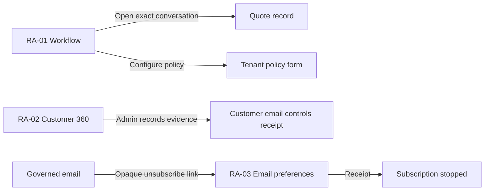

# Revenue Autopilot UI Specification

Status: Accepted for source implementation; runtime and sends remain gated
Date: August 9, 2026
Owners: QuotePilot maintainers

## Overview

This specification binds Revenue Autopilot to three discoverable surfaces:
Workflow operations, Customer 360 email controls, and the public unsubscribe
route. It evolves existing quote/payment/conversation/closeout workflows and
does not create a generic marketing dashboard or authenticated customer portal.

Target requirements: `docs/CUSTOMER_CENTERED_WORKSPACE_PLAN.md` CWF-11/CWF-12
Architecture: `docs/REVENUE_AUTOPILOT_ADR.md`
Prototype: none; production React components are the implementation under test

## Screen list and transitions

| Screen | Route/surface | Entry condition | Main transitions |
|---|---|---|---|
| RA-01 Workflow operations | `/app/workflow` | Same-tenant staff; tenant policy controls require admin | Read bounded operations; configure policy; materialize exact quote; reconcile ambiguous job; open/acknowledge exact reply |
| RA-02 Customer email controls | `/app/customers/:customerId` Overview | Same-tenant staff; mutation requires admin | Review consent/subscription projection; admin records exact evidence; refresh Customer 360 |
| RA-03 Email preferences | any non-portal pathname with `?unsubscribe=<opaque-token>` | Valid signed v1 organization/customer token whose hash matches the stored customer controls | Read organization/context; unsubscribe; reconcile same request; show receipt |

`?portal=<token>` retains precedence over `?unsubscribe=...` so the existing
customer decision center cannot be replaced or shadowed by this program.



## Component decomposition

```text
SalesWorkflowView
  +-- RevenueAutopilotPreviewPanel
  +-- RevenueAutopilotOperations
      +-- Activation gates
      +-- Five operation lanes
      +-- Bounded jobs/provider outcomes
      +-- Unread-reply attention
      +-- Mutation receipt/recovery
  +-- Automation policy form (admin)

CustomerWorkspaceView
  +-- RevenueAutopilotCustomerControls

Public route
  +-- RevenueAutopilotUnsubscribePage
```

### Component: RevenueAutopilotOperations

| State | Default/success | Loading | Empty | Error | Partial/stale |
|---|---|---|---|---|---|
| Display | Four activation gates, five lane states, bounded jobs/Attention, provider outcomes, source/time, per-lane preparation receipts, and exact controls | Read tenant policy/jobs/Attention with no outcome assumed | No materialized jobs or unread-reply Attention in the bounded view | Safe unavailable state plus retry; no retained data implied current | Show caps/truncation, or retain prior evidence as stale and disable unsafe mutations |

| AC | EARS condition | User action | System response | Recovery |
|---|---|---|---|---|
| RA-AC-01 | When staff opens Workflow | Review operations | Show global runtime, tenant, outbound-send, provider, lane, source, bounds, and provider-outcome states separately | Retry bounded read |
| RA-AC-02 | When an admin records policy | Save policy | Persist exact versioned tenant intent; do not imply global/provider activation | Reconcile same request; reset definitive rejection |
| RA-AC-03 | When staff prepares one quote | Materialize governed records | Create/update exact eligible occurrences or stop/block them from current authority; show bounded counts and one result per email lane | Reconcile same materialization identity |
| RA-AC-04 | When a job is outcome-ambiguous | Reconcile provider outcome | Re-read current authority and reuse the exact job/provider request identity; withhold when blocked and never create a replacement send | Keep uncertainty visible until definitive receipt |
| RA-AC-05 | When unread customer-reply Attention exists | Open conversation or acknowledge exact reply | Opening and acknowledgement remain distinct; exact latest-message supersession, staff-reply resolution, and bounded repair prevent stranded duplicates | Retry/reconcile exact acknowledgement |

### Component: RevenueAutopilotPolicyForm

| State | Default | Loading | Empty | Error | Partial |
|---|---|---|---|---|---|
| Display | Tenant enablement, IANA time zone, quiet hours, bounded attempts, lane toggles, fixed final-balance offsets, templates, and review URL | Parent operations read owns loading | Unconfigured policy becomes explicit dormant defaults | Field error or definitive mutation rejection | Missing post-event template/URL blocks only that lane and policy save as required |

The post-event review lane requires its own strict compiled template and a
public HTTPS review destination. Reject credentials, fragments, nonstandard
ports, localhost/private/internal hosts, and overlong URLs. The configured URL
is an outbound review destination, not evidence that a review was requested,
opened, or completed.

### Component: RevenueAutopilotCustomerControls

| State | Default/success | Loading | Empty | Error | Partial/stale |
|---|---|---|---|---|---|
| Display | Consent and reminder-subscription state, actor/time projection, and exact mutation receipt | Customer 360 owns projection load | Missing authority is `Not configured`, not consent | Safe error, same-request retry/reset | Retained projection is marked stale and mutation is disabled |

| AC | EARS condition | User action | System response | Recovery |
|---|---|---|---|---|
| RA-AC-06 | When staff reviews Customer 360 | Inspect email controls | Show consent and subscription as separate evidence | Refresh Customer 360 |
| RA-AC-07 | When an admin has reviewed customer-specific source evidence | Save controls | Record server actor/time and a new unsubscribe token hash; revocation cannot coexist with subscription | Reconcile same request or reset definitive rejection |

Non-admin staff may review the safe projection but cannot mutate it. The form
must say that consent/subscription does not enable tenant automation, schedule
or send a message, prove provider acceptance/delivery, establish a portal view,
or verify payment.

### Component: RevenueAutopilotUnsubscribePage

| State | Default/success | Loading | Empty | Error | Partial/stale |
|---|---|---|---|---|---|
| Display | Organization label, current subscription state, Stop action, and exact receipt | Validate opaque token/signature and stored hash through callable | Already-unsubscribed is a successful terminal preference state | Invalid, wrong-scope, or stored-hash-mismatched token; definitive rejection leaks no data | No cached customer projection; ambiguous mutation keeps exact attempt for reconciliation |

| AC | EARS condition | User action | System response | Recovery |
|---|---|---|---|---|
| RA-AC-08 | When a valid subscribed recipient opens the link | Stop automated reminders | Record an idempotent unsubscribe receipt and update current state | Reconcile the same request if ambiguous |
| RA-AC-09 | When the token has an invalid signature/scope or does not match stored controls | Load preferences | Fail closed without revealing customer/email/quote/provider data | Return to QuotePilot; staff may review current customer controls separately |

The v1 unsubscribe payload intentionally has no timestamp or expiry. A durable
opt-out link is safer than silently expiring the customer's ability to stop
email. Authority comes from the signed organization/customer scope plus the
stored server-owned token hash.

## Existing component and design-token map

| UI element | Decision | Existing source | Notes |
|---|---|---|---|
| Workflow tabs and evidence cards | Extend | `SalesWorkflowView`, `RevenueAutopilotOperations` | Preserve bounded read and Attention navigation |
| Status | Reuse | `StatusChip` | Provider accepted/delivered/bounced/complained remain separate text labels |
| Customer 360 | Extend | `CustomerWorkspaceView` | Controls stay with the customer read model, not a hidden admin modal |
| Public shell | Reuse | `auth-shell`/public recovery boundary | Neutral email preference page; no staff chrome or portal branding claim |
| Forms/actions | Reuse | existing field, CTA, ghost, warning, receipt styles | No independent theme |

Responsive behavior: operation and metric cards collapse to one column at the
existing mobile breakpoint; controls wrap; long opaque IDs and hostnames wrap;
no customer email, message body, token, provider ID, or payment link is rendered
in staff tables. Existing neutral-shell typography, focus rings, status
families, and reduced-motion rules apply.

## Visual acceptance

Golden states:

1. Dormant: all four activation gates and five lanes explain exactly why no
   outbound operation can run.
2. Active bounded operations: source, captured time, bounds, jobs, provider
   outcomes, and Attention are visible without implying recovered revenue.
3. Ambiguous operation: exact target and reconcile action remain visible; no
   second dispatch CTA appears.
4. Customer control receipt: consent and subscription stay separate and actor/
   time evidence is human-readable.
5. Public unsubscribe receipt: the page confirms only preference mutation and
   never exposes customer or provider details.

## Accessibility

- All state is expressed in text as well as color; errors/uncertainty use
  restrained alerts and ordinary state updates use status regions.
- Workflow tab order follows read context, gates, lanes, jobs/Attention, then
  mutation controls. Dialog policy controls are focus-contained and restore
  focus to the Configure action.
- Unsubscribe has one clear H1 and primary action; a completed receipt receives
  programmatic status without unexpected navigation.
- Every input has a visible label; fixed v1 values explain why they cannot be
  edited. Disabled controls name the missing authority nearby.
- Normal text meets 4.5:1 contrast; large status text and focus indicators meet
  3:1; reduced motion removes nonessential receipt/loading transitions.

## Acceptance traceability

| Requirements | Components | Required evidence |
|---|---|---|
| RA-AC-01 through RA-AC-05 | `RevenueAutopilotOperations`, policy form | Component/client/server/scheduler/webhook tests and capability-state markers |
| RA-AC-06 through RA-AC-07 | `RevenueAutopilotCustomerControls` | Customer 360 integration, role, exact-attempt, and projection tests |
| RA-AC-08 through RA-AC-09 | `RevenueAutopilotUnsubscribePage` | Public-route precedence, token, idempotency, recovery, and non-exposure tests |

All source and local evidence remains distinct from deployed scheduler/webhook,
Resend provider acceptance, production gate promotion, production data, and
human acceptance.

## Open items

None for the source UI contract. Hosted email wording, sender identity,
provider behavior, scheduler monitoring, gate promotion, and production
acceptance remain release work.

## Update history

| Date | Version | Change |
|---|---|---|
| August 9, 2026 | 1.0 | Initial accepted source UI contract |
