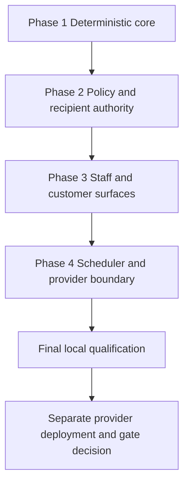

# Work Plan: Revenue Autopilot

Last updated: 2026-09-10 12:09:03 CDT

Status: Historical implementation plan. Current runtime, provider-send, and
acceptance evidence belongs in `PROJECT_STATUS.md`.

Created: August 9, 2026
Type: feature
Review scope: current `feature/customer-centered-workspace` source diff against `origin/main`; no provider/deployment/gate mutation
Estimated impact: multi-surface Functions, dependency, client, rules, UI, tests, configuration, and docs

## Related documents

- `docs/REVENUE_AUTOPILOT_ADR.md`
- `docs/REVENUE_AUTOPILOT_UI_SPEC.md`
- `docs/REVENUE_AUTOPILOT_DESIGN.md`
- `docs/CUSTOMER_CENTERED_WORKSPACE_PLAN.md`
- `docs/CUSTOMER_WORKSPACE_BACKEND_HANDOFF.md`

## Objective

Deliver deterministic, tenant-branded, SMS-free follow-up/payment/post-event
email foundations and exact unread-reply Attention on existing authoritative
evidence, while keeping all runtime/sends default-off until separately accepted.

## Verification strategy

- Correctness: no job or send is eligible without every exact applicable gate;
  stable occurrences never duplicate; stop evidence and customer preferences
  win safely; provider states and exact recovery remain distinct.
- Method: pure core/authority/template tests, callable/client/component tests,
  signed-webhook tests, rules/emulator lanes, full repo checks.
- Timing: focused tests per vertical slice; full source/local qualification after
  docs/capability convergence; provider/hosted checks after separate authorization.
- Early target: with sends off, one eligible quote materializes one stable job
  and exact stop evidence retires it with zero provider calls.
- Failure response: keep both gates false, correct the authority/identity/stop
  rule, and rerun the same occurrence matrix. Runtime-off is fully dormant;
  runtime-on with sends/provider off is preparation-only and makes no provider call.

## Quality-assurance mechanisms

| Mechanism | Enforces | Location | Covered work |
|---|---|---|---|
| Core/authority/template suites | Calendar, gates, stops, jobs, retries, policy, controls, attribution | `src/lib/__tests__/revenueAutopilot*.test.js` | Server contracts |
| Component/browser suites | Complete states, roles, route precedence, recovery | component/e2e tests | User surfaces |
| Rules/emulator | Private records, same-tenant callable operation | rules and emulator lanes | Persistence/authority |
| Env/secrets checks | Gates default off; secret-manager separation | env materializer/secrets scripts | Release config |
| Capability/docs/build/diff | No orphan, canonical sync, compile integrity | package scripts | Whole slice |

## Design-to-plan traceability

| Design item | Category | Covered by | Status |
|---|---|---|---|
| Calendar/occurrence/stop/job state core | prerequisite | Phase 1 | covered |
| Tenant policy/templates/controls/unsubscribe | contract change | Phase 2 | covered |
| Workflow/Customer 360/public preference UI | impl target | Phase 3 | covered |
| Scheduler/leased Resend dispatch/reconciliation | connection switching | Phase 4 | covered |
| `standardwebhooks@1.0.0` raw verification | external dependency | Phase 4 | covered |
| Full local qualification | verification | Final QA | covered |
| Resend/DNS/deploy/gate/human acceptance | prerequisite | Release gate | intentionally separate |

## Reference contract values

| Contract | Required observable value | Covered by |
|---|---|---|
| Operation lanes | quote follow-up, deposit reminder, final-balance reminder, post-event review request, unread customer reply | Phases 1-3 |
| Final balance cadence | tenant event-minus-14/7/3 days | Phases 1-2 |
| Read states | loading, empty, success, stale, partial, error, recovery | Phase 3 |
| Mutation states | ready, submitting, uncertain, reconciliation, receipt, error, recovery | Phase 3 |
| Provider states | provider accepted, delivered, bounced, complained remain distinct | Phases 3-4 |
| Attribution negative | booked value/money received/temporal association are not recovered or accounting revenue | Phases 1/3 |

## UI component-to-task mapping

| UI component | States | Task |
|---|---|---|
| `RevenueAutopilotOperations` | complete read and mutation profiles | Phase 3 |
| Automation policy form | admin validation/mutation/recovery | Phase 3 |
| `RevenueAutopilotCustomerControls` | role-safe read/mutation/recovery | Phase 3 |
| `RevenueAutopilotUnsubscribePage` | loading, ready/already stopped, submitting, uncertain, reconciliation, receipt, error, recovery | Phase 3 |

## ADR bindings

| ADR decision | Axis | Binding | Task |
|---|---|---|---|
| Stable internal occurrence/job model | persistence | Never delegate commercial authority to provider list state | Phase 1/4 |
| Independent runtime/send/provider/tenant/recipient gates | data flow | Every applicable gate must pass before dispatch | Phase 1/2/4 |
| Standard Webhooks direct verification | dependency direction | Webhook uses only webhook secret, never Resend API key | Phase 4 |
| Exact closeout-bound post-event occurrence | contract schema | Completed private closeout and accepted revision required | Phase 1/2 |

## Connection map

| Boundary | Left | Right | Serialized format/parse | Expected signal | Task |
|---|---|---|---|---|---|
| Browser -> callable | client/component | Functions | strict DTO/opaque request IDs | safe projection/receipt | Phases 2-3 |
| Scheduler -> Firestore | Pub/Sub function | private tenant/job records | bounded cursor/job pages | stable created/updated/stopped counts | Phase 4 |
| Job -> Resend | leased dispatcher | provider API | frozen message + provider idempotency | provider message acceptance stored privately | Phase 4 |
| Resend -> webhook | provider | HTTP Function | raw body + svix headers | verified exact job outcome/dedupe | Phase 4 |
| Email -> unsubscribe | template/job | public route | `?unsubscribe=<opaque-token>` | minimal context and exact unsubscribe receipt | Phases 2-3 |
| Env/secrets -> Functions | release materializer/Secret Manager | runtime exports | booleans and named secret bindings | dormant/enabled state without secret leakage | Phase 4/QA |

## Failure-mode checklist

| Category | Applies | Coverage |
|---|---|---|
| same-value | yes | idempotent policy/control/unsubscribe and occurrence replay |
| no-op | yes | dormant/not-due/stopped materialization |
| empty input | yes | strict DTO/policy/template/token validation |
| invalid option | yes | lane/state/template/URL/provider allowlists |
| missing config | yes | time zone, template, review URL, consent, provider and gates block |
| unavailable boundary | yes | provider failure/ambiguity and read recovery |
| shared-state dependency | yes | exact quote/payment/message/closeout re-read |
| rollback-only visibility | yes | provider events/receipts immutable; stops are new evidence |
| missing-sort-key ordering | yes | tenant/job cursors and bounded deterministic occurrence order |

## Implementation phases

### Phase 1: Deterministic core

- [x] Add tenant-calendar/DST/quiet-hour arithmetic and stable occurrences.
- [x] Add exact safety/stop evaluators for four outbound lanes.
- [x] Add unread-reply Attention, job/lease/retry/provider-state, and bounded
  attribution contracts.

### Phase 2: Policy and recipient authority

- [x] Add versioned tenant policy, strict templates, bounded attempts and lane
  settings, plus fixed v1 final-balance cadence.
- [x] Add customer consent/subscription records and signed unsubscribe tokens.
- [x] Bind post-event review to exact accepted revision, completed private
  closeout, strict template, and safe public HTTPS review URL.
- [x] Add deny-all browser rules for private authority collections/indexes.

### Phase 3: Staff and customer surfaces

- [x] Add bounded Workflow operations with gates, five lanes, jobs, provider
  outcomes, Attention, receipts, and recovery.
- [x] Expose runtime, tenant, outbound-send, and provider gates separately and
  show bounded per-lane materialization receipts.
- [x] Add admin policy form in Workflow.
- [x] Add Customer 360 consent/subscription review and admin mutation.
- [x] Add portal-preempted public unsubscribe route and exact recovery.

### Phase 4: Scheduler and provider boundary

- [x] Add 15-minute UTC bounded tenant/job scheduler and private cursor.
- [x] Add leased Resend dispatch, frozen content, bounded retry, exact ambiguous
  reconciliation, and private provider-message index.
- [x] Pin `standardwebhooks@1.0.0` and verify raw Resend events using only
  `RESEND_WEBHOOK_SECRET`; keep `RESEND_API_KEY` off the webhook.
- [x] Keep runtime and sends independently default-off in materialized config.
- [x] Preserve sending/provider-accepted/ambiguous evidence across every stop
  path and re-read current authority before an ambiguous provider retry.
- [x] Supersede and resolve latest-message Attention deterministically, with a
  bounded scheduled repair path for missed event-time creation.

### Final phase: Quality assurance

- [ ] Re-run all focused suites after final source convergence.
- [ ] Pass `npm run check:env`, full unit, rules/emulator, `npm run build`,
  bundle, Playwright, capability surfacing, docs governance, secrets, and diff.
- [ ] Audit every explicit lane, gate, stop, receipt, UI state, secret binding,
  and proof boundary against current source.
- [ ] Record final source/local evidence without a hosted/provider/production/
  human claim.

### Separate release gate (not authorized by this plan)

- [ ] Provision/rotate `RESEND_API_KEY`, `RESEND_WEBHOOK_SECRET`, and
  `REVENUE_AUTOPILOT_TOKEN_SECRET` in Firebase Secret Manager under least
  privilege; retain no values in repo/release evidence.
- [ ] Verify sender/DNS, configure signed webhook, deploy exact coordinated
  Functions/rules/frontend, and observe scheduler/webhook on a hosted candidate.
- [ ] Exercise consent, quiet hours, all four email stop rules, post-event
  reopen stop, exact retries, unsubscribe, bounce/complaint suppression, and
  unread-reply Attention with designated test records.
- [ ] Obtain explicit authorization before promoting runtime, then sends; record
  rollback controls and human acceptance separately.

## Completion criteria and progress

Source implementation is complete only after final local QA and the
requirement audit pass. Production delivery additionally requires every release
gate above. Source phases are merged into the tagged `v0.7.0` source, whose
release-level CI and coordinated Firebase/Vercel deployment receipts do not
establish this plan's provider outcomes, production-data acceptance, runtime or
send-gate promotion, or human acceptance. Those gates remain open.
