# Architecture Decision: QuotePilot Steward as a Bounded Decision Compiler

Last updated: 2026-08-25 00:38:30 CDT

Status: Accepted for implementation planning
Date: August 15, 2026
Decision owner: QuotePilot owner

## Context

QuotePilot already has trusted quote creation and update paths,
server-authoritative pricing, catalog import receipts, model-assisted intake,
customer change requests, Commercial Change Authority, and role-gated Firebase
operations. A new AI setup agent could reuse those authorities or accidentally
create a parallel authority that is easier to prompt, spoof, or misunderstand.

The design must support useful preparation across menu and workflow setup,
provider readiness, quoting, margin review, client advice, difficult customer
questions, and strategy while ensuring that model behavior cannot directly
become customer, pricing, catalog, payment, configuration, or production truth.

## Decision

Adopt a **bounded decision compiler** architecture named QuotePilot Steward.
The model is an untrusted proposal generator inside a fixed server workflow. It
has no tools and no direct data or write access. QuotePilot code selects and
minimizes authorized context, validates a strict structured response,
recalculates every authoritative consequence, and emits an expiring Decision
Packet. A human may stage permitted packet fields into the existing unsaved UI;
all writes remain in existing trusted paths.

```mermaid
flowchart LR
  U[Authenticated operator] --> P[Policy and entitlement preflight]
  P --> C[Server-owned context builder]
  C --> M[Untrusted model inference]
  M --> V[Schema and semantic validator]
  V --> A[Authoritative pricing and consequence adapters]
  A --> D[Expiring Decision Packet]
  D --> H[Human review]
  H --> S[Stage in ordinary editor]
  S --> W[Existing trusted write authority]
```

## Binding decisions

1. **No open-ended agent loop.** The API accepts a fixed task enum and bounded
   inputs. The model receives no function calls, browser, retrieval tool,
   payment tool, messaging tool, database tool, or code execution.
2. **Server-selected context only.** The model cannot choose resource IDs or
   retrieval scope. The server derives the tenant from authenticated staff
   authority and loads exact resources after role checks.
3. **The model never owns commercial numerics.** Price, taxes, fees, discounts,
   deposit, margin, staffing calculations, and production impact are attached
   or rejected by deterministic QuotePilot adapters after inference.
4. **One typed artifact.** Every usable result conforms to the versioned
   `steward-decision-packet-v1` contract. Freeform text is a bounded field inside
   that contract, never the protocol itself.
5. **Evidence and suggestion are different types.** A model suggestion cannot
   claim a catalog, policy, customer, pricing, or quote source. Source
   references are attached and verified by code.
6. **No agent-owned write path.** `Stage for review` changes only current UI
   draft state. Existing admin import, quote create/update, Commercial Change,
   send, booking, payment, and artifact paths remain authoritative.
7. **Exact-revision and expiry fence.** Packets bind the source quote revision,
   catalog revision, policy revision, actor, tenant, task, digest, and expiry.
   Stale packets cannot be staged without regeneration.
8. **Private, minimized records.** Browser principals cannot directly read or
   write run, packet, usage, policy-receipt, or entitlement records. The browser
   receives bounded DTOs from callables.
9. **Separate subscription authority.** Purchase uses Stripe Billing with a
   subscription Checkout Session and signed webhook reconciliation. It does not
   reuse quote-payment, final-balance, buyer-access, or Connect identities,
   secrets, webhooks, collections, or state machines.
10. **Provider behavior is a release gate.** A pinned provider/model, data
    controls, region, retention, terms, cost, and safety behavior must be
    verified before enablement. `store: false` is required but must not be
    described as Zero Data Retention unless the exact API project is approved
    and verified for that control.
11. **Configuration is plan-and-handoff only.** Steward may produce a typed
    menu, workflow, integration, or policy diff, but existing administrator
    editors, revision fences, recent-auth checks, confirmations, and receipts
    remain the only write authority.
12. **Provider guidance is credential-blind.** Steward may interpret bounded
    non-secret readiness projections and link to an existing safe setup path.
    It receives no secret and has no Stripe, Resend, SMS, cloud, deployment, or
    provider tool.
13. **Margin monitoring is deterministic.** Existing recorded-cost and pricing
    code detects missing coverage, below-target states, and scenario numerics.
    The model may explain verified results but cannot calculate, backfill, or
    automatically act on them.
14. **Client memory is a governed source, not hidden model memory.** Advice may
    use same-tenant canonical activity and operator-confirmed facts only when
    source, freshness, review state, and deletion controls are present. No
    protected/sensitive inference, cross-tenant pattern transfer, sentiment
    scoring, or provider conversation state is permitted.
15. **No background model surveillance.** Deterministic code may surface an
    attention state from current records, but a human must open a bounded task
    before provider inference. Steward does not continuously watch customers,
    spend tokens, contact providers, or trigger workflow actions.

## Options considered

| Option | Benefit | Risk | Decision |
|---|---|---|---|
| Generic chatbot in the app | Fastest to build and familiar | Encourages unstructured trust, broad prompts, unclear authority, and unsafe rendering | Rejected |
| Autonomous agent with tools | Can complete more work | Prompt injection or model error can become writes, messages, payments, or cross-resource access | Rejected |
| Deterministic rules only | Strong predictability and offline availability | Cannot draft nuanced responses, synthesize options, or reduce setup work enough | Retained as fallback, not complete product |
| Bounded decision compiler | Combines useful generation with deterministic truth and explicit authority | More contracts, validation, and UX work | Selected |

## Consequences

### Positive

- Model failures are contained before customer-impacting side effects.
- Existing pricing, versioning, catalog, portal, payment, and production
  authorities stay singular.
- Existing workflow, integration, and client-record authorities also remain
  singular while Steward can explain their current state and next safe step.
- The product can explain not only a recommendation but whether and how it may
  be used.
- Provider replacement remains possible because the application contract is
  provider-neutral.
- Packet and policy revisions support reproducible evals and incident review.

### Negative

- Steward cannot honestly feel like a fully autonomous employee.
- Several useful actions require a second explicit review in the existing
  surface.
- Schema validity is not enough; business-semantic validators and adversarial
  evals are required.
- Private packet retention, billing entitlement, and model operations add new
  high-risk backend capabilities and documentation obligations.

## Kill criteria

Keep all provider and tenant gates off, or immediately disable them, if any of
these are observed:

- a packet crosses tenant scope or contains an unauthorized source;
- a model-originated numeric value is presented as authoritative;
- a packet directly triggers a write, send, booking, payment, or approval;
- stale or expired packet content can be staged;
- raw customer content, secrets, or unrestricted output enters logs;
- Steward requests, receives, stores, or echoes a provider credential;
- client advice uses an inferred protected/sensitive trait, disputed memory,
  cross-tenant pattern, or source without a freshness state;
- a background model run occurs without a current bounded human request;
- an entitlement is granted from a browser return instead of a verified
  provider event;
- unsafe allergen, legal, tax, availability, discount, or contractual claims
  bypass the policy gate; or
- the ordinary non-Steward quote and catalog workflows no longer function when
  the provider is unavailable.

## Implementation guidance

- Isolate Steward modules from the existing large Functions entry point and
  export only narrow callables through `functions/index.js`.
- Preserve deterministic extraction in CREATE as the availability floor.
- Reuse existing margin, client-history, workflow-policy, integration-status,
  and Stripe Connect readiness projections rather than creating parallel
  summaries or provider clients.
- Prefer server-created source handles over sending full records from the
  browser.
- Render output through normal React text interpolation; do not support model
  HTML or raw markdown HTML.
- Use exact opaque request IDs and idempotent run creation.
- Pin model snapshots and version system prompts, packet schemas, safety policy,
  and eval sets independently.
- Run the model in shadow mode before any staging action is enabled.
- Treat provider refusal, timeout, and malformed output as normal bounded
  outcomes, not reasons to weaken validation.

## Related decisions

- `docs/INTENT_INTAKE_ADR.md`
- `docs/COMMERCIAL_CHANGE_AUTHORITY_ADR.md`
- `docs/COMMERCIAL_DEPENDENCY_GRAPH_ADR.md`
- `docs/REVENUE_AUTOPILOT_ADR.md`
- `docs/STRIPE_CONNECT_PROGRAM.md`
- `docs/POST_COMPETITIVE_DESIGN.md`
- `docs/STEWARD_PRD.md`
- `docs/STEWARD_DESIGN.md`
- `docs/STEWARD_THREAT_MODEL.md`
