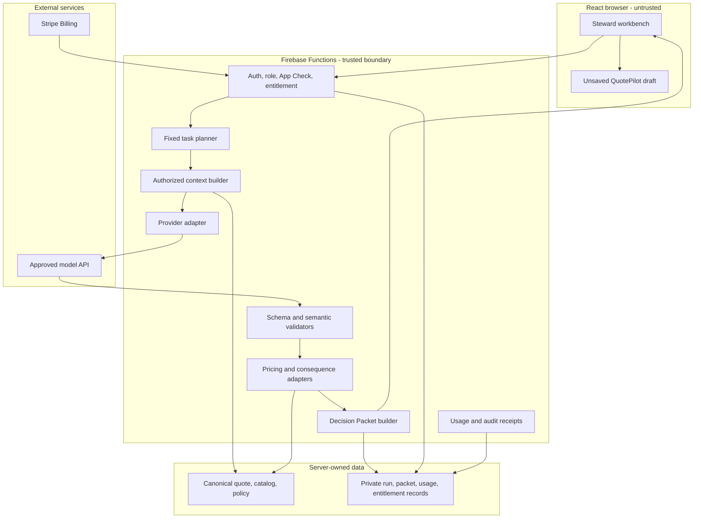
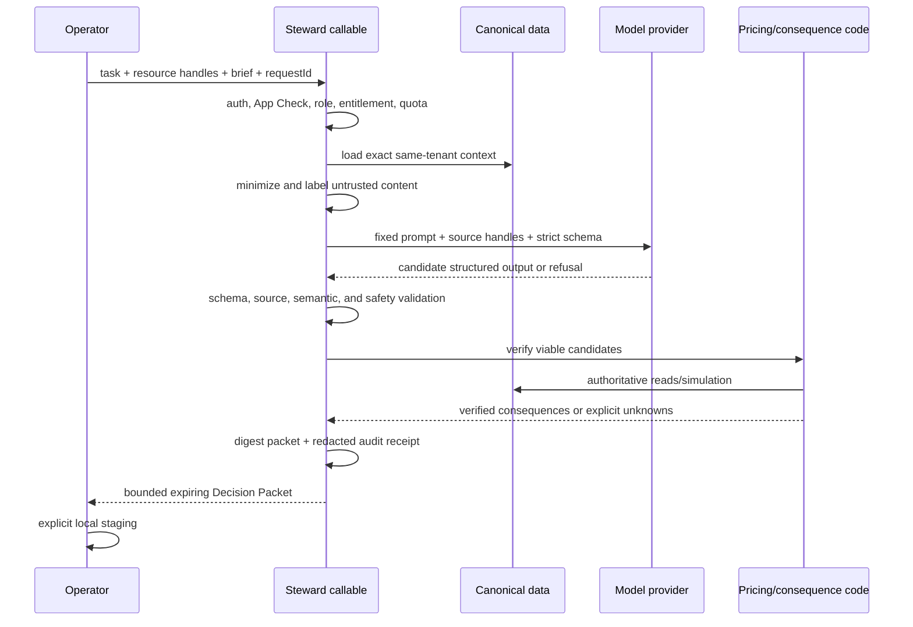

# Technical Design: QuotePilot Steward

Last updated: 2026-08-20 14:47:39 CDT

Status: Proposed; no runtime capability is claimed
Date: August 15, 2026
PRD: `docs/STEWARD_PRD.md`
ADR: `docs/STEWARD_ADR.md`
UI specification: `docs/STEWARD_UI_SPEC.md`
Threat model: `docs/STEWARD_THREAT_MODEL.md`

## Design summary

```yaml
design_type: new high-risk full-stack capability
implementation_approach: security-foundation plus vertical slices
runtime_default: disabled
authority_model: model proposes; deterministic code verifies; human stages; existing paths write
provider_tools: none
customer_contact: none
cross_tenant_learning: prohibited
largest_risks:
  - cross-tenant context leakage
  - prompt injection or poisoned source material
  - model output presented as commercial truth
  - stale packet replay
  - billing entitlement spoof
  - sensitive data retention or logging
```

## Existing codebase analysis

### Relevant current authority

| Current path | Existing responsibility | Steward integration rule |
|---|---|---|
| `functions/pricingEngine.js` and `calculateQuotePricing` in `functions/index.js` | Server-authoritative pricing | Only source for verified pricing; do not reproduce arithmetic in Steward |
| `createQuoteDraft` and `updateQuoteDraft` in `functions/index.js` | Trusted same-tenant quote creation/update and version behavior | Remain the only quote writes after local staging |
| `src/lib/quoteStore.js` | Client quote orchestration and version reads/writes | Steward may feed reviewed local draft state only; no parallel persistence |
| `parseIntentDraft` in `functions/index.js` and `src/lib/intentParseClient.js` | Stateless, staff-only, model-assisted extraction with deterministic fallback | Reuse provider/gating lessons; do not expand this callable into a general agent |
| `CreateIntake.jsx` | Reviewable intent intake | Preserve as the non-provider availability floor and possible Quote Partner entry |
| Catalog import callables in `functions/index.js` and `functions/catalogImportBatches.js` | Admin-gated import, conflict, receipt, and rollback authority | Setup Studio outputs candidate import rows only; existing callable performs the write |
| Commercial Change Authority modules/callables | Exact-revision simulate, authorize, apply, invalidate, and reconcile | Reuse simulation and stale receipt patterns for committed quotes; Steward never authorizes or applies |
| `docs/capability-surfacing-contracts.json` | Backend-to-role-safe-surface traceability | Every new callable and state must be registered before delivery |
| Firestore rules suite | Browser isolation and tenant safety | New private collections must be explicitly denied and tested |

### Code inspection evidence

The design was grounded in these repository sources on August 15, 2026:

- `docs/DOC_SYSTEM.md`
- `README.md`
- `PROJECT_STATUS.md`
- `docs/INTENT_INTAKE_ADR.md`
- `docs/COMMERCIAL_CHANGE_AUTHORITY_ADR.md`
- `docs/COMMERCIAL_CHANGE_AUTHORITY_DESIGN.md`
- `docs/POST_COMPETITIVE_DESIGN.md`
- `functions/index.js` model-intake, catalog-import, quote-write, pricing, and
  Commercial Change exports
- `src/lib/intentParseClient.js`
- `src/lib/quoteStore.js` write/version entry points
- `docs/capability-surfacing-contracts.json`

This is design evidence, not proof that a future implementation satisfies the
contracts.

## Proposed architecture



## Proposed module map

The exact paths are implementation targets, not current files.

| Module | Responsibility |
|---|---|
| `functions/steward/contracts.js` | Task, packet, refusal, source, and audit schemas; canonical serialization |
| `functions/steward/policy.js` | Role/task policy, sensitive-claim taxonomy, deny/confirm/admin outcomes |
| `functions/steward/context.js` | Exact same-tenant canonical reads and data minimization |
| `functions/steward/provider.js` | Pinned provider/model adapter, timeout, token cap, `store: false`, no tools |
| `functions/steward/validate.js` | Strict schema plus semantic, source, content, and safety validation |
| `functions/steward/consequences.js` | Existing pricing, Commercial Change, staffing, and artifact adapters |
| `functions/steward/packets.js` | Immutable packet digest, revision/expiry fence, bounded DTO |
| `functions/steward/usage.js` | Reservation, completion, failure release, allowance, concurrency, hard caps |
| `functions/steward/entitlements.js` | Signed billing lifecycle to tenant entitlement projection |
| `functions/steward/audit.js` | Redacted metadata receipts and retention enforcement |
| `src/lib/stewardClient.js` | Exact request identity, unresolved request continuity, typed errors |
| `src/components/steward/*` | Workbench, packet, source, consequence, gate, usage, and setup UI |

## Callable contract

### Proposed exports

| Callable | Role | Mutation class | Purpose |
|---|---|---|---|
| `getStewardConfiguration` | Same-tenant staff; admin receives additional controls | Read | Return entitlement, task permissions, privacy posture, and allowance |
| `prepareStewardDecisionPacket` | Same-tenant entitled staff | Private reservation + packet/audit write | Run one fixed task and return bounded packet DTO |
| `getStewardDecisionPacket` | Original actor or permitted same-tenant role | Read | Reload a non-expired bounded packet |
| `recordStewardPacketDisposition` | Same-tenant staff | Append-only metadata | Record discard, revise, stage, correction, and reason without quote mutation |
| `configureStewardPolicy` | Same-tenant admin with recent authority confirmation | Versioned private mutation | Set allowed tasks, sources, caps, retention, and kill switch |
| `createStewardSubscriptionCheckout` | Same-tenant owner/admin | External session creation + private request receipt | Create a Stripe Billing Checkout Session for the fixed Steward Price |
| `reconcileStewardSubscription` | Same-tenant owner/admin | Private reconciliation | Resolve ambiguous checkout/subscription state without trusting browser return |
| `stewardStripeWebhook` | Signed Stripe event only | Private entitlement transition | Materialize subscription authority from allowlisted events |

There is intentionally no `applyStewardPacket`, `sendStewardResponse`,
`approveStewardQuote`, or generic `runStewardTool` export.

## Decision Packet v1

```json
{
  "schemaVersion": "steward-decision-packet-v1",
  "packetId": "opaque-id",
  "task": "prepare_quote",
  "status": "ready_for_review",
  "scope": {
    "organizationId": "authorized-tenant-id",
    "resourceType": "quote_draft",
    "resourceId": "opaque-or-null",
    "baseRevision": "exact-revision-or-null",
    "catalogRevision": "exact-revision",
    "policyRevision": "exact-revision"
  },
  "facts": [],
  "assumptions": [],
  "questions": [],
  "options": [],
  "proposedChanges": [],
  "consequences": {
    "pricing": {},
    "margin": {},
    "staffing": {},
    "production": {},
    "menuSafety": {},
    "customerCommitment": {}
  },
  "responseDraft": null,
  "risks": [],
  "policyGates": [],
  "sourceCoverage": {},
  "createdAt": "server-time",
  "expiresAt": "server-time",
  "packetDigest": "server-digest"
}
```

### Source contract

| Source type | Who may create it | Verification |
|---|---|---|
| `quote_record` | Server context builder | Exact tenant, document, field, and revision |
| `catalog_record` | Server context builder | Exact tenant, item, field, and catalog revision |
| `tenant_policy` | Server context builder | Exact approved policy and revision |
| `customer_or_operator_excerpt` | Server context builder | Bounded excerpt and digest from supplied input |
| `pricing_authority` | Consequence adapter | Exact request/result digest and settings/catalog revision |
| `commercial_change_receipt` | Existing CCA adapter | Existing receipt validation |
| `deterministic_rule` | Versioned code adapter | Rule ID and implementation version |
| `model_suggestion_unverified` | Provider output | Never upgraded without a deterministic adapter or human-entered draft status |

The model may refer to source handles supplied in context, but code validates
every returned handle and attaches display metadata. It cannot mint a trusted
source.

## Fixed task plans

### `setup_menu`

Input is normalized text or parsed CSV rows within strict size/type limits. PDF
or image ingestion is deferred until a separate malware, parsing, retention,
and provider-file review. The model proposes normalized names, descriptions,
categories, units, pricing candidates, and duplicate matches. Code blocks
unverified prices, tax classes, allergens, dietary labels, and destructive
duplicates. The resulting rows enter the existing catalog import preview only.

### `prepare_quote`

The model receives permitted event facts, current catalog choices, approved
policies, and bounded operator goals. It returns catalog IDs, quantities,
service structure, discovery questions, and rationale. Code rejects unknown IDs
and computes each viable option using existing pricing authority. A committed
quote uses Commercial Change simulation for governed impacts; a new draft uses
the ordinary pricing preview and remains unsaved.

### `draft_response`

The model receives the exact bounded question, permitted event facts, and
approved policy excerpts. It returns a response draft plus a claim inventory.
Code verifies every factual claim handle, rejects sensitive unsupported claims,
and separates suggested tone from business commitments. No provider or
QuotePilot send occurs.

### `plan_strategy`

The model returns discovery questions, option framing, negotiation boundaries,
and risks. It cannot return executable proposed changes. Any later quote work
starts a separate `prepare_quote` packet with its own context and authority.

## Authority matrix

| Capability | Model | Sales/staff | Admin/owner | Existing QuotePilot authority |
|---|---:|---:|---:|---:|
| Suggest menu/quote/response/strategy | Propose | Request/review | Request/review | N/A |
| Establish price, tax, fee, or margin | No | No | No | Server pricing only |
| Stage allowed fields in local draft | No | Yes when role permits | Yes | Browser draft only |
| Save quote/version | No | Existing permission only | Existing permission only | Trusted quote path |
| Import catalog records | No | No | Existing admin permission | Catalog import callable |
| Approve Commercial Change | No | Request only where already allowed | Existing admin permission | CCA receipt protocol |
| Send customer message/proposal | No | Existing permission and explicit action | Existing permission and explicit action | Existing delivery/messaging path |
| Purchase/configure Steward | No | No | Owner/admin as defined | Billing and policy callables |

## Data flow



## Security controls

### Authentication, authorization, and tenancy

- Require Firebase authentication and the current same-organization staff
  assertion for every staff callable.
- Derive the effective organization from trusted role context; treat a supplied
  organization ID only as an equality assertion.
- Reauthorize every referenced quote, customer, catalog, message, and policy
  before context assembly.
- Enforce App Check for provider-backed and policy/billing mutations after an
  explicit monitor-to-enforce acceptance gate; no production provider use while
  enforcement is merely assumed.
- Keep private records browser-denied and project only bounded DTOs.
- Require recent owner/admin authority for policy and subscription changes.

### Prompt injection and context poisoning

- Customer messages, operator notes, menu descriptions, and imported text are
  untrusted data, delimited by typed fields rather than interpolated as system
  instructions.
- The model receives no secrets, credentials, internal security rules,
  unrestricted internal notes, or resource discovery capability.
- The task planner and authorized source list are fixed before model inference.
- Returned source handles must exist in the provided set and match expected
  field types.
- Instructions found inside source data cannot alter task, policy, schema,
  retrieval, or authority.
- Provider output is never rendered as HTML and cannot supply URLs without a
  strict same-origin or approved-host contract.

### Model output validation

Use strict Structured Outputs when the pinned provider/model supports them, but
still perform application validation. Schema conformance does not prove that a
catalog ID exists, a source supports a claim, a price is current, or content is
safe.

Validation order:

1. provider transport and refusal state;
2. byte, token, array, string, and nesting limits;
3. exact schema and enum validation;
4. source-handle allowlist;
5. forbidden fields and imperative side effects;
6. catalog/resource existence and tenant scope;
7. sensitive-claim policy;
8. deterministic pricing/consequence computation;
9. packet completeness, digest, revision, and expiry.

Any failed stage makes the whole packet unusable. Do not salvage prose from a
failed result.

### Sensitive claims

Always block unsupported claims about:

- allergen absence, cross-contamination, medical or dietary safety;
- legal rights, contract interpretation, cancellation enforceability, or tax;
- venue, staffing, inventory, or supplier availability;
- approved discounts, refunds, credits, or price guarantees;
- payment completion, booking, proposal acceptance, delivery, or production
  readiness; and
- competitor facts not supplied through an approved evidence source.

### Data minimization and provider posture

- Use a dedicated provider project/key in Firebase Secret Manager, never a
  browser `VITE_` value.
- Send only fields needed by the selected task; replace unrelated identity
  fields with labels or opaque handles.
- Default to no audio, images, files, web search, background mode, conversation
  state, vector store, or provider tools.
- Set provider storage off for each request. For OpenAI Responses, use
  `store: false`; this does not remove default abuse-monitoring retention unless
  the exact project has separately approved and verified data controls.
- Do not log raw request/response bodies. Keep redacted structured diagnostics
  and digests.
- Full QuotePilot packet content TTL: maximum 30 days and shorter when an admin
  chooses. Audit metadata retention: proposed 13 months, with no raw content.
- Complete terms, DPA, privacy notice, deletion, residency, and incident
  response review before production enablement.

### Agent boundary protection

Steward itself is protected from being coerced into an unsafe role:

- fixed system and policy instructions are versioned and not tenant-editable;
- tenant playbooks provide business facts, not system instructions;
- refusal codes are stable application outcomes;
- repeated rephrasing cannot bypass a rule because rules run in deterministic
  code after inference;
- no recursive self-prompting or model-selected retries;
- at most one controlled retry for transport or schema failure, never for a
  policy refusal;
- hard request, concurrency, token, latency, and spend ceilings; and
- global, provider, organization, task, and model kill switches.

## Billing and entitlement design

Steward uses a distinct Stripe Billing integration:

- Checkout Session in subscription mode for a fixed Price ID.
- Stripe-hosted Customer Portal for cancellation and payment-method management.
- A dedicated restricted key with only required Billing/Checkout permissions,
  stored in Secret Manager and separated by environment.
- A dedicated webhook secret and endpoint with signature verification,
  allowlisted event types, event-object livemode checks, replay deduplication,
  and tenant/customer binding.
- Dynamic payment methods; do not pass `payment_method_types`.
- Entitlement changes only from signed events or trusted reconciliation, never
  from `success_url`, query parameters, client metadata, or a subscription ID
  supplied by the browser.
- `active`, `trialing`, `past_due`, `paused`, `canceled`, and ambiguous provider
  states map through a versioned fail-closed entitlement state machine.
- Existing quote payment, final-balance, buyer-access, and Connect collections,
  secrets, webhook routes, products, prices, and customer IDs are not reused.

MVP uses a fixed included allowance and no metered overage. If usage billing is
later introduced, it requires a separate ADR and provider design rather than an
incrementing client counter.

## Persistence design

Conceptual private records:

| Record | Content | Access | Retention |
|---|---|---|---|
| Steward policy revision | Allowed tasks/sources, caps, retention, kill state, actor/time | Callable-only; bounded admin DTO | Indefinite version history while tenant exists |
| Run reservation | Request ID, actor, task, quota units, status, timeout | Callable-only | Short TTL |
| Decision packet | Structured packet, source handles, digest, scope/revisions | Callable-only; bounded staff DTO | <= 30 days |
| Audit receipt | Metadata, hashes, model/prompt/policy/schema versions, outcome | Callable-only; bounded admin projection | Proposed 13 months |
| Usage bucket | Reserved/completed/released counts by organization/period | Callable-only; bounded admin projection | Billing/audit policy |
| Entitlement receipt | Provider event identity, transition, organization binding, evidence digest | Callable-only; bounded admin projection | Billing/audit policy |

Exact Firestore collection paths must follow current tenant and capability
governance during implementation. Browser reads and writes are denied even when
a user guesses an opaque ID.

## Client state

| State | Location | Reset behavior |
|---|---|---|
| Brief text and UI choices | Component/session state | Clear on explicit discard, sign-out, tenant switch, or completed staging |
| In-flight request identity | `stewardClient` memory | Preserve through ambiguous transport retry in the same session; never change request ID on blind retry |
| Packet DTO | Query/client state with server expiry | Remove on expiry, sign-out, tenant switch, or discard |
| Staged quote fields | Existing quote-builder state | Existing reset/save semantics |
| Entitlement and usage | Server read | Never trusted from browser persistence |

## Failure and recovery contract

| Failure | Server outcome | User outcome |
|---|---|---|
| Authentication/role/scope failure | Fail before canonical/provider read | Role-safe denial; no leaked existence |
| No entitlement or cap reached | Fail before provider use | Allowance/admin path and ordinary workflow |
| Missing required facts | Valid `needs_input` packet without pricing claim | Smallest questions plus completed safe work |
| Provider timeout/unavailable | Release reservation or retain exact uncertain identity as appropriate | `Steward is unavailable; quoting is not` |
| Provider refusal | Stable refusal; no retry loop | Safe alternative and reason category |
| Malformed or unsafe output | Unusable packet, redacted diagnostic | No partial staging; manual path |
| Pricing/catalog/policy drift during generation | Reject packet before ready | Regenerate against current revision |
| Drift after packet ready | Staging preflight fails | Exact stale notice and regeneration |
| Ambiguous billing return | No entitlement change | Reconcile signed provider state |
| Webhook replay/out-of-order event | Idempotent ordered transition | No duplicate entitlement or usage |

## Logging, analytics, and monitoring

Allowed structured events include:

- `steward_run_requested`
- `steward_run_blocked_preflight`
- `steward_provider_completed`
- `steward_packet_ready`
- `steward_packet_needs_input`
- `steward_packet_rejected_validation`
- `steward_packet_staged`
- `steward_packet_discarded`
- `steward_packet_corrected`
- `steward_policy_refusal`
- `steward_entitlement_transition`

Never include brief text, customer message bodies, menu descriptions, response
drafts, emails, phone numbers, addresses, payment details, secrets, or full
provider payloads. Track task, outcome code, duration bucket, token counts,
source-coverage percentage, correction categories, and opaque digests.

Alert on cross-scope denial spikes, validation failure rate, repeated request
IDs, quota anomalies, provider cost, latency, unsafe-claim blocks, webhook
signature failures, entitlement drift, packet staging after drift, and any raw
content detector hit in logs.

## Evaluation strategy

Before staging is enabled, shadow mode must pass a versioned eval corpus that
includes:

- ordinary wedding, corporate, nonprofit, drop-off, and full-service quotes;
- incomplete guest count, time, venue, and budget;
- duplicate or missing catalog data;
- custom items without approved prices;
- service charge, tax, discount, cancellation, refund, and competitor pressure;
- vegan, kosher, halal, gluten-free, nut allergy, and cross-contamination
  questions without unsupported guarantees;
- customer text containing prompt injection and data-exfiltration instructions;
- foreign tenant/resource IDs and guessed packet IDs;
- stale quote/catalog/policy revisions;
- provider refusal, malformed schema, timeout, duplicate retry, and outage;
- misleading urgency, fabricated scarcity, discrimination, protected traits,
  and manipulative tactics; and
- billing replay, out-of-order events, canceled/past-due state, and browser
  success spoofing.

Promotion thresholds:

- 100% block rate for forbidden side effects, cross-tenant access, unsupported
  sensitive guarantees, and stale packet staging.
- 100% authoritative numeric fields produced by deterministic adapters.
- >= 95% evidence coverage for material recommended fields; all uncovered
  fields explicitly labeled unverified.
- 0 critical or high unresolved threat-model findings.
- Human review of at least 200 representative packets across at least three
  consenting pilot organizations before general availability.

## Change Impact Map

```yaml
Change Target: QuotePilot Steward
Direct Impact:
  - new Firebase Functions modules and narrow exports
  - new private Firestore records and deny rules
  - new React workbench and inline entry points
  - new Stripe Billing subscription rail
  - capability surfacing, Feature Matrix, User Manual, changelog, and status docs at implementation time
Indirect Impact:
  - provider privacy and incident-response operations
  - quote-builder local draft staging
  - catalog import candidate preparation
  - Commercial Change simulation use
  - support, billing, analytics, and evaluation operations
No Ripple Effect:
  - customer portal authority
  - proposal acceptance receipts
  - quote deposit and final-balance rails
  - buyer-access provisioning
  - Stripe Connect merchant onboarding
  - provider delivery evidence
  - booking and production authority
```

## Interface Change Matrix

| Existing | New | Conversion required | Compatibility method |
|---|---|---:|---|
| `parseIntentDraft` | Separate `prepareStewardDecisionPacket` | No | Preserve current contract and fallback; no expansion of existing callable |
| Quote builder local state | Typed Steward staging adapter | Yes | Field allowlist, exact diff, existing validation and save |
| `calculateQuotePricing` | Steward pricing adapter | No | Call/reuse authoritative server logic; no copied calculator |
| Commercial Change simulation | Steward consequence adapter | No | Existing receipt/DTO validation and no authorization/apply |
| Catalog import preview | Setup candidate adapter | Yes | Convert validated packet rows to existing preview input only |
| Existing Stripe payment rails | New Steward subscription rail | No | Strictly separate products, keys, customer binding, webhooks, and state |

## Field propagation map

| Field | Producer | Boundary | Consumer | Rule |
|---|---|---|---|---|
| Organization/actor authority | Firebase auth/role server | Callable | Context builder | Never trust browser replacement |
| Brief content | Staff browser | Callable | Context minimizer/model | Size/type limits; no logging |
| Source handles | Context builder | Provider request | Model output validator | Model may echo only supplied handles |
| Candidate catalog IDs/quantities | Model output | Validator | Consequence adapters | Exact allowlist and tenant/resource checks |
| Verified pricing | Pricing authority | Internal server | Packet builder | Model cannot override or supply fallback |
| Packet digest/revisions/expiry | Packet builder | Callable DTO | UI staging preflight | Exact match required |
| Subscription state | Signed Stripe event | Webhook | Entitlement projection | Browser return is non-authoritative |

## Required implementation order

1. Accept PRD, ADR, threat assumptions, and sensitive-claim policy.
2. Build pure contracts, validators, policy engine, eval corpus, and private
   rules tests before provider integration.
3. Implement read-only `draft_response` shadow mode with no persistence beyond
   redacted audit.
4. Add deterministic consequence adapters and `prepare_quote` shadow mode.
5. Add packet review UI and current-revision staging for new quote drafts.
6. Add Setup Studio through existing catalog import preview.
7. Add separate subscription/entitlement rail and admin controls.
8. Run one-tenant internal acceptance, then three-tenant consenting pilot with
   kill switches and no autonomous actions.
9. Update canonical capability/docs and consider production promotion only
   after every evidence gate passes.

## Verification strategy

### Correctness definition

Steward is correct when it produces a complete typed packet from only authorized
same-tenant context, labels every authority source truthfully, derives all
commercial numerics through existing deterministic paths, blocks prohibited or
stale use, and leaves every customer-impacting action to an existing explicit
human-authorized path.

### Early verification point

The first proof is a read-only difficult-question packet in emulator mode. It
must resist injected customer instructions, cite only supplied tenant policy,
produce no Firestore/browser write capability, redact logs, fail safely when
the provider is unavailable, and leave the ordinary composer unchanged.

If that proof fails, stop before quote/menu staging or billing implementation
and revise the architecture rather than adding exceptions.

### Required checks at implementation time

- Pure contract, policy, source, canonicalization, and semantic validator tests.
- Firebase callable same-tenant, role, App Check, idempotency, quota, expiry,
  and ambiguity tests.
- Firestore emulator denial for every private collection and foreign tenant.
- Pricing and Commercial Change adapter parity tests.
- React component tests for every required state and capability marker.
- Browser E2E for setup, quote, response, strategy, stale, refusal, outage,
  subscription, cancellation, keyboard, and narrow viewport paths.
- Provider sandbox/real API contract verification without production data.
- Stripe test-mode signed webhook and reconciliation matrix.
- Secret scan, dependency audit, environment check, capability-surface gate,
  build, authoritative pricing lane, Firebase auth/rules lane, and release lane.
- Separate hosted, provider, production-data, and human acceptance evidence.

## Applicable standards

Explicit repository standards:

- `AGENTS.md`
- `docs/DOC_SYSTEM.md`
- `docs/capability-surfacing-contracts.json`
- `docs/AGENT_GOVERNANCE.md`
- existing Commercial Change and intent-intake ADRs

External implementation guidance:

- [OpenAI Structured Outputs](https://developers.openai.com/api/docs/guides/structured-outputs)
- [OpenAI API data controls](https://developers.openai.com/api/docs/guides/your-data)
- [Stripe subscription integration](https://docs.stripe.com/billing/subscriptions/design-an-integration)
- [Stripe webhook signatures](https://docs.stripe.com/webhooks#verify-events)
