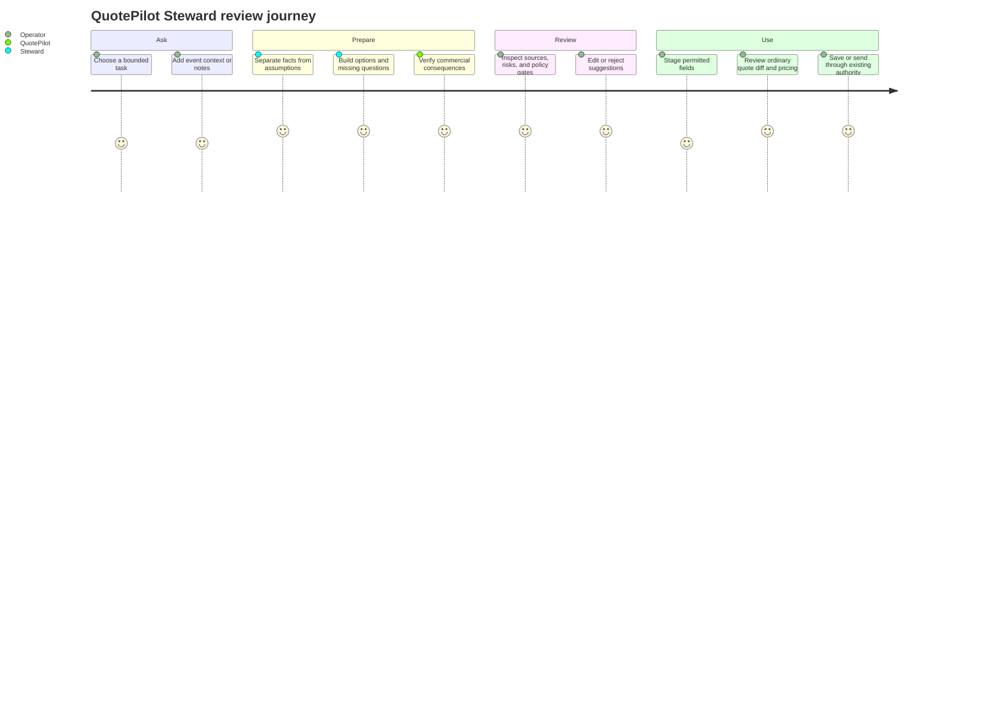
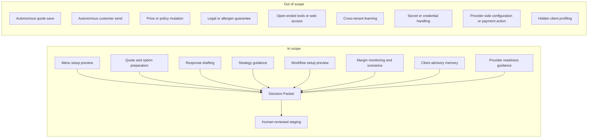

# Product Requirements: QuotePilot Steward

Last updated: 2026-08-20 20:18:11 CDT

Status: Accepted for implementation planning
Date: August 15, 2026
Related research: `docs/STEWARD_COMPETITIVE_RESEARCH.md`

## Overview

### One-line summary

QuotePilot Steward is a paid, tenant-bounded business copilot that helps teams
configure menus and workflows, understand provider readiness, protect margin,
prepare quotes and responses, and advise each client from reviewed first-party
history while leaving every write, payment, send, approval, and customer
commitment under existing human and server authority.

### Product principle

Steward may **prepare, compare, explain, and stage**. It may never independently
**approve, apply, publish, send, charge, promise, or conceal**.

No design can guarantee zero vulnerabilities. This product instead adopts
fail-closed authority, minimized data, deterministic verification, immutable
receipts, explicit limits, and adversarial testing so a model failure cannot by
itself become a commercial action.

### Why this is needed

Caterers routinely quote while standing in a venue, speaking with a customer,
or switching between incomplete notes, a menu, staffing assumptions, and a
budget. Existing tools accelerate document assembly but leave the operator to
mentally connect the commercial and operational consequences. Generic AI can
write persuasive text but may invent facts, expose data, or blur who approved
the result.

Steward should make the on-the-spot moment calmer and more ambitious: the
operator can ask for setup guidance, a menu, workflow, provider-readiness
check, quote, margin review, client plan, answer, or strategy and receive a
structured Decision Packet that can be challenged and reviewed before entering
the trusted QuotePilot flow.

## Primary users

| User | Need | Authority |
|---|---|---|
| Organization owner/admin | Set up menus, workflows, providers, and house rules; govern data use; purchase the add-on; review safety and usage | Configure Steward policy and entitlement; review staged setup plans; retain existing admin-only authorities |
| Sales or event operator | Build a fast, defensible quote, protect margin, understand a client, and answer difficult questions | Request packets and stage permitted suggestions into an unsaved draft; existing quote and communication authority remains unchanged |
| Operations staff | Understand staffing and production consequences | Read bounded consequences when already authorized for the underlying event; no commercial apply authority is added |
| Customer | Receive accurate, respectful, human-approved communication | No direct Steward access or autonomous contact in MVP |

## Core jobs

1. **Setup Studio:** Turn a menu document, CSV, or operator notes into a staged
   catalog import with duplicates, missing prices, units, tax categories,
   dietary labels, and uncertainties called out for review.
2. **Quote Partner:** Turn qualified event facts into one recommended quote and
   up to two meaningful alternatives using only approved catalog choices and
   authoritative calculations.
3. **Difficult Question Desk:** Draft a response to budget pressure, competitor
   comparison, service charges, substitutions, schedule changes, dietary
   concerns, cancellation questions, or "what can we do instead?" using
   approved house policies and exact event context.
4. **Strategy Table:** Prepare discovery questions, option architecture,
   negotiation boundaries, upsell opportunities, and risk-aware next steps
   without making customer commitments.
5. **Workflow Coach:** Review the organization's recorded workflow policies,
   attention rules, reminders, templates, and operational gates; produce a
   staged configuration plan for an administrator to apply through the
   existing authoritative settings surfaces.
6. **Margin Advisor:** Monitor complete recorded-cost margin evidence, explain
   below-target or unavailable states, and prepare bounded price/scope scenarios
   through existing deterministic pricing and Commercial Change simulation.
7. **Client Advisor:** Build a source-labeled relationship brief from
   tenant-owned accepted/booked history, confirmed preferences, recorded
   interactions, and operator-reviewed memory without inferring protected or
   sensitive traits.
8. **Provider Setup Guide:** Explain non-secret readiness, missing evidence,
   test-mode steps, and safe handoffs for Stripe and other approved integrations
   without receiving credentials or creating provider objects.

## User journey

## Scope boundary

## Functional requirements

### Must have: MVP

- **STW-FR-001: Bounded tasks.** The user must select one of `setup_menu`,
  `configure_workflow`, `guide_provider_setup`, `prepare_quote`,
  `review_margin`, `advise_client`, `draft_response`, or `plan_strategy`;
  arbitrary tool-running requests are rejected.
  - AC-001: An unsupported task returns a stable refusal code and no provider
    request.
  - AC-002: The model never receives a general-purpose tool, browser, database,
    payment, messaging, or write capability.
- **STW-FR-002: Same-tenant context.** The server derives the organization and
  role from authenticated authority, validates every requested resource, and
  loads canonical context itself.
  - AC-003: Foreign organization IDs and resource IDs fail before provider use
    and produce no content-bearing logs.
  - AC-004: A user receives only fields already permitted by the underlying
    QuotePilot role and surface.
- **STW-FR-003: Decision Packet.** Every successful run returns facts,
  assumptions, questions, options, proposed changes, consequences, risks,
  policy gates, source references, base revision, and expiry.
  - AC-005: Every proposed material field has an evidence source or is labeled
    `model_suggestion_unverified`.
  - AC-006: Unknown and unsupported values remain unknown; confidence alone
    never upgrades them to verified.
- **STW-FR-004: Authoritative calculations.** Models may propose catalog IDs,
  quantities, and option structures but may not establish price, margin, tax,
  fee, deposit, staffing, or production truth.
  - AC-007: Every displayed pricing value is produced by the existing trusted
    pricing path and carries its catalog/settings revision.
  - AC-008: Margin is unavailable when required recorded cost evidence is
    incomplete.
- **STW-FR-005: Human review boundary.** Steward output cannot directly save a
  quote, mutate a catalog, send a message, publish a proposal, approve a
  commercial change, charge a payment method, or make a booking.
  - AC-009: The only initial use action is `Stage for review`; the ordinary
    trusted editor and save flow remain separate.
  - AC-010: The interface says `Nothing has changed` until a user completes an
    existing authorized write.
- **STW-FR-006: Menu setup safety.** Setup output maps candidate rows into the
  existing catalog-import preview and never directly creates catalog records.
  - AC-011: Missing prices, units, duplicate matches, tax classification, and
    unverified dietary/allergen claims block automatic selection.
  - AC-012: Final catalog creation uses the existing admin-gated import batch,
    conflict detection, receipt, and rollback contract.
- **STW-FR-007: Difficult-question safety.** Response drafts distinguish
  approved policy, event facts, suggested language, and prohibited claims.
  - AC-013: Legal, tax, medical, allergy-safety, availability, discount, and
    contractual guarantees are omitted unless exact approved evidence supports
    the statement; sensitive categories route to human review.
  - AC-014: Steward never sends the response or marks a customer interaction
    answered.
- **STW-FR-008: Paid entitlement.** Only an active organization entitlement and
  enabled tenant policy allow provider-backed runs.
  - AC-015: Browser success returns, client claims, or Stripe object IDs alone
    cannot grant entitlement.
  - AC-016: Entitlement follows a separate signed-webhook Stripe Billing rail
    and cannot reuse quote deposits, final balances, buyer access, or Connect.
- **STW-FR-009: Cost control.** Admins see a usage allowance and can set a hard
  organization cap; MVP has no surprise overage.
  - AC-017: Exhausted or disabled usage fails before provider use and preserves
    deterministic QuotePilot workflows.
  - AC-018: Concurrent and per-user limits prevent duplicate high-cost runs.
- **STW-FR-010: Audit and privacy.** Raw prompts, full customer messages,
  provider secrets, and unrestricted model responses are excluded from logs and
  long-lived audit receipts.
  - AC-019: Audit evidence records actor, organization, task, policy revision,
    model snapshot, source IDs/hashes, outcome, usage, timestamps, and packet
    digest without raw sensitive content.
  - AC-020: Full packet content expires within the configured maximum of 30
    days; metadata-only receipts have a separately documented retention period.
- **STW-FR-011: Safe degradation.** Provider timeout, refusal, malformed output,
  quota exhaustion, or model disablement does not block ordinary quoting,
  catalog import, or customer communication.
  - AC-021: Recovery points to the existing deterministic/manual path.
  - AC-022: No partial packet can be staged.
- **STW-FR-012: Workflow configuration safety.** Steward may compare current
  tenant workflow policy with an approved goal and prepare a versioned settings
  diff, but it cannot enable a gate, schedule a job, change a role, or write a
  policy.
  - AC-023: Every proposed configuration field maps to an existing role-safe
    editor and names the current value, proposed value, consequence, do-nothing
    outcome, owner, and required approval.
  - AC-024: Applying any configuration remains an explicit administrator action
    through the existing revision-fenced authority and receipt path.
- **STW-FR-013: Deterministic margin advice.** Steward may explain and compare
  margin only after the existing margin authority establishes complete
  recorded-cost coverage for the exact quote or scenario.
  - AC-025: Background margin monitoring is deterministic and server- or
    client-rule driven; it never spends model tokens or changes a quote by
    itself.
  - AC-026: Costs, target margin, and margin advice remain staff-only. A margin
    task may send only the minimum verified margin/target/delta context allowed
    by tenant policy—never raw cost lines—and no result may enter a proposal,
    portal, customer response, or customer-safe projection.
- **STW-FR-014: Governed client memory.** Client advice may use only current-
  tenant canonical activity and operator-confirmed memory facts with source,
  freshness, scope, and review state.
  - AC-027: Steward cannot infer or retain protected traits, health/dietary
    details, religion, disability, minors' data, sentiment, personality,
    willingness to overpay, or hidden vulnerability scores.
  - AC-028: Authorized staff can inspect the source behind every memory fact;
    administrators can correct, expire, or delete it; stale or disputed facts
    are excluded from provider context and recommendations.
  - AC-029: Recorded behavior means exact first-party events—such as accepted
    selections, booked event patterns, explicit preferences, and separately
    evidenced communication states—not inferred intent or cross-tenant trends.
- **STW-FR-015: Provider setup guidance.** Steward may read bounded, non-secret
  QuotePilot readiness projections and prepare an ordered setup checklist for
  Stripe, Resend, SMS, or another approved integration.
  - AC-030: The interface rejects API keys, webhook secrets, payment-card data,
    bank information, and recovery codes before provider use and never asks the
    user to paste them into Steward.
  - AC-031: Steward cannot create or modify provider accounts, webhooks,
    products, prices, subscriptions, charges, refunds, payouts, routing, secret
    bindings, runtime gates, or production configuration.
  - AC-032: Each provider step links to the existing role-safe QuotePilot or
    provider-hosted surface and keeps configuration, provider acceptance,
    settlement, activation, and production evidence separate.

### Should have: controlled follow-up

- A live `Quote with Steward` focus mode optimized for a tablet or laptop during
  a customer conversation, without recording audio.
- Tenant-authored playbooks for discount limits, substitutions, deposits,
  cancellation language, minimums, and escalation contacts.
- An admin evaluation screen showing acceptance, correction, refusal, unsafe
  block, cost, latency, and downstream rework as separate metrics.
- Exact packet comparison so an operator can ask for a revised option without
  losing the original evidence.

### Could have: later proposals

- Consent-based transcription after a separate privacy and recording-law
  review.
- Operator-curated reusable strategy recipes and response patterns.
- Admin-reviewed workflow and provider setup recipes that reference only
  versioned non-secret configuration fields and existing authoritative routes.
- A customer-facing clarification form that gathers facts but never exposes the
  agent or allows autonomous negotiation.

### Will not have in this program

- An autonomous customer-facing sales representative.
- Unbounded web browsing, arbitrary tools, code execution, or third-party MCP
  access.
- Automatic acceptance, discount approval, proposal publication, messaging,
  booking, payment, refund, or production release.
- Autonomous provider setup, secret handling, gate promotion, background model
  surveillance, or automatic margin-driven repricing.
- Inferred allergens, dietary safety, medical suitability, legal conclusions,
  tax advice, or guaranteed availability.
- Cross-tenant training, benchmarking, retrieval, or imitation.
- Sentiment-based pricing, protected-class inference, deceptive scarcity, or
  manipulative sales tactics.

## Non-functional requirements

| Area | Requirement |
|---|---|
| Security | Zero successful cross-tenant reads, direct browser access to private records, stale packet application, or autonomous side effects in the required negative test matrix |
| Reliability | Provider failure leaves all existing manual/deterministic paths available; packet generation is all-or-nothing |
| Performance | Target p50 <= 8 seconds and p95 <= 20 seconds for text-only packet preparation; deterministic preflight <= 1 second excluding network |
| Availability | Steward may target 99.5% monthly availability without changing QuotePilot's core quoting availability target |
| Accessibility | WCAG 2.2 AA; complete keyboard path; status and consequence changes announced without color-only meaning |
| Privacy | Data minimization by task; no raw prompt in analytics; operator-visible disclosure before provider-backed use; reviewable/deletable tenant memory; documented deletion and provider-retention posture |
| Cost | Per-run token and time ceilings, organization allowance, hard cap, duplicate suppression, and admin-visible usage |
| Explainability | 100% of deterministic values show their authority source; model suggestions are visibly distinct from verified evidence |

## Success metrics

1. Median time from qualified facts to review-ready initial quote is under five
   minutes, measured from first Steward request to packet-ready state.
2. At least 95% of material staged fields retain a visible source reference,
   measured by packet contract telemetry; the remaining fields must be visibly
   unverified suggestions.
3. Zero autonomous customer-impacting actions across production telemetry and
   audit review.
4. At least 50% of pilot users report that Steward reduced mental switching
   during a live quote, measured after 30 days.
5. Fewer than 2% of packets reach `ready_for_review` with a deterministic
   semantic validation failure; those packets must remain unusable.
6. Pilot users correct fewer than 10% of authoritative numeric fields because
   those fields are generated by deterministic systems, not the model.
7. Accessibility audit scores 100% for critical interaction paths and has zero
   serious automated violations before pilot promotion.
8. 100% of client-advice memory facts show a canonical source and freshness
   state; disputed, stale, sensitive, or deleted facts appear in zero provider
   requests.
9. 100% of margin alerts and scenarios are traceable to the existing
   deterministic margin/pricing authorities, with no model-originated fallback
   numbers.

## Commercial hypothesis

The initial offer should be simple and protective:

- `QuotePilot Steward` as an organization add-on, not a per-seat permission.
- Suggested validation price: `$99/month` including 300 completed packets.
- A 14-day trial with 30 completed packets.
- No automatic overage in MVP. At the cap, admins may upgrade or wait for the
  next cycle.
- Usage counts only completed provider-backed packets, not policy refusals,
  validation failures, or QuotePilot-side outages.

This is a pricing hypothesis, not a committed price. Validate willingness to
pay, provider cost, support load, and packet completion rate before launch.

## Risks

| Risk | Impact | Mitigation |
|---|---|---|
| Users treat polished model text as truth | High | Evidence-first layout, verified/unverified types, no chat persona, mandatory staging and ordinary review |
| Prompt injection in customer text or menu files | High | Treat documents as data, no tools, fixed task plans, strict output schema, server-side source allowlist, deterministic semantic validation |
| Cross-tenant leakage | Critical | Server-derived tenant, exact resource authorization, no model-selected retrieval, private records, negative tests |
| Incorrect price or margin | Critical | Model cannot establish numerics; existing pricing authority recomputes; incomplete costs fail closed |
| Unsafe dietary or contractual promise | High | Sensitive-claim taxonomy, approved policy citations, blocked guarantees, human escalation |
| Subscription spoof or billing confusion | High | Separate Stripe Billing rail, signed webhooks, immutable entitlement transitions, clear cancellation and usage UI |
| Provider data retention conflicts with customer expectations | High | Pre-launch DPA/privacy review, task minimization, `store: false`, no files/background/tools, truthful disclosure, ZDR treated as optional verified control |
| Model drift changes behavior | High | Pinned model snapshot, prompt/policy versions, eval gate, canary, instant provider/model kill switch |
| Stale or inferred client memory creates bad advice | High | First-party sources only, explicit freshness, operator review, correction/deletion, no protected or sensitive inference |
| Setup guidance crosses into provider or production authority | Critical | Non-secret readiness DTOs, no tools, no secret input, role-safe handoffs, existing provider and release gates remain separate |
| Margin optimization encourages harmful or deceptive treatment | High | Deterministic numerics, policy constraints, no protected-trait use, explicit tradeoffs, human review, no automatic repricing |

## Owner approval record

The owner reviewed and accepted this PRD and the related ADR, UI specification,
technical design, threat model, and work plan on August 20, 2026. The approved
launch context is recorded in `docs/STEWARD_THREAT_MODEL.md`. Acceptance
authorizes implementation planning, not provider enablement, billing
activation, deployment, production promotion, or autonomous authority.

Later on August 20, 2026, the owner directed this planning scope to include
menu and workflow configuration, provider-readiness guidance, deterministic
margin monitoring, and tenant-owned client advisory memory. That direction
does not broaden Steward's write, secret, payment, provider, customer-contact,
deployment, or production authority.
