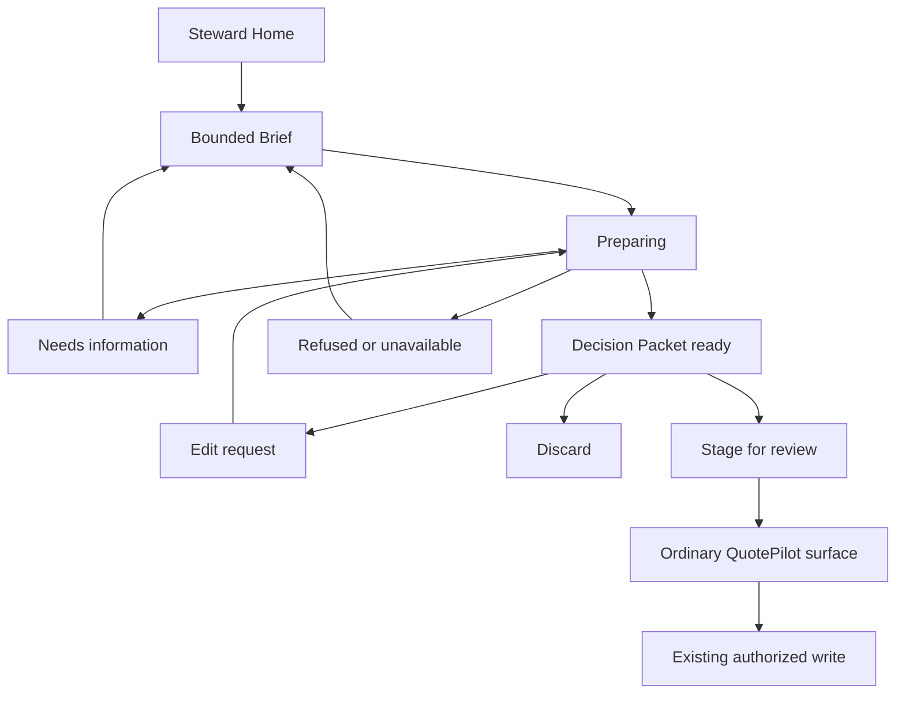
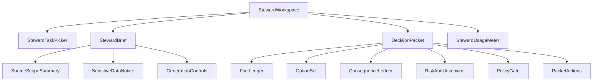

# UI Specification: QuotePilot Steward

Last updated: 2026-08-20 14:47:39 CDT

Status: Proposed
Date: August 15, 2026
Related PRD: `docs/STEWARD_PRD.md`

## Experience direction

Steward is a calm editorial workbench, not a chatbot character. It should feel
like a meticulous second set of eyes laying out a brief on a table: facts on the
left, choices in the center, consequences and authority on the right.

Do not use an AI orb, sparkle iconography, chat bubbles, animated typing,
futuristic gradients, autonomous language, or a human avatar. The interface
should preserve QuotePilot's warm hospitality palette and use measured motion
only when verified consequences replace provisional ones.

## Primary surfaces

| Surface | Entry | Purpose | Exit |
|---|---|---|---|
| Steward Home | `/app/steward` for entitled staff | Select Setup, Quote, Answer, or Strategy; inspect allowance and privacy posture | Opens a bounded brief |
| Setup Studio | Admin entry from `/app/steward` and Catalog | Prepare a menu import and resolve uncertain mappings | Existing catalog-import preview |
| Quote Partner | Inline from new/edit quote | Prepare event options and verified consequences | Stage permitted fields in the existing unsaved editor |
| Question Desk | Inline from Workflow, Messaging, or quote | Draft a policy-grounded customer response | Copy or stage text into the ordinary composer; never send |
| Strategy Table | From quote or Steward Home | Prepare discovery, alternatives, negotiation boundaries, and next questions | Save nothing; operator may start a Quote Partner brief |
| Decision Packet | Shared result view | Review evidence, assumptions, options, consequences, risk, and authority | Revise, discard, or stage for review |
| Steward Controls | Admin-only | Configure allowed tasks, approved policy sources, limits, retention, and kill switch | Return to Steward Home |

## Screen transitions

## Component tree

## Component: StewardTaskPicker

Four large text-led choices: `Set up a menu`, `Prepare a quote`, `Answer a
difficult question`, and `Plan the conversation`. Each shows what Steward will
produce and what it cannot change.

| State | Display |
|---|---|
| Default | Four choices, allowance, and `Nothing runs until you review the brief` |
| Disabled | Reason: no entitlement, tenant kill switch, or role restriction; ordinary workflow link remains |
| Exhausted | Usage period and admin route; no purchase pressure inside active customer work |
| Error | Stable recovery and manual path |

## Component: StewardBrief

The brief shows task, exact event/customer/catalog scope, data classes that will
leave QuotePilot, and a compact input. It must not accept secret keys,
credentials, payment-card data, or unrestricted file uploads.

| State | Display |
|---|---|
| Default | Task-specific prompt and currently authorized sources |
| Incomplete | Missing required facts and exact questions |
| Sensitive | Notice and explicit confirmation before provider-backed processing |
| Ready | `Prepare packet` plus data/retention summary |
| Submitting | Locked request identity and cancel control where supported |
| Error | Input preserved locally; no implied provider completion |

## Component: DecisionPacket

The packet headline follows this fixed order:

1. `What you asked`
2. `Known facts`
3. `What still needs an answer`
4. `Recommended plan`
5. `Alternatives`
6. `Commercial consequences`
7. `Customer response` when applicable
8. `Risks and policy gates`
9. `What you can do next`

### State x display matrix

| State | Headline | Required behavior |
|---|---|---|
| Preparing | `Building the decision packet` | Show named stages, not fake token streaming |
| Needs input | `A safe answer needs more information` | Show smallest required questions and all safely completed work |
| Ready for review | `Prepared for your review` | Show packet revision, expiry, source coverage, and no-change label |
| Partially verified | `Some consequences are still unknown` | Unknown fields remain structurally present and cannot be hidden by prose |
| Refused | `This request crosses a QuotePilot boundary` | Name the rule, safe alternative, and escalation route |
| Stale | `The event changed after this packet was prepared` | Disable staging and offer exact regeneration |
| Expired | `This packet has expired` | Disable staging and explain why |
| Provider unavailable | `Steward is unavailable; quoting is not` | Route to deterministic/manual flow |
| Staged | `Staged in your draft` | Name exact fields; state that no record has been saved |

## Component: FactLedger

Facts use four visually and semantically distinct source types:

| Type | Label | Meaning |
|---|---|---|
| `recorded` | `Recorded` | Exact current QuotePilot record |
| `customer_or_operator` | `From the brief` | Exact supplied wording or source excerpt |
| `verified_rule` | `Verified rule` | Deterministic catalog, policy, or pricing authority |
| `unverified` | `Suggestion` | Model proposal with no authority |

Color is supplementary. Every type has text, icon, and accessible description.

## Component: ConsequenceLedger

The ledger always keeps these domains separate:

- Pricing
- Margin
- Staffing
- Production
- Menu and dietary safety
- Customer commitment

Each domain renders `current`, `proposed`, `delta`, `source`, and `status` when
available. An unavailable domain says why and what evidence would establish it.
The UI must never blend an estimated margin, staffing suggestion, or model claim
into the authoritative pricing style.

## Component: PolicyGate

| Outcome | Copy | Action |
|---|---|---|
| Allowed advisory | `Steward may prepare this` | Continue |
| Human confirmation | `You must review this before staging` | Explicit checkbox or field review |
| Admin authority | `An administrator owns this decision` | Open role-safe route; do not request credentials |
| Prohibited | `Steward cannot perform or promise this` | Show reason and safe alternative |

## Component: PacketActions

Action order is fixed:

1. `Stage for review` when every required gate passes.
2. `Revise the brief`.
3. `Discard packet`.
4. `View evidence and policy`.

Never label a Steward action `Apply`, `Approve`, `Publish`, `Send`, `Book`,
`Confirm`, `Charge`, `Finalize`, or `Make current`.

## Interaction requirements

| ID | EARS requirement | PRD link |
|---|---|---|
| UI-001 | When a user opens Steward, the system shall show the task boundary, authorized sources, allowance, and privacy posture before accepting a provider-backed request | AC-001, AC-003, AC-019 |
| UI-002 | When a packet contains unsupported or incomplete evidence, the system shall retain a visible unknown state and disable staging only for affected required fields | AC-005, AC-006 |
| UI-003 | When deterministic consequence verification completes, the system shall replace provisional placeholders with source-labeled values and announce the update through an `aria-live` region | AC-007, AC-008 |
| UI-004 | When a packet is current and reviewable, the system shall show `Nothing has changed` until the user enters an existing authorized write path | AC-009, AC-010 |
| UI-005 | If the packet's quote, catalog, or policy revision drifts, the system shall disable staging and require exact regeneration | ADR decision 7 |
| UI-006 | If the provider fails, the system shall preserve the user's brief locally for the session and show the ordinary manual/deterministic path | AC-021, AC-022 |
| UI-007 | When response text is prepared, the system shall keep `Copy draft` or `Stage in composer` separate from the existing send action | AC-013, AC-014 |
| UI-008 | When a user stages packet fields, the system shall show an exact field diff and source before changing local draft state | AC-009 |

## Copy rules

### Required phrases

- `Prepared for your review`
- `Nothing has changed`
- `Pricing verified against current rules`
- `Suggestion - not verified`
- `The event changed after this packet was prepared`
- `Steward is unavailable; quoting is not`

### Prohibited phrases

- `Steward approved`
- `AI confirmed`
- `Guaranteed safe`
- `Automatically updated`
- `Done for you` when a write or send remains
- `Customer accepted` without the existing acceptance receipt
- `Ready for production` without exact production authority

## Existing component reuse map

| Existing area | Decision |
|---|---|
| CREATE intake and deterministic extraction | Extend the interaction contract; preserve as fallback |
| Quote builder draft state | Reuse only as the local staging target |
| Pricing preview | Reuse authoritative result presentation; do not copy calculator logic |
| Commercial Change impact panel | Reuse consequence vocabulary and exact-revision patterns |
| Catalog import preview | Reuse as the only setup apply path |
| Workflow/message composer | Reuse as draft-text destination; existing send authority remains |
| Ambient evidence and object styling | Extend with Steward-specific source and policy types |

## Responsive and accessibility requirements

- Desktop uses a three-column workbench at widths that support it; tablet and
  mobile use the same semantic order as the packet headline list.
- The review action remains visible without covering content or trapping focus.
- Every status transition is available to screen readers without continuous
  token announcements.
- Focus moves to the first invalid or newly required field after generation.
- Tables collapse to labeled definition lists on narrow screens.
- All source, unknown, and gate states remain understandable without color.
- Reduced-motion mode removes number interpolation and panel transitions.
- Keyboard users can inspect every source and stage or reject each proposed
  field.

## Visual acceptance criteria

- No chat transcript dominates any Steward surface.
- At 1280x720, task, known facts, recommendation, first consequence row, and
  no-change boundary are visible without horizontal scrolling.
- At 390x844, no label or amount clips and the primary action follows all
  required risk/gate content.
- Verified and suggested values are visually distinct in monochrome capture.
- Long customer questions and menu item names wrap without obscuring source or
  action controls.
