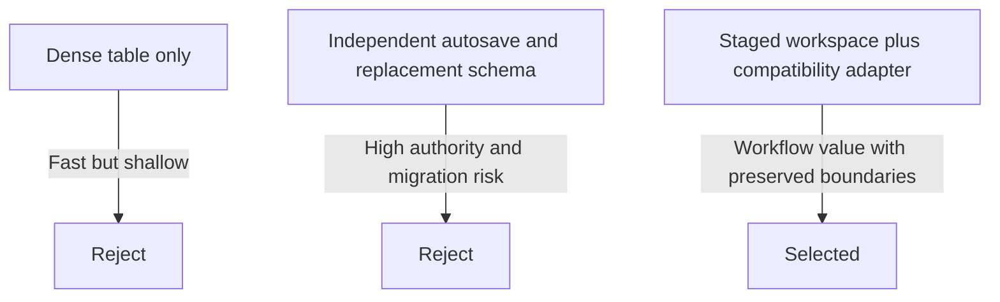

# ADR-0001 Package Workspace State and Persistence

Last updated: 2026-08-29 01:20:25 CDT

## Status

Proposed

## Context

QuotePilot's current package editor combines six concerns in one repeated form:
package identity, per-person price, optional cost, active state, and three sets
of inclusion references. Changes are staged in the catalog draft and committed
through `saveCatalog`, which applies organization scoping, catalog revision
fencing, pricing-confirmation handling, reload, and reconciliation.

The desired Package Workspace needs richer lifecycle and readiness language,
searchable inclusion selection, package-scoped orientation, and truthful save
states. Replacing the persistence path or pricing contracts during the first UI
slice would create avoidable commercial and migration risk.

## Decision

Build a package-focused staged workspace over the existing catalog save and
pricing contracts. Model persisted lifecycle and derived readiness as separate
axes. Extend package records behind a compatibility adapter only when later
phases require new eligibility, promise, or rule fields.

### Decision Details

| Item | Content |
|---|---|
| Decision | Use staged editing, orthogonal lifecycle/readiness state, and backward-compatible package extensions |
| Why now | The current UI prevents fast commercial comprehension and exposes relational configuration directly |
| Why this | It delivers the workflow correction while preserving revision fencing, saved quote compatibility, and authoritative pricing |
| Known unknowns | Legacy active-package migration policy and required eligibility fields are not yet accepted |
| Kill criteria | Reverse or narrow the decision if the first vertical slice cannot reproduce all legacy package pricing and inclusion totals exactly |

## State Model

### Persisted lifecycle

- `draft`: intentionally unavailable to ordinary Quote Builder selection.
- `active`: available to Quote Builder subject to existing catalog and future
  eligibility authority.
- `archived`: retained for evidence but unavailable for new quoting.

Legacy compatibility maps `active !== false` to active and `active === false`
to draft until a reviewed migration policy says otherwise. Archived must never
be inferred from the legacy Boolean.

### Derived readiness

- `incomplete`: required identity/economic/reference facts are absent or
  invalid.
- `needs_review`: minimum facts exist, but review evidence is stale, references
  are inactive, margin evidence is unavailable/risky under an accepted policy,
  or catalog pricing confirmation is not current.
- `ready`: all accepted deterministic checks pass for the loaded exact catalog
  revision.

Readiness is not persisted as authority. QuotePilot stores reason inputs and
review evidence, then derives the current result. Package readiness does not
replace catalog pricing confirmation.

### Editing state

`clean -> dirty -> saving -> receipt` is the success path. `saving` may instead
lead to `reconciliation`, `uncertain`, `recovery`, or `error` using the existing
catalog save outcome contract. A package switch changes selection only; it does
not discard or save the current draft.

## Rationale

### Options Considered

1. **Dense table and inline drawer over the current fields**
   - Pros: Lowest implementation cost; immediate scanability improvement.
   - Cons: Keeps readiness, lifecycle, eligibility, and composition as field
     editing problems; does not satisfy the workflow-first requirement.

2. **Autosave each package independently with a replacement package schema**
   - Pros: Package-scoped persistence; simpler clean/dirty story after each
     field write.
   - Cons: Bypasses or duplicates the current catalog revision and pricing
     confirmation transaction, complicates menu-edit coordination, and raises
     saved-quote/pricing compatibility risk.

3. **Staged package workspace with compatibility adapter (selected)**
   - Pros: Preserves current trusted boundaries, supports package-focused UX,
     allows deterministic readiness, and enables incremental schema adoption.
   - Cons: The underlying save remains catalog-scoped in MVP; per-package draft
     isolation must be explicit in client state.

## Consequences

### Positive Consequences

- The first release can improve comprehension without changing pricing math.
- Save-state copy aligns with real revision/reconciliation behavior.
- Lifecycle and readiness can be shown together without inventing one overloaded
  status.
- Future eligibility/rule fields can be added in reviewed vertical slices.

### Negative Consequences

- MVP Save still commits the current catalog draft, not an isolated package API.
- Some desired fields remain unavailable until persistence and pricing consumers
  support them.
- Client draft management becomes more structured and needs focused tests.

### Neutral Consequences

- Current package inclusion arrays remain Quote Builder's authoritative
  inclusion references in MVP.
- Managed menu operations remain separate revision-aware mutations.
- The existing `active` field remains written during compatibility operation.

## Architecture Impact

- Extract the package UI from `AdminCatalogModal.jsx` into focused components.
- Add a pure package health model that consumes the exact local draft and
  loaded catalog context.
- Keep `useCatalogData.saveCatalog` as the only MVP package persistence entry.
- Add optional package workspace metadata only through normalized read/write
  adapters with legacy fallbacks.
- Do not change `quoteCalculator.js` or `functions/pricingEngine.js` until a
  separately accepted pricing/eligibility phase requires it.

## Implementation Guidance

- Stable package IDs, never row order or display names, own selection and draft
  identity.
- Readiness rules are pure, deterministic, reason-coded, and unit tested.
- Missing data remains unavailable; no default may masquerade as evidence.
- UI labels must distinguish package readiness, lifecycle, catalog pricing
  confirmation, and save outcome.
- New package fields do not affect Quote Builder until both local and
  authoritative consumers adopt and verify the same contract.
- AI may explain known reason codes but may not produce readiness, price, cost,
  margin, eligibility, or publication decisions.

## Related Information

- [`docs/PACKAGE_WORKSPACE.md`](../PACKAGE_WORKSPACE.md)
- [`docs/prd/quotepilot-package-workspace-prd.md`](../prd/quotepilot-package-workspace-prd.md)
- [`docs/ui-spec/quotepilot-package-workspace-ui-spec.md`](../ui-spec/quotepilot-package-workspace-ui-spec.md)
- [`docs/design/quotepilot-package-workspace-design.md`](../design/quotepilot-package-workspace-design.md)
