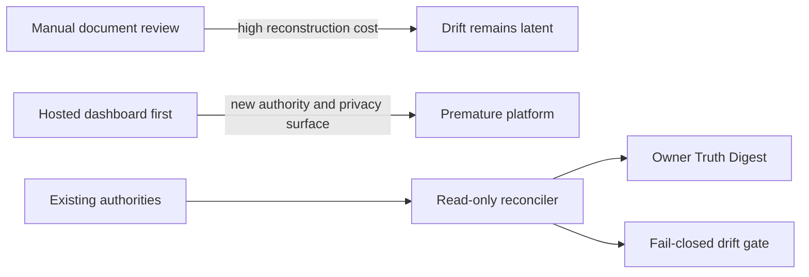

# ADR-0002 Product Truth Observability

Last updated: 2026-08-28 17:25:14 CDT

## Status

Accepted

Approved by the repository owner on August 28, 2026. Acceptance authorizes the
documented implementation program; it does not claim exact CI observation,
required-gate promotion, a hosted digest, or an owner-facing application surface.

Implementation status: the terminal commands, deterministic tests, ignored
snapshot option, and advisory CI job now exist as a source/local candidate.
Exact CI observation and any promotion to a required gate remain pending.

## Context

QuotePilot has strong but separate sources for capability inventory, current
operational status, release receipts, task evidence, validation, runtime
diagnostics, backlog, and human/provider gates. An owner currently has to
reconstruct the product state manually across those sources.

The need is now demonstrated rather than hypothetical:

- the active branch is materially ahead of and behind `origin/main`;
- local canonical documents contain conflicting production-version claims;
- the Development Evidence Compiler has task evidence but no complete CI,
  hosted, provider, production, human, or outcome coverage;
- public reachability does not identify the deployed application artifact or
  prove authenticated behavior; and
- dirty-worktree governance failures and exact committed-candidate validation
  are different evidence states that must not be collapsed.

The system needs a fast owner view without creating another manually maintained
status authority or weakening the existing proof boundaries.

## Decision

Adopt a generated, read-only Product Truth Digest and fail-closed drift checker
that reconcile existing canonical sources into an evidence-qualified snapshot.
The digest is a projection, never a new source of operational or product truth.

### Decision Details

| Item               | Content                                                                                                                                                                                                         |
| ------------------ | --------------------------------------------------------------------------------------------------------------------------------------------------------------------------------------------------------------- |
| **Decision**       | Add one deterministic repository command surface for an owner-readable digest and a machine drift gate over existing authorities.                                                                               |
| **Why now**        | Current documents and branch/release state already produce contradictory answers, while accumulated delivery is too large to reconstruct safely from memory.                                                    |
| **Why this**       | A generated projection reduces human reconstruction and exposes contradictions without centralizing secrets, duplicating governance, or claiming unsupported runtime truth.                                     |
| **Known unknowns** | The best freshness windows for CI, hosted, provider, production, human, and outcome evidence require calibration after real digest use.                                                                         |
| **Kill criteria**  | Reverse or redesign the projection if operators begin treating it as authority, it requires copied secrets/customer data, or maintaining its adapters costs more attention than the contradictions it prevents. |

## Rationale

The owner needs answers to four questions: what is live, what exists but is not
live, what proves each claim, and what needs a human decision. Existing
documents own those facts, but none reconciles them. The selected option adds a
small read-only compiler over existing truth rather than a second status store.

### Options Considered

1. **Continue manual canonical-document review**
   - Pros: No new code or workflow.
   - Cons: Already permits contradictory release claims, makes exact-SHA proof
     reconstruction expensive, and does not provide deterministic drift checks.

2. **Create a hosted observability database and dashboard first**
   - Pros: Rich visualization and centralized runtime history.
   - Cons: Introduces new infrastructure, authentication, retention, privacy,
     availability, and data-authority problems before the evidence contract is
     trustworthy.

3. **Generate a repository/CI Truth Digest over existing authorities (selected)**
   - Pros: Read-only, reversible, testable, secret-safe, useful locally and in
     GitHub, and compatible with the existing evidence model.
   - Cons: Initial adapters are limited to evidence that is available to the
     invocation environment; unavailable provider or hosted identity remains
     `unknown`, not inferred.

## Consequences

### Positive Consequences

- The owner receives one compact view without losing links to exact evidence.
- Contradictions become findings rather than silently selected facts.
- Source, local, CI, hosted, provider, production, human, and outcome evidence
  remain distinct.
- The same deterministic core can serve terminal, CI summary, and a later
  admin-only interface.

### Negative Consequences

- A maintained adapter is required for each authority included in the digest.
- Evidence freshness policy introduces thresholds that must be reviewed.
- Offline or unauthorized invocations will report some domains as `unknown`.

### Neutral Consequences

- `PROJECT_STATUS.md`, `DEV_TASKS.md`, `docs/FEATURE_MATRIX.md`, release
  receipts, and the Development Evidence Compiler retain their current owners.
- Application session diagnostics remain local troubleshooting evidence until
  a separately reviewed aggregate runtime path exists.

## Architecture Impact

The change adds a read-only reconciliation layer between existing authorities
and human/CI consumers. It adds no product mutation path, provider client,
database, secret, or application runtime dependency. Generated JSON remains
ignored or attached as an ephemeral CI artifact; only the contract, code,
tests, workflow integration, and documentation are tracked.

## Implementation Guidance

- Preserve each source's authority; the digest must cite rather than overwrite.
- Represent `verified`, `attention`, `drift`, and `unknown` explicitly.
- Never infer a stronger evidence class from a weaker one.
- Make contradictions first-class findings with both source locators.
- Keep the first slice terminal/CI-only. An in-app owner interface requires a
  later UI specification and security review after the digest is trusted.
- The friendly status command may render findings and exit successfully; the
  gate command must return a non-zero status for blocking drift or malformed
  required inputs.

## Related Information

- [`docs/design/product-truth-observability-design.md`](../design/product-truth-observability-design.md)
- [`docs/plans/20260828-feature-product-truth-observability.md`](../plans/20260828-feature-product-truth-observability.md)
- [`docs/DEVELOPMENT_EVIDENCE_COMPILER.md`](../DEVELOPMENT_EVIDENCE_COMPILER.md)
- [`docs/REPOSITORY_OPERATING_SYSTEM_AUDIT.md`](../REPOSITORY_OPERATING_SYSTEM_AUDIT.md)
- [`docs/DOC_SYSTEM.md`](../DOC_SYSTEM.md)
