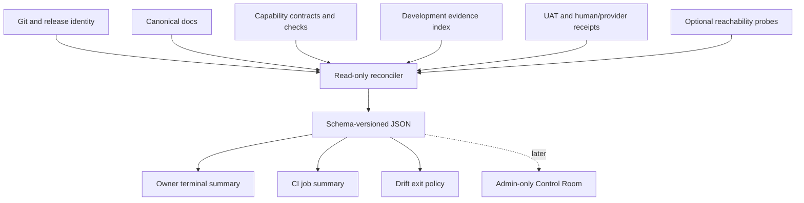

# Product Truth Observability Design Document

Last updated: 2026-08-28 17:25:14 CDT

## Overview

This design defines a deterministic, read-only Product Truth Digest and drift
gate for QuotePilot. It compiles existing Git, documentation, capability,
validation, release, task-evidence, reachability, and acceptance signals into
one evidence-qualified owner view without becoming a new source of truth.

No frontend is included in the MVP. A later admin-only Control Room requires a
separate UI specification after the terminal/CI contract is accepted in use.

Implementation status: the terminal/JSON compiler, status/gate exit policies,
ignored snapshot option, focused fixtures, and advisory CI job are implemented
locally. Exact CI observation, owner comprehension, freshness calibration, and
required-gate promotion remain outside source proof.

## Design Summary (Meta)

```yaml
design_type: "new_feature"
risk_level: "medium"
complexity_level: "medium"
complexity_rationale: "The compiler reconciles multiple authorities and evidence classes, must detect contradictions without inventing truth, and exposes both human and machine command behavior."
main_constraints:
  - "Read-only and secret-safe"
  - "Existing canonical documents retain authority"
  - "Unavailable evidence remains unknown"
  - "Generated snapshots are ignored or ephemeral"
biggest_risks:
  - "The projection is mistaken for authority"
  - "A brittle parser creates false drift findings"
unknowns:
  - "Final evidence freshness windows"
  - "When an owner-facing application surface earns implementation"
```

## Background and Context

### Prerequisite ADRs

- [`docs/adr/ADR-0002-product-truth-observability.md`](../adr/ADR-0002-product-truth-observability.md): generated projection, existing-authority, proof-boundary, and persistence decisions.

### External Resources Used

| Resource             | Feature-specific identifier       | Notes                                                                              |
| -------------------- | --------------------------------- | ---------------------------------------------------------------------------------- |
| Canonical Git remote | `TOTALLYMAJOR/quoteflow`          | Read-only branch, tag, and workflow identity where credentials permit.             |
| Production edge      | `https://quotepilot.mbmapps.com/` | Reachability only; HTTP success is not build identity or authenticated acceptance. |
| Firebase origin      | `https://tonicatering.web.app/`   | Reachability only; the legacy infrastructure name is not product identity.         |

### Agreement Checklist

#### Scope

- [x] Add an owner-readable terminal digest.
- [x] Add a fail-closed drift-check command.
- [x] Reuse existing canonical documents, evidence records, and validation contracts.
- [x] Support JSON output for CI and future consumers.
- [x] Add tests and workflow documentation before activation.

#### Non-Scope

- [x] No production/provider mutation, deployment, or credential binding.
- [x] No hosted observability database or new telemetry collector.
- [x] No customer data, provider payload, token, signed URL, or raw diagnostic export.
- [x] No application UI in the MVP.
- [x] No claim that reachability proves deployed identity or user success.

#### Constraints

- [x] Parallel operation: Yes; the digest is advisory until the acceptance gate in the work plan promotes it.
- [x] Backward compatibility: Required; existing commands and canonical owners remain unchanged.
- [x] Performance measurement: Required; local status generation target is under five seconds without optional network probes.

#### Applicable Standards

- [x] Documentation ownership `[explicit]` — `docs/DOC_SYSTEM.md`.
- [x] Evidence-class separation `[explicit]` — `docs/DEVELOPMENT_EVIDENCE_COMPILER.md`.
- [x] Task planning and completion lifecycle `[explicit]` — `AGENTS.md`, `docs/AGENT_GOVERNANCE.md`.
- [x] Release proof boundaries `[explicit]` — `docs/VERSION_CONTROL.md`, `docs/LAUNCH_RUNBOOK.md`.
- [x] Secret exclusion `[explicit]` — `scripts/check-secret-assets.mjs` and repository guardrails.

#### Assumed Behaviors

- [x] Git exposes local branch, SHA, status, tags, remote-tracking reference, and divergence without mutation — Evidence: current repository commands; Confirmed: Yes.
- [x] Development evidence records remain readable JSON under `.cache/development-evidence/` — Evidence: `scripts/record-development-evidence.mjs`, `scripts/summarize-development-evidence.mjs`; Confirmed: Yes.
- [x] Hosted/provider evidence may be unavailable to a local invocation — Evidence: current release tooling requires scoped workflow context/credentials; Confirmed: Yes.

#### Quality Assurance Mechanisms

- [x] `npm run check:docs:governance` — Enforces canonical process-document sync and timestamps — Status: adopted.
- [x] `npm run check:secrets` — Enforces secret-safe tracked output — Status: adopted.
- [x] Focused deterministic unit fixtures — Enforce parsing, contradiction, severity, ordering, and exit-code contracts — Status: adopted.
- [x] `npm run build` and `npm run check:env` — Preserve repository build/environment health — Status: adopted.
- [x] Existing `npm run check:capability-surfaces` output — Consumed as evidence; not bypassed or weakened — Status: adopted.

### Problem to Solve

An owner cannot currently determine current production, candidate divergence,
capability delivery stage, proof coverage, material drift, and required human
decisions from one deterministic view. Manual reconstruction has already
produced conflicting version claims and incomplete evidence coverage.

### Current Challenges

- Operational, capability, release, task, validation, and runtime evidence have
  different owners and lifecycles.
- Current Markdown can contain both current and historical-looking claims using
  the same vocabulary.
- Local dirty-tree failures can be confused with exact committed-candidate
  failures.
- Reachability, configuration, deployment, provider behavior, and human
  acceptance are easy to collapse in prose.
- Existing evidence indexing summarizes task records but does not reconcile the
  whole product state.

### Requirements

#### Functional Requirements

- FR-001: Generate a stable JSON digest and readable text summary.
- FR-002: Report branch/SHA, dirty state, main divergence, latest release tag,
  and declared production identities.
- FR-003: Report capability and evidence-class coverage without promoting one
  class into another.
- FR-004: Detect contradictory production claims and uncovered capability
  authority changes.
- FR-005: Distinguish `verified`, `attention`, `drift`, and `unknown`.
- FR-006: Link every material finding to its exact source locator.
- FR-007: Emit the three highest-priority owner decisions separately from
  engineering detail.
- FR-008: Support offline/local operation and optional explicitly bounded
  reachability/remote probes.

#### Non-Functional Requirements

- **Performance**: Produce the offline digest in less than five seconds on the repository baseline.
- **Reliability**: Same inputs produce semantically identical sorted output except `generatedAt`.
- **Security**: Store no secret, customer payload, provider response, signed URL, or raw runtime diagnostic data.
- **Maintainability**: Source adapters remain independently testable and failures identify the unavailable authority.
- **Usability**: The text summary answers live/candidate/proof/drift/decision questions before detailed findings.

## Acceptance Criteria

- **AC-001 — When** local status is requested, the system shall print production, candidate, evidence coverage, drift findings, and next owner decisions in that order.
- **AC-002 — When** JSON is requested, the system shall emit schema-versioned deterministic fields with findings sorted by severity, category, and stable ID.
- **AC-003 — If** two sources claim different current production releases, **then** the system shall emit blocking `release.identity.conflict` drift with both locators.
- **AC-004 — If** the branch is both ahead of and behind the tracked main reference, **then** the system shall emit an attention finding with exact counts and SHAs.
- **AC-005 — If** evidence for a class is unavailable, **then** the system shall report `unknown`; it shall not infer failure or success.
- **AC-006 — If** a capability-surfacing gate fails, **then** the digest shall retain the failing command and bounded messages without claiming the committed candidate failed unless that exact candidate was tested.
- **AC-007 — While** the working tree is dirty, the system shall label results as dirty-worktree evidence and preserve the exact HEAD.
- **AC-008 — When** `check:product-drift` finds blocking drift, the command shall exit `1`; malformed required inputs shall exit `2`; no blocking drift shall exit `0`.
- **AC-009 — When** `status:product` successfully creates a report containing drift, it shall still exit `0` and render the drift prominently.
- **AC-010 — When** optional network probes are disabled or unavailable, the offline digest shall still complete and label those domains `unknown`.
- **AC-011 — When** the output is scanned, it shall contain no repository-defined secret-like value or raw sensitive diagnostic value.
- **AC-012 — Until** the CI activation criteria are accepted, the new check shall be advisory and documentation shall label it non-blocking.

## Existing Codebase Analysis

### Implementation Path Mapping

| Type     | Path                                                  | Description                                                     |
| -------- | ----------------------------------------------------- | --------------------------------------------------------------- |
| Existing | `scripts/summarize-development-evidence.mjs`          | Summarizes ignored task evidence records.                       |
| Existing | `scripts/production-release-evidence.mjs`             | Validates exact release/workflow evidence in governed contexts. |
| Existing | `scripts/check-capability-surfacing.mjs`              | Detects orphan or undeclared backend/data-authority changes.    |
| Existing | `docs/DOC_SYSTEM.md`                                  | Owns canonical-document responsibilities.                       |
| Existing | `PROJECT_STATUS.md`                                   | Owns current operational claims.                                |
| Existing | `docs/FEATURE_MATRIX.md`                              | Owns capability inventory and source status.                    |
| Existing | `src/lib/sessionDiagnostics.js`                       | Local, privacy-bounded runtime troubleshooting evidence only.   |
| New      | `scripts/product-truth-observability.mjs`             | Shared deterministic compiler and CLI entrypoint.               |
| New      | `src/lib/__tests__/productTruthObservability.test.js` | Fixture-driven contract and drift-policy tests.                 |
| New      | `.cache/product-truth/`                               | Optional ignored snapshots; never release authority.            |

### Integration Points

- **Package scripts**: `status:product` and `check:product-drift` invoke the same compiler with different exit policy.
- **Local workflow**: start-of-work status and pre-PR/pre-release drift check after activation.
- **CI**: advisory job summary first; required gate only after false-positive review.
- **Evidence compiler**: reads existing records but does not mutate or reinterpret their evidence class.

### Code Inspection Evidence

| File/Function                                                 | Relevance                                             |
| ------------------------------------------------------------- | ----------------------------------------------------- |
| `scripts/record-development-evidence.mjs:buildRecord`         | Existing task evidence contract and dirty/SHA fields. |
| `scripts/summarize-development-evidence.mjs:buildSummary`     | Existing aggregation and repeated-risk behavior.      |
| `scripts/production-release-evidence.mjs:validateGitEvidence` | Exact release Git identity pattern.                   |
| `scripts/check-doc-governance.mjs`                            | Canonical-document change enforcement.                |
| `scripts/check-capability-surfacing.mjs`                      | Existing capability drift authority.                  |
| `src/lib/sessionDiagnostics.js:readSessionDiagnostics`        | Privacy-bounded local runtime boundary.               |

### Fact Disposition Table

| Fact ID      | Focus Area           | Disposition  | Rationale                                                                   | Evidence                                     |
| ------------ | -------------------- | ------------ | --------------------------------------------------------------------------- | -------------------------------------------- |
| PTO-FACT-001 | Canonical ownership  | preserve     | Digest cites owners and never writes their truth.                           | `docs/DOC_SYSTEM.md`                         |
| PTO-FACT-002 | Evidence classes     | preserve     | No class implies another.                                                   | `docs/DEVELOPMENT_EVIDENCE_COMPILER.md`      |
| PTO-FACT-003 | Task evidence index  | transform    | Reuse as one adapter inside broader reconciliation.                         | `scripts/summarize-development-evidence.mjs` |
| PTO-FACT-004 | Runtime diagnostics  | out-of-scope | Local diagnostics do not become centralized telemetry in MVP.               | `src/lib/sessionDiagnostics.js`              |
| PTO-FACT-005 | Manual status review | transform    | Replace reconstruction with generated findings while retaining source docs. | Current canonical-doc contradictions         |

## Design

### Change Impact Map

```yaml
Change Target: Product Truth Observability
Direct Impact:
  - package.json command aliases
  - scripts/product-truth-observability.mjs
  - focused unit tests and fixtures
  - orchestration, version-control, evidence, status, backlog, and changelog docs
Indirect Impact:
  - PR and release attention moves toward exact drift findings
  - future owner UI may consume the JSON contract
No Ripple Effect:
  - quote calculation and persistence
  - authentication and authorization
  - Firebase rules and indexes
  - provider execution and production configuration
  - customer-facing quote and proposal outputs
```

### Interface Change Matrix

| Existing                        | New                           | Conversion Required   | Compatibility Method                                       |
| ------------------------------- | ----------------------------- | --------------------- | ---------------------------------------------------------- |
| `npm run evidence:index`        | `npm run status:product`      | No                    | Digest consumes compatible evidence records as one source. |
| Manual canonical-doc comparison | `npm run check:product-drift` | No                    | Advisory rollout; manual review remains available.         |
| No product-truth JSON           | Schema-versioned digest JSON  | Yes for new consumers | Versioned schema and additive evolution.                   |

### Architecture Overview



### Data Flow

```text
resolve invocation identity
  -> load independent source adapters
  -> normalize facts with source/evidence class/freshness
  -> identify contradictions and missing required proof
  -> classify findings without selecting a convenient source
  -> sort and emit JSON
  -> render owner summary
  -> apply status or gate exit policy
```

### Main Components

#### Source adapters

- **Responsibility**: Read one authority and return normalized facts or an
  explicit unavailable result.
- **Interface**: `collect(context) -> { facts, warnings, unavailable }`.
- **Dependencies**: Injected filesystem, Git runner, clock, and optional probe.

#### Reconciler

- **Responsibility**: Compare facts, preserve evidence classes, and emit stable
  findings and owner decisions.
- **Interface**: `reconcile(collectedFacts, policy) -> digest`.
- **Dependencies**: No network or process calls; pure deterministic logic.

#### Renderer and exit policy

- **Responsibility**: Render owner-first text or JSON and apply command-specific
  exit semantics.
- **Interface**: `renderText(digest)`, `renderJson(digest)`, `exitCode(mode, digest)`.

### Data Representation Decision

| Criterion             | Assessment | Reason                                                                       |
| --------------------- | ---------- | ---------------------------------------------------------------------------- |
| Semantic Fit          | No         | Task evidence records describe one task, not a whole-product reconciliation. |
| Responsibility Fit    | No         | The digest spans multiple canonical owners without replacing them.           |
| Lifecycle Fit         | No         | It is generated per invocation and may expire independently.                 |
| Boundary/Interop Cost | Low        | JSON supports terminal, CI, and later UI consumers.                          |

**Decision**: new versioned digest contract; reuse existing evidence records as
inputs rather than extending them into a whole-product authority.

### Design Convergence

1. **Direct MVP**: one dependency-light Node module, two package aliases, JSON/text output, focused fixtures, and advisory workflow documentation.
2. **Failed Items**: manual review cannot reliably expose contradictions; the current evidence index does not reconcile release/capability/runtime/acceptance truth.
3. **Adopted Additions**: explicit `unknown`, source locators, and separate status/gate exit policies are required to prevent false certainty and unusable owner output.
4. **Rejected Additions**: hosted database, new telemetry vendor, provider mutation, and application UI are deferred because none is required to prove the core contract.

### Digest Contract

```yaml
Contract: com.mbmapps.quotepilot.product-truth-digest/v1
Input:
  Type: Independent normalized facts from registered adapters
  Preconditions: Repository root and required local canonical sources resolve
  Validation: Per-adapter structural validation; optional sources may be unavailable
Output:
  Type: JSON object plus optional text rendering
  Guarantees: Stable IDs/order, exact source locators, separate evidence classes, explicit unknowns
  On Error: Exit 2 for malformed required input; preserve bounded diagnostics
Invariants:
  - No evidence class implies another
  - Digest never mutates an input authority
  - Generated output is not a release or acceptance receipt
  - Sensitive values are excluded
```

### Field Propagation Map

| Field            | Boundary                  | Status    | Serialized Format           | Consumer Parse Rule             | Detail                              |
| ---------------- | ------------------------- | --------- | --------------------------- | ------------------------------- | ----------------------------------- |
| `schemaVersion`  | compiler → JSON consumers | new       | fixed schema string         | exact supported value required  | Prevents silent incompatible reuse. |
| `generatedAt`    | clock → digest            | new       | ISO-8601 UTC                | valid timestamp; not proof time | Snapshot creation only.             |
| `headSha`        | Git adapter → digest      | preserved | 40 lowercase hex characters | exact SHA validation            | Identifies inspected source.        |
| `evidenceClass`  | source adapter → finding  | preserved | fixed enum string           | reject unknown enum values      | Prevents proof promotion.           |
| `status`         | reconciler → consumers    | new       | `verified                   | attention                       | drift                               | unknown` | exact enum | Presentation may map to color but text remains primary. |
| `sourceLocators` | adapters → findings       | preserved | sorted string array         | non-empty for material findings | Allows direct verification.         |

### State Transitions and Invariants

```yaml
State Definition:
  - Initial State: source not inspected
  - Possible States: verified, attention, drift, unknown
State Transitions: source absent -> collect -> unknown
  source consistent and sufficient -> reconcile -> verified
  source valid but incomplete/stale -> reconcile -> attention
  sources contradict or required gate fails -> reconcile -> drift
System Invariants:
  - unknown is never silently converted to verified
  - attention is not release failure unless policy marks the fact required
  - status command and gate command share the same digest
```

### Error Handling

| Error Category    | Example                         | Detection               | Recovery                           | Owner impact                            |
| ----------------- | ------------------------------- | ----------------------- | ---------------------------------- | --------------------------------------- |
| Required input    | malformed canonical contract    | structural validation   | exit 2 with locator                | Digest unavailable until repaired.      |
| Optional boundary | remote or probe unavailable     | injected adapter result | report `unknown`                   | Local view remains usable.              |
| Contradiction     | two current production releases | reconciler              | blocking finding, no source chosen | Owner sees both claims.                 |
| Dirty evidence    | task record captured with WIP   | evidence index          | attention finding                  | Exact committed proof remains separate. |
| Security          | secret-like output              | final serialized scan   | abort and exit 2                   | No artifact written.                    |

### Logging and Monitoring

- Log only adapter name, status, duration, bounded finding IDs, and failure
  category to stderr when verbose mode is requested.
- Never log source bodies, environment values, tokens, customer identifiers,
  signed URLs, provider payloads, or raw runtime diagnostics.
- CI should retain the JSON/text summary as an ephemeral artifact and job
  summary after activation.

## Implementation Plan

### Implementation Approach

**Selected Approach**: Hybrid, with a pure deterministic foundation followed by
one owner-value vertical slice and then CI activation.

### Required Implementation Order

1. **Contract and characterization fixtures**
   - Technical reason: Current contradictions must be reproducible before the
     parser or severity policy is trusted.
2. **Pure adapters and reconciler**
   - Technical reason: Testable facts and findings must exist before CLI output.
3. **Terminal commands**
   - Technical reason: The owner must accept the local report before CI blocks.
4. **Advisory CI summary**
   - Technical reason: False-positive and freshness policy need observation.
5. **Required gate promotion**
   - Technical reason: Promotion is a separate human decision based on advisory evidence.

### Migration Strategy

Additive and advisory. Existing docs and commands remain authoritative. The
implemented package commands produce a projection only, and the workflow keeps
the CI gate advisory until explicit promotion.

## Security Considerations

- **Authentication and authorization**: Local MVP needs repository access only.
  Optional GitHub/provider adapters use the caller's existing read-only scope;
  no credential is persisted.
- **Input validation**: Treat Markdown, JSON, Git output, network results, and
  evidence records as untrusted input with size and structure bounds.
- **Sensitive data**: Exclude environment values, raw diagnostic events,
  provider payloads, customer data, signed URLs, and token-like strings.

## Test Boundaries

| Component             | Mock?                                      | Rationale                                                                  |
| --------------------- | ------------------------------------------ | -------------------------------------------------------------------------- |
| Git runner            | Yes in unit; real in focused CLI smoke     | Deterministic divergence fixtures plus one repository integration.         |
| Filesystem            | Yes in unit; temp fixtures for integration | Avoid coupling tests to current dirty WIP.                                 |
| Network probes        | Yes by default                             | Reachability is optional and must not make offline output fail.            |
| Existing check output | Fixture                                    | Preserve exact class and bounded messages without rerunning in pure tests. |

### Data Layer Testing Strategy

N/A for product databases. The MVP reads repository files and optional remote
metadata only; it does not read Firestore customer/tenant data.

### Integration Verification Points

- Current contradictory version fixture produces `release.identity.conflict`.
- Ahead-and-behind fixture preserves both counts and exact SHAs.
- Empty evidence directory produces `unknown`, not success.
- Dirty evidence records remain attention-only unless another required gate fails.
- Status and gate commands emit identical digest semantics with different exit policy.

## Verification Strategy

### Correctness Proof Method

- **Correctness definition**: Known contradictory fixtures are detected, known
  consistent fixtures remain non-blocking, and every material finding retains
  its exact source and evidence class.
- **Verification method**: Fixture-driven unit tests, temporary-repository CLI
  integration, secret scan, docs governance, environment check, and build.
- **Verification timing**: Per implementation phase; CI promotion only after an
  advisory observation period and owner review.

### Early Verification Point

- **First target**: Detect the observed `v0.7.0`/`v0.14.0`/`v0.15.0` production
  identity conflict from bounded fixtures.
- **Success criteria**: One stable blocking finding cites every conflicting
  source without choosing a winner; the status renderer explains it in the
  first screenful.
- **Failure response**: Stop before CI integration and redesign the fact/source
  contract rather than adding parser exceptions.

### Output Comparison

- **Comparison input**: Same fixed repository/evidence fixture.
- **Expected fields**: schema, repository identity, production claims,
  evidence coverage, findings, decisions, and source locators.
- **Diff method**: JSON field comparison after excluding `generatedAt`.
- **Pipeline coverage**: collection, normalization, reconciliation, sorting,
  rendering, and exit policy are each tested.

## Future Extensibility

- **Deferred**: signed hosted digest, admin-only UI, privacy-reviewed aggregate
  runtime telemetry, outcome metrics, and provider-specific adapters.
- **Intentional limitations**: no application database, no product mutation,
  and no central telemetry service in the MVP.
- **Existing extension points**: JSON output for CI and a later read-only UI;
  evidence records for task-level inputs.

## Risks and Mitigation

| Risk                        | Impact | Probability | Mitigation                                                                                           |
| --------------------------- | ------ | ----------- | ---------------------------------------------------------------------------------------------------- |
| Digest treated as authority | High   | Medium      | Label projection, link sources, prohibit writes, and test proof boundaries.                          |
| Markdown parser brittleness | Medium | Medium      | Parse narrow declared headings/contracts, emit unknown on ambiguity, and add contradiction fixtures. |
| False-positive CI blocks    | High   | Medium      | Advisory rollout and separate owner promotion.                                                       |
| Secret leakage              | High   | Low         | Bounded fields, no environment values, secret scan, no raw diagnostics.                              |
| Stale remote metadata       | Medium | Medium      | Record observed time/source and never call cached references verified remote truth.                  |

## References

- [`docs/adr/ADR-0002-product-truth-observability.md`](../adr/ADR-0002-product-truth-observability.md)
- [`docs/DEVELOPMENT_EVIDENCE_COMPILER.md`](../DEVELOPMENT_EVIDENCE_COMPILER.md)
- [`docs/REPOSITORY_OPERATING_SYSTEM_AUDIT.md`](../REPOSITORY_OPERATING_SYSTEM_AUDIT.md)
- [`docs/ORCHESTRATION_BLUEPRINT.md`](../ORCHESTRATION_BLUEPRINT.md)

## Update History

| Date       | Version | Changes                                | Author                    |
| ---------- | ------- | -------------------------------------- | ------------------------- |
| 2026-08-28 | 1.0     | Initial accepted implementation design | Codex with owner approval |
