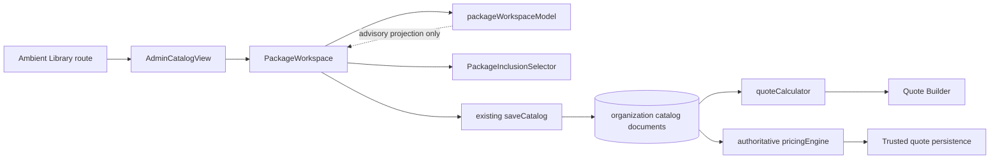
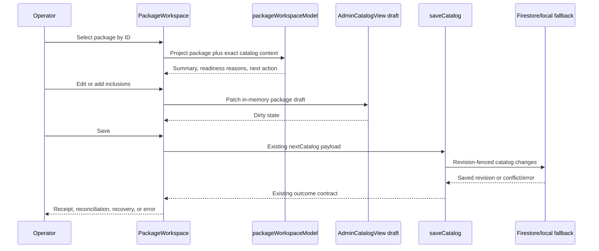

# QuotePilot Package Workspace Design Document

Status: Proposed
Version: 0.1
Last updated: 2026-08-29 01:20:25 CDT

## Overview

This design delivers a workflow-first package editor without changing the MVP's
commercial authority. It adds a package-focused view model, deterministic
readiness, progressive inclusion selection, and staged persistence over the
existing catalog revision/save path.

### Referenced UI Spec

- UI Spec: [`docs/ui-spec/quotepilot-package-workspace-ui-spec.md`](../ui-spec/quotepilot-package-workspace-ui-spec.md)
- Component structure and visible state behavior are inherited from that spec.

## Design Summary

```yaml
design_type: refactoring_and_extension
risk_level: high
complexity_level: high
complexity_rationale: The workspace changes a high-use commercial editor while preserving catalog revision fencing, local fallback, package inclusion semantics, authoritative pricing, and saved quote compatibility.
main_constraints:
  - Deterministic commercial calculations remain authoritative.
  - Current package documents and saved quotes remain readable.
  - Managed menu writes retain their separate mutation behavior in MVP.
  - Missing cost remains distinct from recorded zero.
biggest_risks:
  - UI readiness could be confused with pricing or publication authority.
  - Schema expansion could diverge between browser and authoritative pricing.
unknowns:
  - Accepted migration treatment for legacy active packages.
  - Required eligibility and minimum fields for the P2 domain contract.
```

## Background and Context

### Prerequisite ADR

- [`docs/adr/ADR-0001-package-workspace-state-and-persistence.md`](../adr/ADR-0001-package-workspace-state-and-persistence.md)

### Agreement Checklist

#### Scope

- [ ] Replace only the Packages section presentation in the first slice.
- [ ] Add deterministic package health and staged package draft orchestration.
- [ ] Add explicit searchable selectors for current inclusion arrays.
- [ ] Preserve the existing exact Library route and role-safe handoff.

#### Non-Scope

- [ ] Do not add commercial simulation scenarios or offer regression runs.
- [ ] Do not change package pricing from per-person in MVP.
- [ ] Do not change authoritative pricing formulas or no-double-charge behavior.
- [ ] Do not combine managed-menu writes into catalog settings save.
- [ ] Do not expose costs or margins to customer-safe projections.

#### Constraints

- [ ] Parallel operation: Yes, legacy package documents remain valid.
- [ ] Backward compatibility: Required for package documents and saved quotes.
- [ ] Performance measurement: Required for package switching and selector
  filtering.

#### Applicable Standards

- [ ] `AGENTS.md` safe-change and validation workflow `[explicit]`.
- [ ] `docs/DOC_SYSTEM.md` canonical document ownership `[explicit]`.
- [ ] `docs/DESIGN_SYSTEM.md` workspace visual and interaction contracts
  `[explicit]`.
- [ ] `docs/DESIGN_PRINCIPLES.md` outcome-first and decision-compression review
  `[explicit]`.
- [ ] Stable-ID selection and fail-closed evidence presentation `[implicit]`,
  confirmed in current Package/Menu contracts.

#### Assumed Behaviors

- [ ] `saveCatalog` remains the trusted MVP catalog save entry. Evidence:
  `src/hooks/useCatalogData.js:728`. Confirmed: Yes.
- [ ] Current package inclusion arrays mean select-to-add at no added charge.
  Evidence: `src/components/WizardSteps.jsx:1087` and
  `functions/pricingEngine.js:1188`. Confirmed: Yes.
- [ ] Event type currently filters managed menu candidates and is not persisted
  on packages. Evidence: `src/components/AdminCatalogModal.jsx:2032` and
  `src/hooks/useCatalogData.js:223`. Confirmed: Yes.

#### Quality Assurance Mechanisms

- [ ] `scripts/run-maintainer-checks.sh` - project build and core checks -
  project-wide - adopted.
- [ ] `npm run check:env` - environment contract - project-wide - adopted.
- [ ] `npm run check:capability-surfaces` - required if later slices add backend
  or data authority - adopted when applicable.
- [ ] Focused Vitest component/model suites - package view model and editor -
  adopted.
- [ ] Playwright responsive/accessibility flow - 390, 768, 1440 - adopted.
- [ ] Pricing parity fixtures across local and server engines - commercial
  invariants - adopted.

### Problem to Solve

Current package editing is a repeated relational form. The implementation can
persist important fields safely, but the interface does not present the package
as a commercial object or expose why it is or is not ready to quote.

### Current Challenges

- Every package and candidate inclusion is expanded simultaneously.
- `active` is the only package-level state.
- The menu event-type selector has ambiguous domain meaning.
- Save controls and clean-state language are duplicated.
- The current schema cannot represent package promise, eligibility, minimums,
  or review evidence.
- Package cost is optional and margin remains unavailable when required costs
  are absent; the workspace must preserve that boundary.

## Acceptance Criteria (EARS)

### Orientation and editing

- [ ] **When** Packages opens with records, the system shall select one package
  by stable ID and show its commercial summary, readiness, inclusions, and next
  action.
- [ ] **When** the operator changes package selection, the system shall preserve
  every package draft by stable ID and perform no persistence operation.
- [ ] **While** a package draft is clean, the system shall show one saved state
  and no enabled Save or Revert control.
- [ ] **When** a material field changes, the system shall show one dirty state
  and enable Save and Revert.

### Composition

- [ ] **While** Includes is open, the system shall render current inclusions and
  explicit Add actions without rendering the complete candidate catalog.
- [ ] **When** Add selected is confirmed, the system shall merge normalized
  stable IDs into the correct inclusion array exactly once.
- [ ] **If** an included reference is inactive or missing, **then** the system
  shall retain it visibly, mark it as blocking/review evidence, and allow its
  removal.
- [ ] **While** event type is used in the menu selector, the system shall label
  it as a menu-availability filter and shall not alter package eligibility.

### Economics and authority

- [ ] **If** cost is blank, **then** the system shall preserve `null` and show
  contribution and margin as unavailable.
- [ ] **When** an MVP package is saved, the system shall preserve per-person
  price and the three legacy inclusion arrays without changing calculation
  results.
- [ ] **While** readiness is displayed, the system shall derive it from exact
  deterministic inputs and shall not treat it as catalog pricing confirmation.
- [ ] **If** a save conflicts with a newer catalog revision, **then** the system
  shall preserve or reconcile the draft using the existing save outcome
  contract and shall not claim an ordinary receipt.

## Existing Codebase Analysis

### Implementation Path Mapping

| Type | Path | Description |
|---|---|---|
| Existing | `src/components/AdminCatalogModal.jsx` | Package form, draft state, inclusion toggles, save outcome presentation |
| Existing | `src/hooks/useCatalogData.js` | Package normalization, write shape, revision-aware catalog persistence |
| Existing | `src/components/WizardSteps.jsx` | Quote Builder package selection and select-to-add inclusion copy |
| Existing | `src/lib/quoteCalculator.js` | Local deterministic package and inclusion pricing |
| Existing | `functions/pricingEngine.js` | Authoritative package lookup, validation, and no-double-charge pricing |
| Existing | `src/components/marginPresentation.js` | Fail-closed staff margin model |
| Existing | `src/components/AmbientLibraryRoute.jsx` | Exact Library Packages handoff and dirty-draft hosting |
| New | `src/components/PackageWorkspace.jsx` | Three-zone/stacked package workflow composition |
| New | `src/components/PackageNavigator.jsx` | Stable-ID package summaries and switching |
| New | `src/components/PackageInclusionSelector.jsx` | Search/filter/multi-select inclusion picker |
| New | `src/components/PackageHealthPanel.jsx` | Readiness and next-action presentation |
| New | `src/lib/packageWorkspaceModel.js` | Pure package projection, lifecycle compatibility, readiness reasons |
| New | `src/components/packageWorkspace.css` | Scoped responsive workspace styling |

### Code Inspection Evidence

| File/Function | Relevance |
|---|---|
| `AdminCatalogModal.jsx:addRow` | Current package defaults and `active` Boolean |
| `AdminCatalogModal.jsx:togglePackageInclusion` | Current draft-only inclusion mutation |
| `AdminCatalogModal.jsx:handleSave` | Current staged save and outcome source |
| `useCatalogData.js:packageWriteShape` | Current persisted package fields and 100-ID bounds |
| `useCatalogData.js:saveCatalog` | Role/Firebase/revision/pricing-confirmation boundary |
| `WizardSteps.jsx:ServicesStep` | Current active-package and inclusion behavior |
| `pricingEngine.js:resolveAuthoritativePackageInclusions` | Authoritative reference validation |
| `pricingEngine.js:calculateAuthoritativeQuote` | Per-person package base and selected-inclusion de-duplication |

### Fact Disposition Table

| Fact ID | Focus Area | Disposition | Rationale | Evidence |
|---|---|---|---|---|
| PW-F01 | Package stable ID | preserve | Identity must never use name or row order | Package document ID and exact reference maps |
| PW-F02 | Per-person package price | preserve | MVP does not add unsupported pricing math | `pppMinor` write shape and authoritative package line |
| PW-F03 | Optional package cost | preserve | Missing and recorded zero are distinct | `costPppMinor` nullable conversion |
| PW-F04 | Inclusion ID arrays | transform presentation | Keep storage/meaning, replace checkbox matrices with selectors | Three `included*Ids` fields |
| PW-F05 | Active Boolean | transform through adapter | Expose lifecycle without breaking legacy records | `active: item.active !== false` |
| PW-F06 | Catalog save | preserve | Owns revision and reconciliation behavior | `saveCatalog` |
| PW-F07 | Event-type selector | transform label/placement | It filters menu candidates only in current model | Package editor menu load effect |
| PW-F08 | Delete action | transform presentation | Retain dependency cleanup, move behind contextual confirmation | `removeCatalogRowWithInclusions` |
| PW-F09 | Authoritative pricing | preserve | Commercial source of truth | `functions/pricingEngine.js` |

## Design

### Change Impact Map

```yaml
Change Target: Library Packages presentation and client draft orchestration
Direct Impact:
  - src/components/AdminCatalogModal.jsx
  - src/components/PackageWorkspace.jsx
  - src/components/PackageNavigator.jsx
  - src/components/PackageInclusionSelector.jsx
  - src/components/PackageHealthPanel.jsx
  - src/lib/packageWorkspaceModel.js
  - src/components/packageWorkspace.css
  - focused component and model tests
Indirect Impact:
  - package write normalization if lifecycle metadata is later enabled
  - responsive Library route geometry and bundle size
No Ripple Effect in MVP:
  - quoteCalculator pricing formulas
  - authoritative pricing formulas
  - saved quote and proposal payloads
  - customer portal projections
  - Firestore rules and Firebase Function exports
```

### Interface Change Matrix

| Existing | New | Conversion Required | Compatibility Method |
|---|---|---|---|
| Inline Packages JSX in `AdminCatalogView` | `<PackageWorkspace />` | Yes | Component extraction with existing callbacks |
| `active: boolean` | `lifecycle: draft|active|archived` view model | Yes | Adapter maps legacy false/true; archive unavailable until persisted |
| Three inclusion checkbox fieldsets | `<PackageInclusionSelector kind=...>` | No storage conversion in MVP | Read/write same arrays |
| Generic catalog dirty state | Package draft registry plus catalog fingerprint | Yes | Compose package drafts back into existing catalog before save |
| Event type package control | Menu selector availability filter | No data conversion | Relabel and move into menu selector |

### Architecture Overview



Dependency rule: workspace components may consume deterministic catalog and
save contracts. Pricing modules must not import workspace modules.

### Domain Model

```text
PackageAggregate
  id: stable package document ID
  identity
    displayName
    promiseSummary?                 future optional field
  economics
    pricingBasis: per_person        MVP invariant
    pricePerPerson
    costPerPerson?: number|null
  composition
    includedMenuItemIds[]
    includedAddonIds[]
    includedRentalIds[]
    inclusionRules[]?               future adjunct, not MVP pricing authority
  publication
    lifecycle: draft|active|archived
  eligibility?                      future persisted extension
    eventTypeIds[]
    minGuests?
    maxGuests?
    serviceStyles[]?
  evidence
    catalogRevision
    pricingConfirmationCurrent
    reviewedCatalogRevision?

PackageWorkspaceProjection
  package: PackageAggregate
  readiness: incomplete|needs_review|ready
  readinessReasons[]
  nextAction
  inclusionCounts
  referenceHealth
  marginPresentation
  quoteBehaviorSummary
```

### Data Representation Decision

| Criterion | Assessment | Reason |
|---|---|---|
| Semantic Fit | Partial | Current fields fit MVP economics/composition but not lifecycle/readiness/eligibility |
| Responsibility Fit | Yes | Package metadata belongs to the organization catalog package |
| Lifecycle Fit | Yes | New fields change with package administration |
| Boundary/Interop Cost | Medium | Browser, Firestore, Quote Builder, and authoritative pricing must agree before fields affect behavior |

**Decision**: Extend through an adapter. Keep current fields authoritative in
MVP. Add optional workspace metadata only in a later vertical slice, and do not
let new fields influence quoting until every consumer and test boundary adopts
them.

### Readiness Rule Architecture

The model returns ordered reason objects:

```text
ReadinessReason
  code: stable machine identifier
  severity: blocker|review|info
  title: operator language
  detail: evidence-bound explanation
  targetSection: overview|includes|pricing|eligibility|evidence
  targetField?: stable field key
  actionLabel: outcome-named next action
```

MVP reason order:

1. `missing_name` - blocker.
2. `missing_positive_price` - blocker.
3. `missing_or_invalid_reference` - blocker.
4. `inactive_reference` - review.
5. `missing_package_cost` - review until a policy explicitly makes it blocking.
6. `margin_unavailable` - review.
7. `catalog_pricing_unconfirmed` - review, separate from package readiness.
8. `legacy_lifecycle_unreviewed` - review only if migration policy adopts it.

Derivation:

```text
if any blocker reason -> incomplete
else if any review reason -> needs_review
else -> ready
```

Activation requires `ready` plus current catalog pricing confirmation in the
phase where lifecycle becomes authoritative. MVP may display the recommendation
without adding a new activation mutation.

### Data Flow



### Main Components

#### PackageWorkspace

- Responsibility: Compose selection, per-package drafts, sections, and save
  actions without owning commercial calculations.
- Interface: `catalog`, `selectedPackageId`, `onSelectedPackageChange`,
  `onCatalogDraftChange`, `onSave`, `saving`, `saveState`.
- Dependencies: Package model, navigator, selector, health panel.

#### packageWorkspaceModel

- Responsibility: Normalize legacy lifecycle, resolve referenced records,
  derive readiness and next action, and provide staff-only economics projection.
- Interface: `buildPackageWorkspaceModel({ packageRecord, catalog, menuItems,
  pricingConfirmationCurrent, marginPolicy })`.
- Dependencies: Pure functions only; may reuse margin presentation logic through
  an adapter, but cannot perform writes or provider calls.

#### PackageInclusionSelector

- Responsibility: Filter candidate records and return stable selected IDs.
- Interface: `kind`, `candidates`, `selectedIds`, `availabilityContext`,
  `onConfirm(ids)`, `onCancel()`.
- Dependencies: Existing loaded menu/add-on/rental records.

#### PackageHealthPanel

- Responsibility: Present model reasons and route one next action to a section
  or field.
- Interface: `readiness`, `reasons`, `nextAction`, `onResolveTarget`.
- Dependencies: No write authority.

### Data Contracts

#### Legacy package persistence contract

```yaml
Contract: packageWriteShape
Input:
  Type: current client package record
  Preconditions: stable non-empty document ID owned by caller map
  Validation: normalized strings, minor-unit money, stable IDs bounded to 100
Output:
  Type: package document patch
  Guarantees:
    - name is a string
    - pppMinor is integer minor units
    - costPppMinor is integer minor units or null
    - included ID arrays contain normalized non-empty IDs
    - active is Boolean
  On Error: duplicate/missing IDs block save before write
Invariants:
  - missing cost is null, not zero
  - inclusion semantics do not change
```

#### Package workspace model contract

```yaml
Contract: buildPackageWorkspaceModel
Input:
  Type: exact package draft plus loaded same-organization catalog context
  Preconditions: package identity is selected by stable ID
  Validation: finite money, bounded arrays, exact reference maps
Output:
  Type: immutable PackageWorkspaceProjection
  Guarantees:
    - readiness has ordered reason codes
    - nextAction is null or points to the first resolvable reason
    - missing facts remain unavailable
    - no mutation or pricing side effect occurs
  On Error: returns unavailable projection with reason; never throws through UI
Invariants:
  - authoritative pricing remains outside this model
  - customer-safe data never includes cost or margin
```

### Field Propagation Map

| Field | Boundary | Status | Serialized Format | Consumer Parse Rule | Detail |
|---|---|---|---|---|---|
| `id` | Firestore -> catalog -> workspace/Quote Builder | preserved | document ID | exact trimmed string | Owns identity |
| `name` | package draft -> Firestore -> staff/customer projections | preserved | string | trimmed for display | Customer-safe |
| `ppp`/`pppMinor` | client -> Firestore -> pricing | preserved | integer minor units at storage | divide by 100 in normalization | Per-person MVP |
| `costPpp`/`costPppMinor` | client -> Firestore -> staff margin | preserved | integer minor units or null | null remains missing | Never customer-safe |
| `included*Ids` | client -> Firestore -> Quote Builder/pricing | preserved | bounded string arrays | exact-ID map lookup | Select-to-add at $0 |
| `active` | package -> Quote Builder | preserved in MVP | Boolean | false excludes package | Lifecycle adapter input |
| `lifecycle` | package metadata -> workspace/Quote Builder | future | enum string | reject unknown; legacy fallback | No Quote Builder effect until P2 |
| `eventTypeIds` | package metadata -> Quote Builder | future | bounded string array | exact-ID lookup | Must not be inferred from selector filter |

### State Transitions and Invariants

```yaml
Editing State:
  - clean
  - dirty
  - saving
  - receipt
  - reconciliation
  - uncertain
  - recovery
  - error
Transitions:
  clean -> material edit -> dirty
  dirty -> revert -> clean
  dirty -> save -> saving
  saving -> confirmed/reconciled save -> receipt
  saving -> concurrent revision -> reconciliation
  saving -> saved but pricing confirmation uncertain -> uncertain
  saving -> reload required -> recovery
  saving -> validation/infrastructure failure -> error
Invariants:
  - package switching never saves or discards
  - one exact catalog revision fences each save
  - readiness never establishes pricing confirmation or persistence
  - browser return or UI state never establishes authoritative pricing
```

### Client State Design

| State Category | State | Management Method | Sync Strategy | Reset/Clear Behavior |
|---|---|---|---|---|
| Server state | Catalog snapshot/revision | Existing `useCatalogData` | Explicit reload after save/conflict | Replace only after accepted reconciliation |
| Local draft | Package records/settings | Existing parent draft plus package adapter | Staged | Revert selected or all drafts explicitly |
| Local UI | Selected package/section/filter | `useState` or reducer | None | Preserve while route remains mounted |
| Temporary selector | Search/filter/selected IDs | Selector-local state | Confirm merges once | Cancel/close clears selector only |

### UI Action to API Contract Mapping

| UI Action | API / operation | Request | Response | Error Contract |
|---|---|---|---|---|
| Save package changes | Existing `saveCatalog(nextCatalog)` | Full normalized catalog draft | `{ok}` plus current error/recovery flags | Existing validation, revision, uncertain, recovery states |
| Revert package changes | Client-only | Selected package baseline ID | No network response | If baseline unavailable, require catalog reload |
| Add inclusions | Client-only | kind plus selected stable IDs | Updated package draft | Missing/invalid candidate remains unselected |
| Delete package draft | Existing client cleanup then Save | Package removal plus dependent cleanup | Save outcome after explicit Save | Malformed templates block draft deletion |
| Managed-menu edit | Existing menu service operation | Exact event/category/item and catalog revision | Advanced revision | Kept separate from package Save |

### Error Handling

| Error Category | Example | Detection | Recovery Strategy | User Impact |
|---|---|---|---|---|
| Validation | Missing positive price | Model/save validation | Focus exact field | Package remains dirty/incomplete |
| Reference | Included item unavailable | Exact-ID map lookup | Remove reference or restore catalog record | Visible health reason |
| Concurrency | Catalog revision changed | Existing save transaction | Preserve draft and review latest | Conflict state, no false receipt |
| Infrastructure | Firebase/save unavailable | Existing hook result | Retry or approved local fallback | Named error/source boundary |
| Partial evidence | Menu inventory not loaded | Load boundary | Retry/load exact event menu | Never classify as empty |

## Implementation Approach

### Selected Approach

Hybrid vertical slices. The first slice delivers navigator, overview, health,
and truthful staged save over the current schema. The second replaces inclusion
matrices. Later slices add lifecycle metadata, eligibility/rules, preview, and
comparison only after their contracts are accepted.

### Required Implementation Order

1. **Characterization and package model**
   - Proves current package/inclusion/pricing behavior and deterministic health.
2. **Navigator plus Overview/Health vertical slice**
   - Proves five-second comprehension without changing storage.
3. **Inclusion selector vertical slice**
   - Replaces checkbox matrices while preserving exact arrays.
4. **Persistence state cleanup and responsive acceptance**
   - Removes duplicate save affordances and verifies conflict/recovery states.
5. **Lifecycle metadata migration**
   - Requires accepted legacy migration policy and local/server adoption.
6. **Eligibility, rules, customer preview, comparison**
   - Each is a separately verified contract slice.

### Migration Strategy

1. Build characterization fixtures from current package documents.
2. Ship the workspace under the existing Package route using current fields.
3. Keep legacy package UI available behind a temporary rollback switch only if
   required by release policy; do not maintain two writable paths long term.
4. Add optional metadata with tolerant reads and no quoting effect.
5. Backfill only after dry-run counts, unresolved legacy states, and rollback
   are reviewed. Never infer archived state.
6. Enable new Quote Builder behavior only after local and server pricing/validity
   tests agree on exact fixtures.

## Security Considerations

- Authentication and authorization: reuse current administrator Library route
  and organization-scoped save. Any new backend mutation requires an explicit
  role-safe capability contract and Firestore/Functions review.
- Input validation: normalize money, lifecycle enums, stable ID arrays, bounds,
  and eligibility values at client and trusted persistence boundaries.
- Sensitive data: cost, contribution, margin, readiness reasons tied to cost,
  and internal IDs remain staff-only and are excluded from customer projections
  and analytics payloads unless explicitly safe.

## Test Boundaries

### Mock Boundary Decisions

| Component/Dependency | Mock? | Rationale |
|---|---|---|
| Pure workspace model | No external mocks | Use exact fixtures and pure assertions |
| Package UI | Mock menu service loads where needed | Isolate interaction and state behavior |
| `saveCatalog` component integration | Yes, plus existing hook tests | Exercise every visible result without network |
| Local pricing calculator | No | Required parity source |
| Authoritative pricing engine | No in focused server tests | Required commercial proof |
| Firebase emulator | No mock in integration phase | Required for revision/role behavior if backend changes |

### Data Layer Testing Strategy

- Schema dependencies: organization `catalogPackages`, catalog settings revision
  and pricing confirmation, add-on/rental collections, and managed menu records.
- Test data: versioned fixtures with complete, missing-cost, inactive-reference,
  missing-reference, and concurrent-revision packages.
- Mock limitation: component mocks cannot prove Firestore revision isolation,
  authoritative pricing parity, hosted role behavior, or customer projection
  safety.

### Integration Verification Points

- Package workspace draft -> existing `saveCatalog` -> reloaded exact revision.
- Same fixture -> local calculator and authoritative pricing engine.
- Package inclusion selector -> exact Quote Builder included-at-$0 behavior.
- Dirty Package workspace -> Library route preservation and guarded exit.
- Cost/readiness staff projection -> customer preview/export non-leakage.

## Verification Strategy

### Correctness Proof Method

- Correctness definition: the new workspace makes package state comprehensible
  and editable while every legacy package fixture retains the same persisted
  fields, base price, selected inclusion totals, and conflict behavior.
- Verification method: pure model tests, component interaction tests, local and
  authoritative pricing parity fixtures, route/draft integration tests, and
  responsive keyboard/axe Playwright acceptance.
- Verification timing: after each vertical slice, with full repository gates in
  the final QA phase.

### Early Verification Point

- First target: one current package fixture rendered through the navigator,
  Overview, and Health model with no schema change.
- Success criteria: exact legacy values render; missing cost stays unavailable;
  switching and editing produce a dirty draft; Save calls the existing
  `saveCatalog` payload; local pricing output is byte-for-byte unchanged for the
  normalized fixture.
- Failure response: stop before inclusion selector or schema work and revise the
  adapter/state model.

### Output Comparison

- Comparison input: same catalog, event, guest count, package, and selected
  inclusion IDs before and after workspace adoption.
- Expected fields: package base line, included line IDs, pricing modes, unit
  prices, quantities, totals, grand total, and persisted package write shape.
- Diff method: deep equality for normalized JSON plus explicit null-vs-zero
  assertions for cost fields.
- Pipeline coverage: package draft -> write shape -> catalog reload -> Quote
  Builder selection -> local calculation -> authoritative calculation -> saved
  quote snapshot.

## Future Extensibility

- Deferred: staffing rules, substitution groups, allowances, eligibility,
  minimums, package comparison, and change history. Each needs accepted domain
  authority and integration tests.
- Intentional limitation: MVP remains per-person and select-to-add because that
  is the current trusted commercial contract.
- Existing extension points: package inclusion arrays consumed by Quote Builder
  and both pricing engines; package cost consumed by staff margin presentation;
  event templates reference package IDs.

## Risks and Mitigation

| Risk | Impact | Probability | Mitigation |
|---|---|---|---|
| Readiness appears authoritative beyond its inputs | High | Medium | Reason codes, evidence boundaries, and separate pricing confirmation |
| Legacy active migration changes package availability | High | Medium | No persisted lifecycle in first slice; reviewed migration fixture later |
| New fields diverge across calculators | High | Low | No quoting effect until local/server parity passes |
| Selector loses stale references | High | Low | Selected stale references stay visible/removable |
| Duplicate writable paths drift | Medium | Medium | Temporary rollback only; retire legacy UI after acceptance |
| Bundle/geometry regression | Medium | Medium | Lazy selector, bundle gate, three-viewport Playwright suite |

## References

- [`docs/PACKAGE_WORKSPACE.md`](../PACKAGE_WORKSPACE.md)
- [`docs/prd/quotepilot-package-workspace-prd.md`](../prd/quotepilot-package-workspace-prd.md)
- [`docs/ui-spec/quotepilot-package-workspace-ui-spec.md`](../ui-spec/quotepilot-package-workspace-ui-spec.md)
- [`docs/adr/ADR-0001-package-workspace-state-and-persistence.md`](../adr/ADR-0001-package-workspace-state-and-persistence.md)

## Update History

| Date | Version | Changes | Author |
|---|---|---|---|
| August 18, 2026 | 0.1 | Initial QuotePilot Package Workspace design | Codex |
