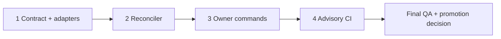

# Work Plan: Product Truth Observability

Last updated: 2026-08-28 17:33:20 CDT

Created Date: 2026-08-28
Type: feature
Estimated Duration: 3–5 focused implementation days
Estimated Impact: 10–14 files across scripts, tests, package/workflow, and canonical docs
Related task: `QP-OBS-018`
Review Scope: Product-truth compiler, command interfaces, advisory CI summary,
workflow activation, tests, and documentation only; no application/provider/data mutation.

## Related Documents

- Design: [`docs/design/product-truth-observability-design.md`](../design/product-truth-observability-design.md)
- ADR: [`docs/adr/ADR-0002-product-truth-observability.md`](../adr/ADR-0002-product-truth-observability.md)
- Existing evidence contract: [`docs/DEVELOPMENT_EVIDENCE_COMPILER.md`](../DEVELOPMENT_EVIDENCE_COMPILER.md)

No PRD is required for the terminal/CI developer-infrastructure MVP. A later
owner-facing application surface requires a separate PRD and UI specification.

## Verification Strategy

### Correctness Proof Method

- **Correctness definition**: The compiler detects known contradictions and
  missing proof without inventing source, deployment, provider, production, or
  human truth; every material finding carries exact locators.
- **Verification method**: Fixture-driven unit tests, temporary Git-repository
  integration, command exit-code tests, secret scan, docs governance,
  environment check, build, and advisory CI observation.
- **Verification timing**: Per phase, with a separate owner decision before the
  CI check becomes required.

### Early Verification Point

- **First target**: The observed conflicting production claims and diverged
  branch fixture.
- **Success criteria**: One stable blocking release-identity finding and one
  non-blocking branch-divergence finding appear in the first screenful with
  exact source locators.
- **Failure response**: Stop before package/CI integration and revise the
  normalized fact contract.

### Proof Strategy

- **Proof obligation source**: Accepted ADR, Design AC-001 through AC-012, and
  characterization fixtures derived from the observed repository contradictions.
- **Per-task propagation**: Every phase below names the acceptance criteria and
  exact command output that proves it.

## Quality Assurance Mechanisms

| Mechanism                | Enforces                                           | Config Location                           | Covered Files                       |
| ------------------------ | -------------------------------------------------- | ----------------------------------------- | ----------------------------------- |
| Focused Vitest suite     | Normalization, drift, ordering, and exit contracts | `vite.config.js`                          | Product-truth module/tests          |
| Secret scan              | No token/customer/provider leakage                 | `scripts/check-secret-assets.mjs`         | Tracked implementation and fixtures |
| Documentation governance | Canonical workflow and timestamps                  | `scripts/check-doc-governance.mjs`        | Process/canonical docs              |
| Environment and build    | Repository compatibility                           | `scripts/check-env.mjs`, `vite.config.js` | Whole project                       |
| Advisory CI observation  | False-positive and availability behavior           | Existing CI workflow                      | Exact candidate SHA                 |

## Design-to-Plan Traceability

| Design section          | Item                                  | Category             | Covered By                 | Status  |
| ----------------------- | ------------------------------------- | -------------------- | -------------------------- | ------- |
| Functional Requirements | FR-001 through FR-008                 | impl-target          | Phases 1–3                 | covered |
| Acceptance Criteria     | AC-001 through AC-011                 | verification         | Phases 1–3 and QA          | covered |
| Acceptance Criteria     | AC-012 advisory activation            | connection-switching | Phase 4                    | covered |
| Data Flow               | adapters → reconciler → renderer/gate | contract-change      | Phases 1–3                 | covered |
| Security Considerations | bounded, secret-safe output           | prerequisite         | Every phase and QA         | covered |
| Future Extensibility    | no MVP application UI                 | prerequisite         | Scope guard in every phase | covered |

## Reference Contract Values

| Design section    | Contract Type            | Required Observable Value                                                                              | Covered By |
| ----------------- | ------------------------ | ------------------------------------------------------------------------------------------------------ | ---------- |
| AC-001            | structure-order          | `production → candidate → evidence coverage → drift → owner decisions`                                 | Phase 3    |
| AC-008            | derived-display          | Gate exits `0` without blocking drift, `1` with blocking drift, and `2` for malformed required input   | Phase 3    |
| AC-009            | state-lifecycle-negative | Status rendering with findings remains a successful report and does not inherit gate failure semantics | Phase 3    |
| State Transitions | structure-order          | `verified`, `attention`, `drift`, `unknown` remain distinct                                            | Phases 1–2 |

## Failure Mode Checklist

| Category                  | Applies? | Covered By                            |
| ------------------------- | -------- | ------------------------------------- |
| same-value                | yes      | Phase 2 deduplication fixtures        |
| no-op                     | yes      | Phase 3 consistent-state fixture      |
| empty input               | yes      | Phase 1 unavailable-source fixtures   |
| invalid option            | yes      | Phase 3 CLI argument tests            |
| missing config            | yes      | Phase 1 explicit unknown behavior     |
| unavailable boundary      | yes      | Phase 1 optional remote/probe adapter |
| shared-state dependency   | yes      | Phase 1 injected filesystem/Git/clock |
| rollback-only visibility  | yes      | Phase 2 release/rollback fact fixture |
| missing-sort-key ordering | yes      | Phase 2 stable finding ordering       |

## ADR Bindings

| ADR      | Axis                 | Binding Decision                                                                    | Covered By |
| -------- | -------------------- | ----------------------------------------------------------------------------------- | ---------- |
| ADR-0002 | placement            | Product Truth is a read-only reconciliation layer over current authorities          | Phases 1–3 |
| ADR-0002 | dependency direction | Source adapters feed the reconciler; the reconciler never writes source authorities | Phases 1–2 |
| ADR-0002 | contract schema      | Generated JSON is versioned and evidence-qualified                                  | Phases 1–3 |
| ADR-0002 | persistence          | Snapshots are ignored local files or ephemeral CI artifacts                         | Phases 3–4 |

## Connection Map

| Boundary                     | Left owner                 | Right owner            | Serialized Format          | Parse Rule                 | Expected Signal                                | Covered By |
| ---------------------------- | -------------------------- | ---------------------- | -------------------------- | -------------------------- | ---------------------------------------------- | ---------- |
| Canonical sources → adapters | Existing docs/Git/evidence | Product-truth compiler | Markdown, JSON, Git output | bounded adapter validation | normalized facts or explicit unavailable state | Phase 1    |
| Compiler → terminal          | Product-truth compiler     | owner                  | UTF-8 text                 | section/label contract     | owner-first ordered summary                    | Phase 3    |
| Compiler → CI/future UI      | Product-truth compiler     | JSON consumer          | schema-versioned JSON      | exact schema/status enums  | stable digest with locators                    | Phases 3–4 |
| Digest → gate                | reconciler                 | exit policy            | in-memory digest           | blocking severity policy   | exit 0/1/2 contract                            | Phase 3    |

## Objective

Give the owner a fast, evidence-backed holistic view of production, candidate,
capability, proof, drift, and required decisions while preventing a generated
summary from becoming a competing source of truth.

## Background

Current release/version claims conflict across local documents and current
remote main. The branch is both ahead and behind main. Existing task evidence
has no CI/hosted/provider/production/human/outcome coverage, and dirty-root
governance/capability failures are separate from exact committed proof.

## Risks and Countermeasures

### Technical Risks

- **Risk**: Fragile Markdown parsing creates noise.
  - **Impact**: Owner distrust and false CI blocks.
  - **Countermeasure**: Narrow adapters, exact locators, explicit unknowns,
    fixtures, and advisory rollout.
- **Risk**: Summary language promotes weak evidence.
  - **Impact**: False release or production claims.
  - **Countermeasure**: Fixed evidence classes and boundary tests.

### Schedule Risks

- **Risk**: Expanding into hosted telemetry or UI delays the core contract.
  - **Impact**: Drift remains manual.
  - **Countermeasure**: Terminal/CI-only MVP and explicit deferred scope.

## Implementation Phases

### Phase 1: Contract and Source Adapters (Estimated commits: 1)

**Purpose**: Establish normalized facts and explicit unavailable behavior.

#### Tasks

- [x] Add product-truth compiler module with injected Git/filesystem/clock/probe boundaries.
- [x] Add adapters for Git identity/divergence, canonical release claims,
      Feature Matrix/capability state, and development-evidence summary.
- [x] Add empty, malformed, offline, dirty, and exact-SHA fixtures.
- [x] Run focused tests and secret scan.

#### Phase Completion Criteria

- [x] Adapters never mutate sources.
- [x] Optional unavailable evidence produces `unknown`.
- [x] Required malformed input produces the structured error used by exit `2`.

### Phase 2: Reconciler and Drift Policy (Estimated commits: 1)

**Purpose**: Produce deterministic evidence-qualified findings and decisions.

#### Tasks

- [x] Implement status and severity taxonomy with stable IDs and ordering.
- [x] Detect release identity contradictions, branch divergence, evidence gaps,
      dirty records, stale facts, and capability-gate failures.
- [x] Preserve both sides of every contradiction and all exact source locators.
- [x] Add output-comparison and proof-boundary regression tests.

#### Phase Completion Criteria

- [x] AC-003 through AC-007 and AC-011 pass.
- [x] The early verification target passes without parser exceptions.

### Phase 3: Owner Commands (Estimated commits: 1)

**Purpose**: Deliver the first complete owner-value slice.

#### Tasks

- [x] Add `status:product` and `check:product-drift` package aliases.
- [x] Render the owner-first summary and JSON contract.
- [x] Add optional ignored snapshot output under `.cache/product-truth/`.
- [x] Test CLI arguments, ordering, identical digest semantics, and exit 0/1/2.
- [x] Update README, runbook, version-control workflow, status, backlog, and changelog.

#### Phase Completion Criteria

- [x] AC-001, AC-002, and AC-008 through AC-010 pass.
- [ ] Owner reviews one real repository digest and confirms comprehension.

### Phase 4: Advisory CI Summary (Estimated commits: 1)

**Purpose**: Observe real candidate behavior before enforcing the gate.

#### Tasks

- [x] Add an advisory CI invocation and publish text/JSON as job summary/artifact.
- [ ] Record false positives, unavailable boundaries, duration, and owner decisions.
- [ ] Define freshness thresholds from observed evidence rather than assumption.
- [x] Request explicit owner promotion or continued advisory status.

#### Phase Completion Criteria

- [x] AC-012 passes.
- [x] No blocking enforcement occurs without an explicit promotion decision.

### Final Phase: Quality Assurance (Estimated commits: 1)

#### Tasks

- [x] Verify all Design acceptance criteria available to source/local proof.
- [x] Run focused/full tests appropriate to changed paths.
- [x] Run `check:secrets`, `check:docs:governance`, `check:env`, and `build`.
- [x] Verify no provider, data, deployment, or application runtime mutation.
- [x] Review exact staged diff and evidence-class wording.
- [x] Record planner completion timestamp, residual risks, and human decision.

## Completion Criteria

- [ ] Phases 1–4 and final QA are complete.
- [x] Design AC-001 through AC-012 pass at the source/local contract boundary.
- [ ] The first owner digest is accepted as understandable and source-linked.
- [x] CI remains advisory unless separately promoted.
- [x] Canonical documentation is synchronized.
- [x] No generated snapshot is treated as release authority.

## Progress Tracking

### Governance and design

- Start: 2026-08-28 14:51 CDT
- Complete: 2026-08-28 pending validation
- Notes: Owner approved the architecture; implementation commands remain absent.

### Implementation

- Start: 2026-08-28 17:21 CDT
- Complete: Repository implementation complete; exact CI/human review pending
- Notes: Phases 1–3 and advisory CI wiring are implemented locally. Ten focused
  compiler/CLI tests plus three privacy-bounded diagnostics tests pass, and the
  first real digest exposes the expected release conflict,
  branch divergence, dirty-worktree state, and capability-gate failure. CI
  observation, comprehension acceptance, freshness calibration, and required
  gate promotion remain external/human evidence.
- Planner completion: `2026-08-28T22:33:20.909Z`.
- Human decision: continue advisory; required-gate promotion is unresolved.
- Residual risks: exact CI behavior, false-positive rate, freshness thresholds,
  owner comprehension, and the canonical production-release conflict remain
  unverified or unresolved outside source/local proof.
