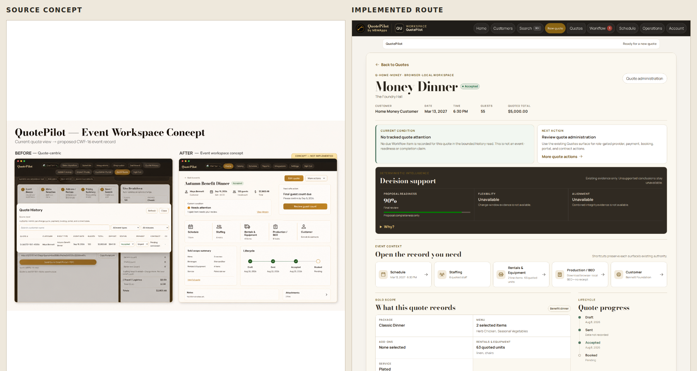
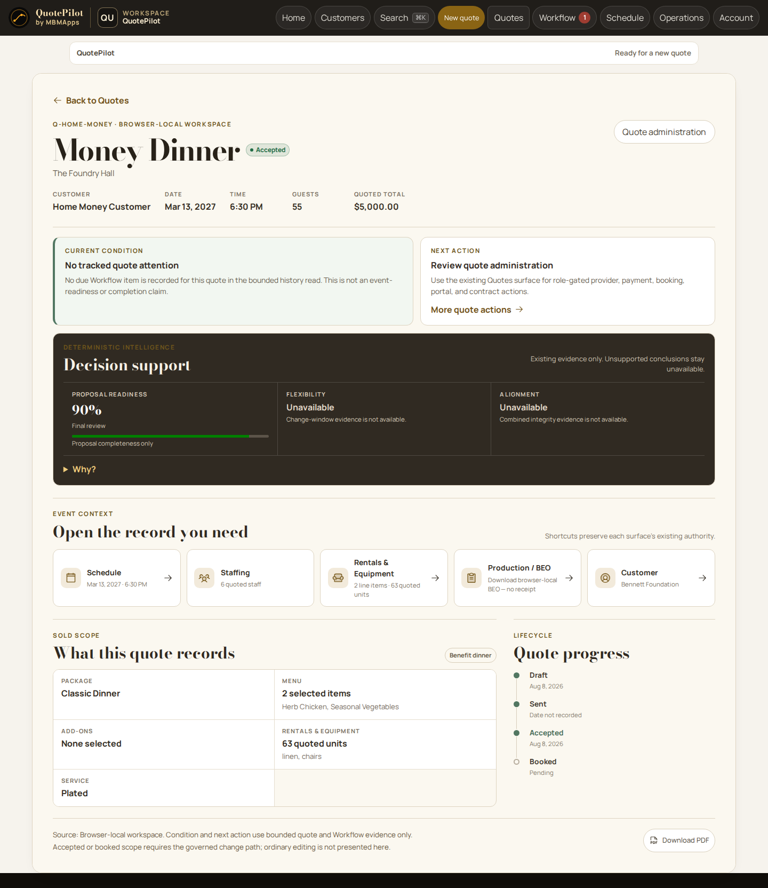
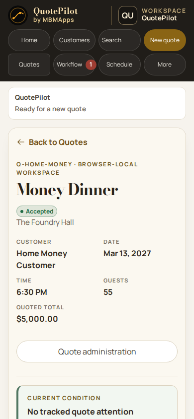
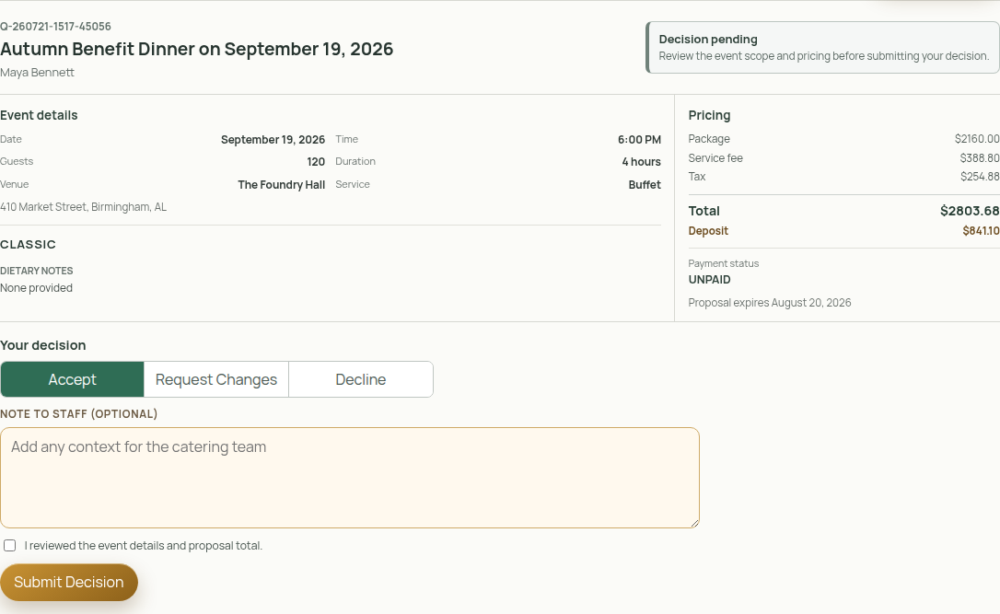
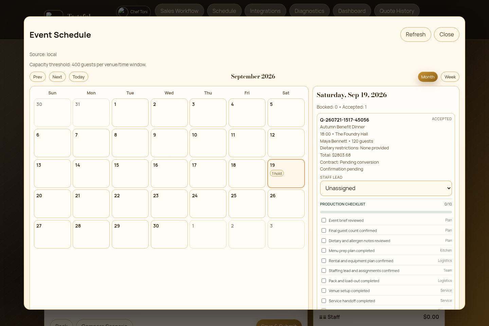

# Michael Major — Product Systems Portfolio

Last updated: 2026-08-31 16:35:30 CDT

> **I build systems that know what they know—and refuse to pretend when they
> do not.**

Most software does not fail because a button is missing. It fails when the
system collapses distinctions the business depends on: a customer said yes, so
the work looks paid; a payment screen returned, so the money looks settled; a
quote was accepted, so operations looks ready. The interface becomes
confident before the evidence does.

That is the class of problem I work on.

I take an ambiguous business idea, find the real operating model inside it,
and turn it into a product people can act through with confidence. I work
across product strategy, domain modeling, UX, architecture, implementation,
release governance, and AI-assisted development because those disciplines meet
at the same point: **the moment a person trusts the system enough to make a
consequential decision.**

## Selected case study — QuotePilot by MBMApps

**My role:** founder, product systems architect, product designer, full-stack
builder, and release/evidence owner.

**The product:** a hospitality commercial operating system that carries an
event opportunity from demand intake through authoritative quoting, customer
decision, payment evidence, and operational handoff.

**The operating environment:** React, Vite, Firebase Auth, Firestore, Firebase
Functions, Vercel, Stripe-facing payment boundaries, provider messaging, and a
standard-library-only Python reconciliation tier.

**Current proof boundary:** exact `v0.15.0` is recorded as the production
runtime. The integrated v0.16 candidate has substantial source and local
qualification, while its hosted, production-data, provider, human-acceptance,
adoption, and commercial-outcome claims remain separate. That distinction is
deliberate, not fine print.

## The problem I chose to solve

QuotePilot began close to what many vertical products begin as: a focused
quote builder surrounded by useful operational tools. The easy move would have
been to keep adding features to the wizard.

I saw a different product hiding underneath it.

A catering operator is not really trying to “make a quote.” They are trying to
turn demand into sold, paid, deliverable work without losing margin, missing a
customer change, or sending the kitchen a stale plan. The quote is one object
inside that larger commercial system.

That reframing changed the architecture and the experience:

`inquiry → quote composition → authoritative pricing → saved revision → proposal → customer decision → payment evidence → booked work → operational handoff`

Each transition has a different actor, a different authority, and a different
kind of proof. My job was to make the system feel simpler without making its
truth simpler than the business really is.

## From concept to working product

The source concept established the product direction: move from a quote-centric
tool to a coherent event opportunity workspace. The implemented route carries
that direction into the real application while preserving existing pricing,
role, navigation, and lifecycle authority.

I did not treat the mockup as a picture to copy. I treated it as a hypothesis
to reconcile with the product's actual data, permissions, constraints, and
working surfaces. The result is recognizably the same idea, but it belongs to
the real system.

The workspace leads with identity, authoritative state, current condition, and
one useful next action. Supporting objects—schedule, staffing, rentals,
production/BEO, customer context, sold scope, and lifecycle—remain connected
without pretending they share one status.

Responsive work is not a desktop screenshot squeezed smaller. At 390 pixels,
the hierarchy still answers the same questions in the same order: what am I
looking at, what state is it in, what matters now, and what should I do next?

## I design authority before I design controls

The core product rule is simple to say and expensive to honor:

> **Approved does not mean paid. Paid does not mean ready for operations.**

The customer may accept a proposal. A payment provider may establish
settlement evidence. An operator may confirm staffing, production, and
logistics readiness. Those truths are related, but none is allowed to impersonate
another.

The customer decision center gives the customer meaningful control—accept,
request changes, or decline—without granting access to internal pricing rules,
costs, margins, or operational authority.

The operations surface then makes the handoff visible: the event can be
accepted while production work, staffing ownership, conversion, and readiness
remain incomplete. The interface tells the operator what is true and what is
still work.

## I use AI as leverage, not as authority

AI is deeply embedded in how I investigate, model, prototype, test, compare,
and document systems. It helps me search a larger possibility space, connect
work across time, challenge my assumptions, and turn incomplete ideas into
executable artifacts faster.

But consequential authority stays deterministic and inspectable.

In QuotePilot, recommendations can explain, rank, and surface evidence. They do
not silently reprice a quote, approve a change, settle a payment, or declare an
event ready. The Commercial Truth Loop is intentionally read-only: no
credentials, no network, no write path. Its findings are observations that
return through a human and an existing trusted action.

That boundary reflects the way I build with AI more broadly: **let intelligence
expand judgment; never let fluency substitute for evidence.**

## What this work demonstrates

| Capability | How it shows up in the work |
| --- | --- |
| Product strategy | Reframed a quote wizard into a customer-centered commercial operating system organized around operator outcomes. |
| Domain and state modeling | Separated quote, proposal, decision, payment, booking, and operations-readiness truth instead of hiding them inside one status. |
| UX architecture | Built calm, decision-led workspaces that surface identity, condition, blocker, evidence, and next action before secondary controls. |
| Visual and interaction design | Established a reusable hospitality-commercial design contract: warm paper, dark ink, restrained gold, editorial moments, working clarity, and one primary action. |
| Full-stack systems design | Joined React surfaces to tenant-scoped Firebase authority, server-side pricing, revision fences, provider evidence, and role-safe customer/staff boundaries. |
| AI operating-model design | Used advisory intelligence and read-only reconciliation while reserving commercial mutation and high-consequence transitions for trusted code and people. |
| Release engineering | Bound claims to exact source, CI, deployment, tenant, provider, production, human, and outcome evidence rather than treating “green” as one universal state. |
| Learning-system design | Created planning, task-evidence, product-truth, and drift-detection mechanisms so repeated delivery compounds into better future decisions. |

## Evidence without inflation

At the time of this package:

- Exact `v0.15.0` is recorded at the Vercel edge and Firebase target after the
  required exact-main CI matrix passed.
- The integrated v0.16 Phase 1 candidate recorded 10/10 browser scenarios,
  26/26 representative responsive/accessibility checks, 4,194 passing unit
  tests with 78 intentional skips, 76 Firestore rules tests, and 127 Commercial
  Truth Loop tests.
- Side-by-side visual QA recorded no actionable P0, P1, or P2 finding for that
  candidate.
- The Commercial Truth Loop has not run against production data, and three
  evidence areas still prevent any record from reaching `fullyReconciled`.
- Authenticated hosted acceptance, provider outcomes, human acceptance,
  adoption, and commercial results are not promoted from weaker evidence.

I include the limits because they are part of the capability. I do not want a
portfolio that performs certainty. I want one that shows I can build toward it.

The exact current operational claims live in
[`PROJECT_STATUS.md`](../../PROJECT_STATUS.md). Product identity and lifecycle
vocabulary live in [`PROJECT_STATE.md`](../../PROJECT_STATE.md). The product
judgment behind the experience is recorded in
[`DESIGN_PRINCIPLES.md`](../DESIGN_PRINCIPLES.md) and
[`DESIGN-CONTRACT.md`](../DESIGN-CONTRACT.md). The evidence model is described
in [`DEVELOPMENT_EVIDENCE_COMPILER.md`](../DEVELOPMENT_EVIDENCE_COMPILER.md).

## Short portfolio versions

### Positioning line

I turn ambiguous operational problems into trustworthy product systems—across
strategy, UX, architecture, implementation, AI collaboration, and release
evidence.

### Short bio

I am a product systems builder working at the intersection of product
strategy, UX, software architecture, and AI-assisted execution. I specialize
in operational products where state, money, authority, and human judgment have
to remain legible. My work turns complex workflows into calm decisions without
letting the interface claim more than the evidence can support.

### Project-card summary

I led QuotePilot from a quote-centric tool toward a hospitality commercial
operating system. I reframed the product around the real operator journey—from
demand and authoritative pricing through customer decision, payment evidence,
and operational handoff—then carried that model through UX, tenant and role
boundaries, full-stack implementation, responsive validation, and governed
release evidence. AI accelerated discovery, synthesis, and testing, while
deterministic services and human approval retained authority over pricing,
payments, customer commitments, and operational readiness.

### Interview opener

The best way to understand my work is that I do not separate product thinking
from system truth. I can start with a vague business idea, find the operating
model underneath it, design the experience, build the architecture, and create
the evidence needed to know what is actually ready. QuotePilot is the clearest
example: the product became better when I stopped treating the quote as the
center and started treating the operator's decision chain as the system.

## The through-line

I am at my best where the problem is still partly hidden—where the request
sounds like a feature, but the real work is a product boundary, a state model,
an authority decision, or an evidence gap.

I do not just make the system do more.

**I make it clearer what the system is allowed to say, what the person needs to
decide, and what proof should exist when the work is done.**
