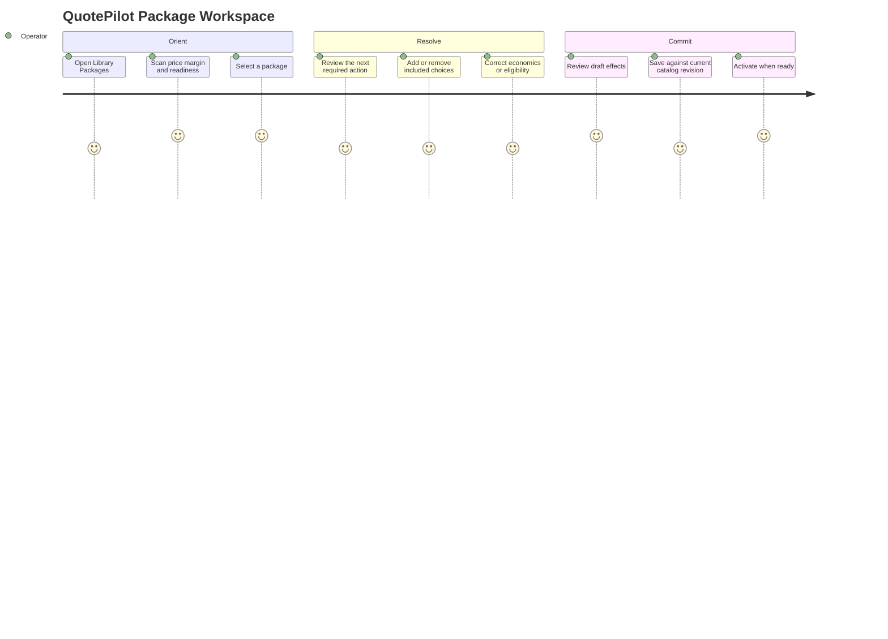
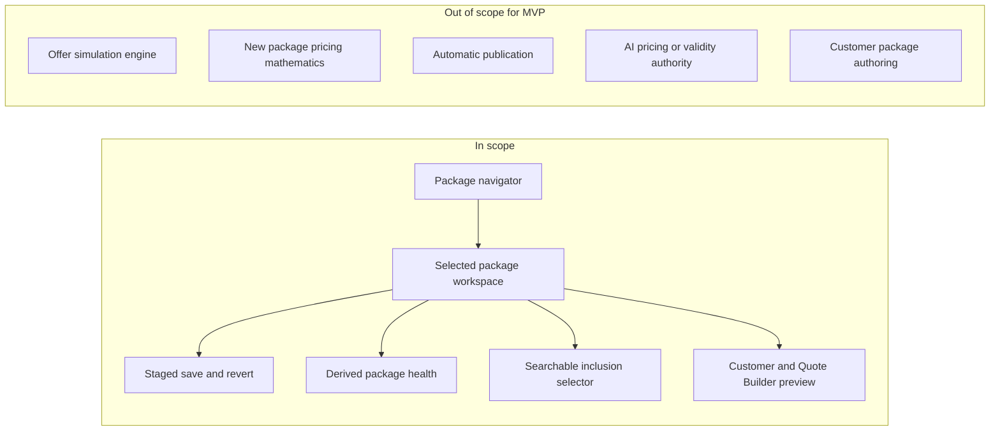

# PRD: QuotePilot Package Workspace

Status: Proposed
Version: 0.1
Last updated: August 18, 2026

## Overview

### One-line Summary

Turn `Library -> Packages` into a commercial package-management workspace that
shows promise, composition, economics, readiness, and the next useful action
before exposing configuration detail.

### Background

The current Package Settings screen exposes significant capability as one long
administrative form. Operators can edit package names, per-person prices,
optional costs, inclusion references, and active state, but they cannot quickly
understand package health or differentiation. QuotePilot should organize the
same work around the package as a business object, not around stored fields.

This PRD does not request simulation scenarios, regression-tested commercial
configurations, or AI authority over pricing and validity.

## User Stories

### Primary Users

- Catering owner who maintains the sellable catalog.
- Catalog or sales administrator who prepares packages for estimators.
- Operations manager who reviews package feasibility and cost coverage.

### User Stories

```text
As a catalog administrator
I want one concise view of a package's promise, economics, inclusions, and risks
So that I can decide whether it is ready for estimators to quote.

As a catering owner
I want missing cost and margin risk explained before activation
So that I do not publish a package without understanding its economics.

As a sales administrator
I want Quote Builder behavior previewed in plain language
So that I know exactly what estimators and customers will be offered.
```

### Use Cases

1. Compare package summaries, select one, and identify its highest-priority gap.
2. Add or remove menu items, add-ons, and rentals through a searchable selector.
3. Enter price and cost, then review contribution and margin availability.
4. Resolve inactive or missing inclusion references before activation.
5. Save or revert a staged package change under catalog revision fencing.
6. Preview package presentation and select-to-add Quote Builder behavior.

### User Journey Diagram



### Scope Boundary Diagram



## Functional Requirements

### Must Have (P1 - MVP)

- [ ] FR-01: Show a compact package navigator with identity, price, lifecycle,
  readiness, margin availability, and warning count.
  - AC-001: Given at least one package, an operator can identify the selected
    package, price, lifecycle, and readiness without opening an editor section.
  - AC-002: Switching packages preserves unsaved drafts and does not mutate the
    persisted catalog.
- [ ] FR-02: Show the selected package's commercial summary in the first
  viewport.
  - AC-003: Price, recorded cost or `Not recorded`, contribution or
    `Unavailable`, margin or `Unavailable`, inclusion counts, and one next action
    are visible at 1440px without opening a secondary panel.
  - AC-004: Missing cost is never displayed or calculated as zero.
- [ ] FR-03: Replace always-visible checkbox matrices with explicit Add actions
  and a searchable multi-select catalog selector.
  - AC-005: The default Includes view lists current inclusions and removal
    controls; it does not render the complete candidate catalog.
  - AC-006: Each selector supports search, kind/category filtering, selected
    count, multi-select, bulk Add, Cancel, and no-results recovery.
  - AC-007: Existing inactive references remain visible and removable, while
    unrelated inactive candidates are unavailable for addition.
- [ ] FR-04: Use explicit staged persistence.
  - AC-008: A clean workspace shows one `Saved` state and no enabled Save or
    Revert action.
  - AC-009: A dirty workspace shows `Unsaved changes`, Save, and Revert; leaving
    through a destructive boundary requires confirmation.
  - AC-010: Saving reports saving, receipt, reconciliation/conflict, uncertain,
    recovery, and error outcomes without claiming success prematurely.
- [ ] FR-05: Separate package lifecycle from readiness.
  - AC-011: Lifecycle is one of `draft`, `active`, or `archived`.
  - AC-012: Readiness is derived as `incomplete`, `needs_review`, or `ready`,
    with deterministic reason codes and a next action.
  - AC-013: Activation is blocked when readiness is not `ready` and the blocking
    reasons are shown before the action.
- [ ] FR-06: Explain Quote Builder behavior.
  - AC-014: The preview states that an inclusion is available at no added charge
    only after an estimator selects it.
  - AC-015: The MVP preserves current per-person package pricing and existing
    selected-inclusion de-duplication in local and authoritative calculations.
- [ ] FR-07: Clarify event-type semantics.
  - AC-016: The inclusion selector labels event type as a menu-availability
    filter until package eligibility is explicitly implemented.
  - AC-017: The UI does not claim that selecting the filter changes package
    eligibility, pricing, or Quote Builder package availability.
- [ ] FR-08: Keep destructive actions contextual and dependency-aware.
  - AC-018: Archive/Delete actions live in an overflow menu and require a
    dependency summary plus confirmation before changing the draft.

### Should Have (P2)

- [ ] FR-09: Add package comparison for two to four packages.
  - AC-019: Comparison uses the same deterministic price, cost availability,
    margin availability, and inclusion counts as the workspace summaries.
- [ ] FR-10: Add explicit package eligibility and minimum constraints after the
  authoritative contract supports them.
  - AC-020: Quote Builder applies eligibility only from persisted, validated
    package fields, never from the transient menu filter.
- [ ] FR-11: Add a customer presentation tab using the existing customer-safe
  proposal projection.

### Could Have (P3)

- [ ] Explain package differentiation based on deterministic catalog facts.
- [ ] Suggest the next package gap from known reason codes.
- [ ] Show change history when authoritative catalog audit evidence exists.

### Won't Have (this release)

- Commercial simulation scenarios or automatic offer regression runs.
- Flat-rate, tiered, or minimum package pricing before pricing-engine support.
- Automatic activation, automatic substitutions, or automatic catalog changes.
- AI-generated prices, margins, readiness states, or validity decisions.
- Customer-side package authoring.

## Non-Functional Requirements

### Performance

- Package switching: update the selected workspace within 100 ms at the 95th
  percentile for 100 packages using a local test fixture.
- Selector filtering: update results within 100 ms at the 95th percentile for
  1,000 candidate records using a local test fixture.
- Initial route: no new initial production chunk larger than 75 KB gzip; lazy
  selector/history surfaces when practical.

### Reliability

- Zero silent overwrite on catalog revision conflicts.
- Zero successful-save messages without a confirmed or reconciled save outcome.
- Existing local fallback behavior remains available only under its current
  environment policy and is labeled browser-local.

### Security

- Reuse existing administrator Library authority and organization scoping.
- Keep costs, contribution, margin, and readiness reasons staff-only.
- Do not expose stable internal IDs in customer-safe projections.

### Accessibility

- Standard: WCAG 2.2 AA.
- Keyboard: navigator, tabs, selector, overflow actions, Save, and Revert must be
  fully operable without pointer input.
- Screen reader: selection, readiness changes, save outcomes, and selector counts
  use named controls and appropriate live regions.
- Responsive targets: 390x844, 768x900, and 1440x1000 with no horizontal
  document overflow or clipped persistent action.

## Success Criteria

### Quantitative Metrics

1. Five-second comprehension: at least 80% of five representative operators can
   correctly state selected package price, readiness, and next action after a
   five-second view in moderated acceptance.
2. Inclusion task: at least 90% of representative operators add three specified
   inclusions and save without assistance in under 90 seconds.
3. Persistence comprehension: 100% of acceptance participants correctly
   distinguish unsaved, saving, saved, and conflict states in scenario testing.
4. Accessibility: zero critical or serious automated violations in the three
   required viewport states, plus successful keyboard-only completion.
5. Commercial parity: 100% of legacy package fixtures produce identical base
   price and selected-inclusion totals before and after the MVP migration.

### Qualitative Metrics

1. Operators describe packages in business terms rather than field names.
2. Operators can explain why an incomplete package cannot be activated.
3. Operators can predict what Quote Builder and the customer will see.

## Technical Considerations

### Dependencies

- Existing role-safe Library route and `AdminCatalogView` handoff.
- Existing `useCatalogData.saveCatalog` revision and reconciliation path.
- Existing local and authoritative pricing calculators.
- Existing package inclusion IDs and Quote Builder select-to-add behavior.
- Existing fail-closed staff margin presentation.

### Constraints

- Backward compatibility with current package documents and saved quotes.
- Pricing remains deterministic and server-authoritative.
- Managed menu writes retain their separate revision-aware operation until an
  explicit architecture change is accepted.
- The active dirty worktree contains unrelated user changes; implementation
  must use a narrow file scope.

### Risks and Mitigation

| Risk | Impact | Probability | Mitigation |
|---|---|---|---|
| Readiness is mistaken for pricing approval | High | Medium | Show package readiness and catalog pricing confirmation as separate states |
| Eligibility UI outruns stored authority | High | Medium | Label event type as filtering only until the contract ships |
| New schema changes pricing behavior | High | Low | Characterization tests and compatibility adapter before migration |
| Large selectors regress performance | Medium | Medium | Lazy render, bounded results, and fixture-based latency gates |
| Workspace hides stale references | High | Low | Preserve and flag selected inactive/missing references |

## Undetermined Items

None for MVP. Margin risk is informational, legacy lifecycle is view-model-only,
and eligibility/minimum fields are out of MVP scope. Phase 5 and Phase 6 require
separate accepted decisions before they can expand the contract.

## Appendix

### References

- [`docs/PACKAGE_WORKSPACE.md`](../PACKAGE_WORKSPACE.md)
- [`docs/DESIGN_SYSTEM.md`](../DESIGN_SYSTEM.md)
- [`docs/DESIGN_PRINCIPLES.md`](../DESIGN_PRINCIPLES.md)
- [`docs/USER_MANUAL.md`](../USER_MANUAL.md)

### Glossary

- **Lifecycle**: Persisted publication intent: draft, active, or archived.
- **Readiness**: Deterministic assessment of whether required package facts are
  complete and references are valid.
- **Inclusion**: A catalog choice an estimator may select at no added charge.
- **Menu availability filter**: Event-type context used to find menu candidates;
  it is not package eligibility.
