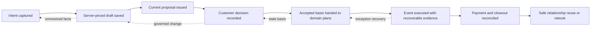

# User Journey and Funnel Model

Last updated: 2026-09-16 23:25:23 CDT

Status: mixed evidence. Product touchpoints and authority boundaries are
repository-grounded. Emotional states, switching triggers, and perceived value
remain hypotheses until interviews, observed work, or product telemetry support
them.

## Primary persona

**Catering owner-operator** — accountable for sales, margin, delivery quality,
cash collection, and customer relationships, often while also resolving daily
operational exceptions.

**Job to be done:** When a customer asks for an event and details keep changing,
help me decide whether to take the work, make an accurate promise, prepare the
team from the current truth, and explain the financial result without rebuilding
the story across email, spreadsheets, documents, and memory.

Secondary actors are the sales/catalog administrator, operations manager,
kitchen lead, staffing administrator/event lead, finance reviewer, and customer
event contact. Their projections and authorities remain distinct.

## End-to-end journey map

| Stage | Touchpoint and action | Expected thought/emotion (hypothesis) | Value created | Primary failure or churn trigger | Measures |
|---|---|---|---|---|---|
| 1. Discover and evaluate | Public marketing/system pages; operator evaluates whether QuotePilot understands catering work. | Skeptical: “Will this reduce work or become another system to maintain?” | Clear promise tied to commercial and operational control. | Generic SaaS claims, unverifiable numbers, unclear migration/setup burden. | Acquisition instrumentation is currently missing; qualitative decision evidence required. |
| 2. Provision and configure | Organization setup, roles, Library, offers/packages, pricing, recipes/costs, provider settings. | Cautious and effort-sensitive. | A trustworthy business model estimators can use. | Setup complexity, incomplete costs, unclear publication state, or unsafe defaults. | `MET-08`, setup research; no governed onboarding funnel yet. |
| 3. Capture intent | Guided Inquiry, staff intake, CREATE, or direct opportunity entry. | Curious but uncertain about incomplete customer facts. | Customer preferences become a reviewable opportunity without becoming a promise. | Missing identity/context, invented scope, duplicate entry, or lost provenance. | Future inquiry-to-opportunity rate; `MET-03` begins at first quote intent. |
| 4. Build and price | Five-step quote flow, catalog selection, add-ons, authoritative pricing, saved draft. | Focused; frustration rises when blockers or pricing consequences are unclear. | A fast, defensible priced draft. **First product aha:** the operator sees a server-priced, saved artifact from incomplete intent. | Wizard abandonment, dead actions, stale catalog revision, missing cost, or unexplained total. | `MET-01`–`MET-05`, `MET-08`. |
| 5. Present and decide | Customer proposal/portal, conversation, delivery, acceptance/rejection/expiry. | Customer seeks confidence; staff seeks a timely decision. | One current decision artifact with explainable scope and price. | Provider acceptance mistaken for customer receipt, multiple “current” proposals, unclear next action. | `MET-06`; provider/view/decision evidence shown separately. |
| 6. Govern change | Quote revision or Commercial Change after acceptance. | Tense: changes threaten margin, timing, and trust. | Prior truth is preserved while consequences and authorization are explicit. **Moment of truth:** the team can explain exactly what changed and what must happen next. | Accepted record overwritten, stale BEO/staffing/production, or unauthorized apply. | `MET-07`, `MET-11`, `MET-12`, `MET-17`. |
| 7. Plan delivery | Calendar, workflow, Staffing, Inventory, production, BEO, run of show. | Busy; needs clarity more than another dashboard. | The accepted promise becomes current domain-owned preparation. | Blended readiness, stale basis, missing owner, late quantity/venue/menu changes. | `MET-11`, `MET-12`, `MET-16`. |
| 8. Execute and recover | Event-day context, receipts, explicit failure/ambiguity states, authorized recovery. | Time-pressured; tolerance for ambiguity is low. | Operators see the smallest next action without losing history. | Wrong event/version, unsafe retry, unavailable “live” authority presented as current. | `MET-05`, `MET-12`, `MET-17`; live execution telemetry remains incomplete. |
| 9. Collect and close | Deposit/final balance, provider reconciliation, actual attendance, closeout, Truth Loop. | Wants closure and an explainable number. | Cash state and realized contribution can be defended. | Duplicate action, ambiguous provider outcome, missing cost/payout evidence, or planned/actual count collapse. | `MET-08`–`MET-10`, `MET-13`, `MET-14`. |
| 10. Retain and rebook | Customer 360, timeline, relationship briefing, safe duplication/rebook. | Wants continuity without repeating setup. | Prior knowledge accelerates the next engagement without copying obsolete authority. | Old price, acceptance, payment, or provider evidence silently cloned. | `MET-15`, retention/rebook outcome research. |
| 11. Advocate | Owner recommends the product after repeated controlled events. | Confidence based on fewer surprises, not novelty. | Evidence-backed word of mouth and durable adoption. | Product looks polished but cannot show saved time, protected margin, or controlled delivery. | `MET-16` plus interview/referral evidence; no current instrumentation. |

## Operating funnel

This is a measurement funnel, not a lifecycle enum. Real catering work loops,
branches, and sometimes ends appropriately at any stage.

## Funnel contracts

| Transition | Entry evidence | Success evidence | Failure/ambiguity evidence | Current observability |
|---|---|---|---|---|
| Intent → priced draft | Staff intent or governed inquiry conversion | Firebase-saved, server-authoritative pricing receipt | Missing required fact, invalid catalog revision, save/pricing failure | Implemented for staff quote sessions; inquiry origin is incomplete. |
| Priced draft → proposal | Saved quote/version | Current issuance and portal/delivery receipt | Missing customer contact, invalid issuance, provider ambiguity | Derivable, not summarized as a funnel. |
| Proposal → decision | Current customer artifact | Accept/reject/expiry receipt | No view/decision, stale issuance, conflicting revision | Derivable, not summarized. |
| Accepted → operational handoff | Accepted exact version | Each required supported domain cites its current basis and owner | Missing, stale, contradictory, blocked, not-yet-available | Not centrally observable. |
| Plan → execution | Current domain plans and artifacts | Domain receipts and explicit recovery outcomes | Late discovery, unavailable live authority, superseded artifact | Partial and domain-specific. |
| Execution → closeout | Event completion evidence | Payment, attendance, cost, and reconciliation evidence | Unknown provider outcome, missing actuals, unexplained discrepancy | Partial. |
| Closeout → relationship reuse | Governed completed engagement | Safe origin-linked rebook or retained relationship evidence | Copied obsolete authority or lost provenance | Not centrally observable. |

## Critical moments

- **Aha moment:** first server-authoritative priced draft saved from real event
  intent with understandable blockers and next action.
- **Commercial moment of truth:** customer-current proposal and accepted snapshot
  remain distinguishable after a meaningful change.
- **Operational moment of truth:** a change identifies every supported stale
  consumer and the smallest owner-specific action.
- **Trust moment of truth:** a provider timeout or conflicting record produces
  safe ambiguity and reconciliation rather than a confident duplicate action.
- **Retention moment:** closeout evidence makes the next event easier without
  copying expired authority.

## Research and instrumentation priorities

1. Observe `BASE-04`: five owner-operators completing comparable real event
   planning, including kitchen and staffing review.
2. Instrument or derive the accepted-to-operational-handoff funnel without
   introducing a universal readiness aggregate.
3. Measure proposal decision lead time and material post-acceptance correction.
4. Establish safe rebook provenance and retention evidence.
5. Interview both owner-operators and customer event contacts; one actor's
   convenience may create hidden work or risk for the other.

Research findings can propose metric, target, or capability changes. They do
not update canonical product authority until an owner decision is entered in
the release/experiment ledger and the owning document is updated.
