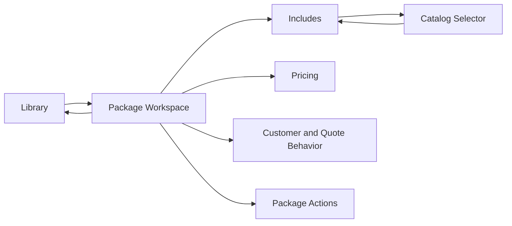

# QuotePilot Package Workspace UI Specification

Status: Proposed
Version: 0.1
Last updated: 2026-08-20 14:47:39 CDT

## Overview

This specification reconstructs `Library -> Packages` around one selected
commercial package. It preserves QuotePilot's neutral workspace language while
replacing the permanently expanded relational form with summary-first editing,
progressive disclosure, and deterministic package health.

### Target PRD

- PRD path: [`docs/prd/quotepilot-package-workspace-prd.md`](../prd/quotepilot-package-workspace-prd.md)
- Feature scope: FR-01 through FR-08 for MVP; FR-09 through FR-11 are later
  phases.

### Design Source

| Source | Path | Version |
|---|---|---|
| Current screenshot | User-supplied Package Settings screenshot | August 18, 2026 prompt |
| Current implementation | `src/components/AdminCatalogModal.jsx` | Active worktree inspection |
| Workspace visual grammar | `docs/DESIGN_SYSTEM.md` | Current source |
| Product principles | `docs/DESIGN_PRINCIPLES.md` | August 16, 2026 |

No prototype code is canonical for this revision. The earlier dense-table mock
is retained only as problem evidence; this specification replaces its proposed
interaction model.

## AC Traceability

| AC ID | Summary | Screen / State | Adoption Decision |
|---|---|---|---|
| AC-001 | Navigator exposes package identity, price, lifecycle, readiness | S-01 default | Adopted |
| AC-002 | Switching preserves draft | S-01 dirty | Adopted |
| AC-003 | First viewport answers commercial questions | S-01 default | Adopted |
| AC-004 | Missing cost stays unavailable | S-01 incomplete | Adopted |
| AC-005 | Existing inclusions before candidates | S-02 default | Adopted |
| AC-006 | Search/filter/multi-select/bulk Add | S-03 default/empty | Adopted |
| AC-007 | Selected stale references remain removable | S-02 partial | Adopted |
| AC-008-010 | One staged persistence model and truthful outcomes | S-01 dirty/saving/conflict/error | Adopted |
| AC-011-013 | Lifecycle and readiness remain separate | S-01 all states | Adopted |
| AC-014-015 | Quote Builder preview and pricing parity | S-05 default | Adopted |
| AC-016-017 | Event type is labeled as menu filtering in MVP | S-03 filter | Adopted |
| AC-018 | Contextual destructive actions | S-06 confirm | Adopted |
| AC-019-020 | Comparison and persisted eligibility | Later screens | On hold |

## Screen List and Transitions

### Screen List

| Screen ID | Screen Name | Description | Entry Condition |
|---|---|---|---|
| S-01 | Package Workspace | Three-zone desktop or stacked mobile package view | Admin opens Library Packages |
| S-02 | Includes | Existing included choices grouped by kind | Operator opens Includes |
| S-03 | Catalog Selector | Searchable candidate picker for one inclusion kind | Operator chooses an Add action |
| S-04 | Pricing | Per-person selling price, optional cost, and margin evidence | Operator opens Pricing or follows economics warning |
| S-05 | Customer and Quote Behavior Preview | Customer-safe summary plus exact estimator selection behavior | Operator opens preview tab |
| S-06 | Package Actions | Duplicate, archive, or dependency-aware delete confirmation | Operator opens overflow action |

### Transition Conditions

| Source | Destination | Trigger | Guard Condition |
|---|---|---|---|
| Library | S-01 | Review packages | Existing role-safe exact Packages handoff |
| S-01 | S-01 | Select another package | Preserve current local drafts by package ID |
| S-01 | S-02/S-04/S-05 | Select workspace tab | No persistence side effect |
| S-02 | S-03 | Add menu item/add-on/rental | Candidate source is available; selected kind is explicit |
| S-03 | S-02 | Add selected | At least one valid candidate selected |
| S-03 | S-02 | Cancel | Discard selector-only selection, preserve package draft |
| S-01 | Library | Back to Library | Confirm if any package draft is dirty |
| S-01 | S-06 | Open overflow action | Package selected |
| S-06 | S-01 | Confirm draft/archive/delete | Dependency and readiness checks pass |



## Information Architecture

### Desktop: three zones

1. **Package Navigator, 260-320px:** package search, Add Package, compact package
   summaries, lifecycle/readiness filters.
2. **Selected Package Workspace, flexible 560px minimum:** identity, commercial
   summary, section navigation, existing inclusions, and staged controls.
3. **Package Health, 280-340px:** readiness, blocking reasons, event context,
   inclusion counts, last known catalog revision, and one next action.

The shell may collapse Zone 3 below Zone 2 between 768px and 1199px. The
workspace must not create nested page-level horizontal scrolling.

### Workspace sections

- Overview: promise, economics, readiness, composition summary.
- Includes: current menu items, add-ons, rentals, and future staffing rules.
- Pricing: MVP per-person price and optional cost; unsupported bases read
  `Not available in this release` rather than presenting dead controls.
- Eligibility and Rules: read-only explanatory boundary in MVP, editable in P2.
- Customer Preview: customer-safe name and inclusion summary.
- Quote Behavior: exact select-to-add and no-double-charge explanation.
- Evidence: catalog revision, save outcome, reference problems, and future
  change history.

## Component Decomposition

```text
PackageWorkspace
  +-- PackageWorkspaceHeader
  |   +-- SaveState
  |   +-- PackageActionsMenu
  +-- PackageNavigator
  |   +-- PackageSearch
  |   +-- PackageNavigatorRow[]
  +-- PackageEditor
  |   +-- PackageIdentityHeader
  |   +-- CommercialSummary
  |   +-- WorkspaceSectionTabs
  |   +-- PackageOverview
  |   +-- PackageIncludes
  |       +-- InclusionGroup[]
  |       +-- CatalogSelectorDialog
  |   +-- PackagePricing
  |   +-- PackageEligibility
  |   +-- PackagePreview
  |   +-- PackageEvidence
  +-- PackageHealthPanel
      +-- ReadinessStatus
      +-- HealthReasonList
      +-- NextBestAction
```

### Component: PackageWorkspace

#### State x Display Matrix

| State | Default | Loading | Empty | Error | Partial |
|---|---|---|---|---|---|
| Display | Three zones and selected package | Navigator and workspace skeletons | `Create your first package` with one CTA | Error banner with Retry/Back to Library | Persisted package data plus explicit unavailable health evidence |

#### Interaction Definition

| AC ID | EARS Condition | User Action | System Response | State Transition | Error Handling |
|---|---|---|---|---|---|
| AC-002 | When another package is selected | Activate navigator row | Preserve current draft and show target draft | selected A -> selected B | If target missing, retain A and announce unavailable |
| AC-008 | While clean | Inspect workspace | Show `Saved`; Save/Revert disabled or absent | clean -> clean | None |
| AC-009 | When a field changes | Edit | Show dirty state and sticky Save/Revert | clean -> dirty | Invalid input stays local and names correction |
| AC-010 | When Save is invoked | Save draft | Use existing guarded save and report exact outcome | dirty -> saving -> receipt/conflict/error | Conflict keeps or reconciles draft according to existing contract |

### Component: PackageNavigator

#### State x Display Matrix

| State | Default | Loading | Empty | Error | Partial |
|---|---|---|---|---|---|
| Display | Search plus rows | Stable-width row skeletons | First-package CTA | Retry state without hiding selected workspace | Rows render available summaries; missing fields show warnings |

#### Interaction Definition

| AC ID | EARS Condition | User Action | System Response | State Transition | Error Handling |
|---|---|---|---|---|---|
| AC-001 | While packages are available | Scan rows | Show name, price, lifecycle, readiness, margin state, warnings | none | Missing facts use `Unavailable` or `Not recorded` |
| AC-002 | When switching | Click, Enter, or Space | Select exact stable package ID | selected -> selected | Never infer identity from row position or name |

### Component: CommercialSummary

#### State x Display Matrix

| State | Default | Loading | Empty | Error | Partial |
|---|---|---|---|---|---|
| Display | Price, cost, contribution, margin | Inline placeholders | Price/cost prompts | Calculation unavailable with reason | Known values stay visible; unknown values are not estimated |

#### Interaction Definition

| AC ID | EARS Condition | User Action | System Response | State Transition | Error Handling |
|---|---|---|---|---|---|
| AC-003 | While selected | Inspect | Show commercial facts and inclusion counts | none | N/A |
| AC-004 | If cost is missing | Inspect | Show `Not recorded` and unavailable contribution/margin | none | Link next action to Pricing |

### Component: PackageIncludes

#### State x Display Matrix

| State | Default | Loading | Empty | Error | Partial |
|---|---|---|---|---|---|
| Display | Existing inclusions grouped by type | Existing summary remains; candidate loading is separate | `Nothing included yet` plus Add actions | Candidate failure leaves current inclusions intact | Inactive/missing selected references remain visible with warning/removal |

#### Interaction Definition

| AC ID | EARS Condition | User Action | System Response | State Transition | Error Handling |
|---|---|---|---|---|---|
| AC-005 | While Includes is open | Inspect | Render only current inclusions and Add actions | none | N/A |
| AC-007 | If a selected reference is inactive | Remove or inspect | Keep warning visible until removed and saved | partial -> dirty | Unrelated inactive options remain hidden |

### Component: CatalogSelectorDialog

#### State x Display Matrix

| State | Default | Loading | Empty | Error | Partial |
|---|---|---|---|---|---|
| Display | Search, filters, result list, count, Add/Cancel | Skeleton list with disabled Add | `No catalog items match` plus Clear filters | Retry without losing selected IDs | Available records plus unavailable selected records labeled clearly |

#### Interaction Definition

| AC ID | EARS Condition | User Action | System Response | State Transition | Error Handling |
|---|---|---|---|---|---|
| AC-006 | When results are selected | Toggle rows | Update selected count; no package mutation yet | picker clean -> picker dirty | Duplicate selection is a no-op |
| AC-006 | When Add selected is used | Activate primary action | Merge stable IDs into package draft once | picker dirty -> package dirty | Invalid/missing IDs are rejected and named |
| AC-016 | While selecting menu items | Change event-type filter | Filter menu candidates only | filter -> filter | Copy states no eligibility/pricing effect |

### Component: PackageHealthPanel

#### State x Display Matrix

| State | Default | Loading | Empty | Error | Partial |
|---|---|---|---|---|---|
| Display | Readiness, reasons, next action | Reserved layout | `No package selected` | `Health unavailable` with source reason | Deterministic known reasons plus unavailable areas |

#### Interaction Definition

| AC ID | EARS Condition | User Action | System Response | State Transition | Error Handling |
|---|---|---|---|---|---|
| AC-012 | When draft changes | Edit | Recompute readiness from local deterministic model | ready/incomplete/needs_review | Never call AI or invent missing evidence |
| AC-013 | If readiness is not ready | Activate | Block and focus first reason | lifecycle unchanged | Announce exact blocking reasons |

### Component: PackageActionsMenu

#### State x Display Matrix

| State | Default | Loading | Empty | Error | Partial |
|---|---|---|---|---|---|
| Display | Duplicate, Archive, Delete | Busy action disabled | N/A | Action-specific error and recovery | Delete disabled with dependency summary |

#### Interaction Definition

| AC ID | EARS Condition | User Action | System Response | State Transition | Error Handling |
|---|---|---|---|---|---|
| AC-018 | When Delete is chosen | Confirm | Show dependencies and explicit consequence first | menu -> confirm | Malformed dependency data blocks deletion |

## Persistence Interaction Contract

- The workspace uses staged editing, not autosave.
- `Saved` means local draft matches the latest accepted catalog snapshot.
- `Unsaved changes` appears after the first material local change.
- Save and Revert are one sticky action group and appear only while dirty.
- `Saving` disables conflicting actions but keeps content visible.
- `Conflict` keeps the user's work visible and offers Review latest/Keep draft
  according to the existing catalog reconciliation contract.
- Managed-menu edits continue to use their existing separate mutation flow in
  MVP. The selector may select from menu records but may not silently edit them.

## Text Wireframes

### Desktop: 1440px

```text
+----------------------------------------------------------------------------+
| Library / Packages                     Saved                  Back to Library|
+------------------------+--------------------------------+-------------------+
| PACKAGES               | CLASSIC                        | PACKAGE HEALTH    |
| [Search packages...]   | Customer promise summary      | READY / INCOMPLETE|
| [+ New package]        |                                |                   |
|                        | $18 / person   Cost $11.40     | 2 items need work |
| > Classic              | Contribution $6.60   37%      | - missing mapping |
|   $18  Ready  37%      |                                | - cost unavailable|
|   Corporate drop-off   | 5 menu | 1 add-on | 1 rental  |                   |
|                        |                                | NEXT BEST ACTION  |
|   Deluxe               | [Overview] [Includes] [Pricing]| Record item costs |
|   $32  Needs review    | [Eligibility] [Preview] [...]  | [Review costs]    |
|                        |                                |                   |
|   Premium              | WHAT IS INCLUDED              | QUOTE BEHAVIOR    |
|   $24  Incomplete      | Menu items (5)  [Add menu item]| Estimator selects |
|                        | [Brownies x] [Salad x] [...]   | included choices; |
|                        | Add-ons (1)     [Add add-on]   | selected lines $0.|
|                        | Rentals (1)     [Add rental]   |                   |
+------------------------+--------------------------------+-------------------+
| Unsaved changes                   [Revert] [Save package changes]            |
+----------------------------------------------------------------------------+
```

### Catalog selector

```text
+---------------------------------------------------------------+
| Add menu items to Classic                                [x] |
| Event type: Birthday (filters menu availability only)         |
| [Search menu...] [Category: All]          3 selected           |
| [ ] Assorted Brownies    Desserts     $1.80 cost               |
| [x] Garden Salad         Salads       $1.70 cost               |
| [x] Rolls and Butter     Sides        $0.90 cost               |
|                                                               |
|                                      [Cancel] [Add 3 items]    |
+---------------------------------------------------------------+
```

### Mobile: 390px

```text
+----------------------------------+
| Packages                  Saved  |
| [Classic v]             [More]   |
| Classic                          |
| $18/person                       |
| Ready                            |
| Cost $11.40 | Margin 37%         |
| 5 menu | 1 add-on | 1 rental    |
|                                  |
| [Overview][Includes][Pricing] -> |
| What is included                 |
| Menu items (5)                   |
| [Brownies x] [Salad x]           |
| [Add menu item]                  |
| Add-ons (1) [Add add-on]         |
| Rentals (1) [Add rental]         |
|                                  |
| Package health [2 issues] [Open] |
+----------------------------------+
| [Revert] [Save changes]          |
+----------------------------------+
```

On mobile, package switching uses a full-width combobox or sheet; Package
Health is an in-flow disclosure above the sticky save bar. The save bar must not
cover the final editable control and must respect safe-area inset.

## Design Tokens and Component Map

### Existing Component Reuse Map

| UI Element | Decision | Existing source | Notes |
|---|---|---|---|
| Route shell and Library handoff | Reuse | `AmbientLibraryRoute.jsx` | Preserve exact focus/dirty-draft behavior |
| Catalog draft/save orchestration | Extend | `AdminCatalogModal.jsx` | Extract package surface without changing save authority |
| Neutral workspace tokens | Reuse | `src/styles.css`, `docs/DESIGN_SYSTEM.md` | Near-white paper, hairlines, one gold action accent |
| Margin presentation model | Reuse | `src/components/marginPresentation.js` | Staff-only and fail closed |
| Package navigator | New | N/A | Stable-ID selection and draft badges |
| Inclusion selector | New | N/A | Search/filter/multi-select dialog or sheet |
| Health derivation | New | N/A | Pure deterministic view model |
| Save outcome display | Extend | Existing capability state markers | Keep all canonical states |

### Typography and Visual Rules

- Use the existing working-text family and scale from QuotePilot; editorial
  display type is reserved for Library context, not dense editor controls.
- Use hairline borders and open sections. Avoid nested dashboard cards.
- Use gold for the one primary action, teal/green for confirmed positive state,
  amber for review, and red only for blocking/destructive state.
- All touch targets are at least 44x44px. Body text is at least 14px on desktop
  and mobile.

### Responsive Behavior

| Breakpoint | Key Changes |
|---|---|
| 1200px and above | Three zones visible |
| 768px-1199px | Navigator remains; Health moves below editor summary |
| Below 768px | Package switcher replaces navigator; tabs horizontally scroll; Health becomes in-flow disclosure; selector becomes full-screen sheet |

## Visual Acceptance

### Golden States

1. Ready active package with complete cost and no warnings.
2. Incomplete draft with missing cost and stale inclusion references.
3. Dirty package with sticky Save/Revert.
4. Revision conflict with current draft preserved.
5. Menu selector with search, filter, selected count, and no-results state.
6. Mobile Includes state with Package Health expanded.

### Layout Constraints

- Desktop editor zone minimum width: 560px.
- Navigator and Health remain independently sticky only when doing so creates no
  nested page scroll or clipped controls.
- No document horizontal overflow at 390, 768, or 1440px.
- Persistent Save/Revert actions never obscure focused or final controls.
- Internal IDs truncate visually but remain available in Evidence with copyable
  full value.

## Accessibility Requirements

### Keyboard Navigation

| Component | Keys | Behavior |
|---|---|---|
| Package navigator | Tab, Enter/Space, optional Arrow keys | Select exact package and move focus to workspace heading |
| Workspace tabs | Arrow Left/Right, Home/End | Standard tablist behavior |
| Inclusion selector | Tab, Space, Enter, Escape | Toggle, bulk Add, or cancel with focus restoration |
| Overflow menu | Arrow keys, Enter, Escape | Standard menu behavior |
| Save/Revert | Tab, Enter/Space | Execute staged action and announce outcome |

### Screen Reader

| Component | Role / name | Live region |
|---|---|---|
| Package navigator | listbox or named navigation with buttons | Selection announcement |
| Readiness | named status region | Polite on deterministic change |
| Selector count | status | Polite |
| Save outcome | status/alert by severity | Polite for progress/receipt, assertive for blocking error |
| Confirmation | dialog with consequence in description | None until result |

### Contrast Requirements

- Normal text: at least 4.5:1.
- Large text and graphical controls: at least 3:1.
- Readiness and lifecycle never rely on color alone.
- Focus indicator: at least 3:1 against adjacent colors and not obscured.

## Open Items

None for MVP. Margin risk does not block activation in the MVP specification,
lifecycle remains a compatibility projection, and eligibility editing is not
shown. Later phases must resolve their contract decisions before extending this
UI specification.

## Update History

| Date | Version | Changes | Author |
|---|---|---|---|
| August 18, 2026 | 0.1 | Initial QuotePilot Package Workspace specification | Codex |
